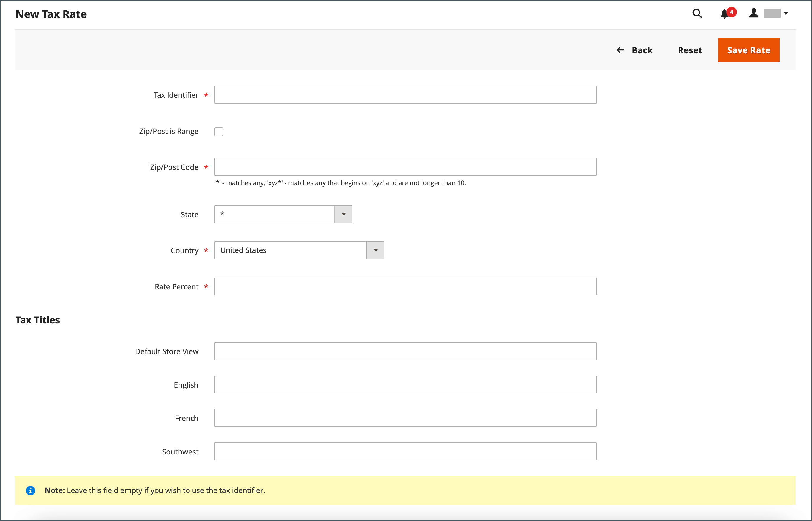

# 税区和税率

税率通常适用于在特定地理区域内进行的交易。 使用&#x200B;_税区和税率_&#x200B;工具为收税和汇款的每个地理区域指定税率。 由于每个税区和税率具有唯一标识符，因此您可以对指定地理区域使用多个税率（例如，不对食物或药品征税，但对其他项目征税的位置）。

根据商店地址计算商店税。 在客户完成订单信息后计算订单的实际客户税。 然后，Commerce会根据商店的税务配置计算税额。

{width="600" zoomable="yes"}

## 定义新税率

1. 在&#x200B;_管理员_&#x200B;侧边栏上，转到&#x200B;**[!UICONTROL Stores]** > _[!UICONTROL Taxes]_>**[!UICONTROL Tax Zones and Rates]**。

1. 单击右上角的&#x200B;**[!UICONTROL Add New Tax Rate]**。

   {width="600" zoomable="yes"}

1. 输入&#x200B;**[!UICONTROL Tax Identifier]**。

1. 要将税率应用于单个邮政编码，请输入&#x200B;**[!UICONTROL Zip/Post Code]**&#x200B;的编码。

   星号通配符(`*`)可用于匹配代码中最多十个字符。 例如，`90*`表示从90000到90999的所有邮政编码。

1. 要将税率应用于某个邮政编码范围，请执行以下操作：

   - 选中&#x200B;**[!UICONTROL Zip/Post is Range]**&#x200B;复选框，并通过输入&#x200B;**[!UICONTROL Range From]**&#x200B;和&#x200B;**[!UICONTROL Range To]**&#x200B;的第一个和最后一个邮政编码来定义范围。

     {width="600" zoomable="yes"}

   - 选择适用税率的&#x200B;**[!UICONTROL State]**。

   - 选择适用税率的&#x200B;**[!UICONTROL Country]**。

   - 输入用于税率计算的&#x200B;**[!UICONTROL Rate Percent]**。

1. 如果您有多个商店，则可以为每个商店视图设置&#x200B;**[!UICONTROL Tax Titles]**。

   >[!NOTE]
   >
   >如果要使用税务标识符，请将此字段留空。

1. 完成后，单击&#x200B;**[!UICONTROL Save Rate]**。

## 编辑现有税率

1. 在&#x200B;_管理员_&#x200B;侧边栏上，转到&#x200B;**[!UICONTROL Stores]** > _[!UICONTROL Taxes]_>**[!UICONTROL Tax Zones and Rates]**。

1. 在&#x200B;_[!UICONTROL Tax Zones and Rates]_网格中查找税率，并在编辑模式下打开记录。

   如果列表中有许多费率，请使用[筛选器控件](../getting-started/admin-grid-controls.md)来查找所需的费率。

1. 对&#x200B;**[!UICONTROL Tax Rate Information]**&#x200B;进行必要的更改。

1. 根据需要更新&#x200B;**[!UICONTROL Tax Titles]**。

1. 完成后，单击&#x200B;**[!UICONTROL Save Rate]**。

## 删除税率

1. 在&#x200B;_管理员_&#x200B;侧边栏上，转到&#x200B;**[!UICONTROL Stores]** > _[!UICONTROL Taxes]_>**[!UICONTROL Tax Zones and Rates]**。

1. 查找要删除的税率并在编辑模式下将其打开。

1. 在菜单栏中，单击&#x200B;**[!UICONTROL Delete Rate]**。

1. 要确认操作，请单击&#x200B;**[!UICONTROL OK]**。
