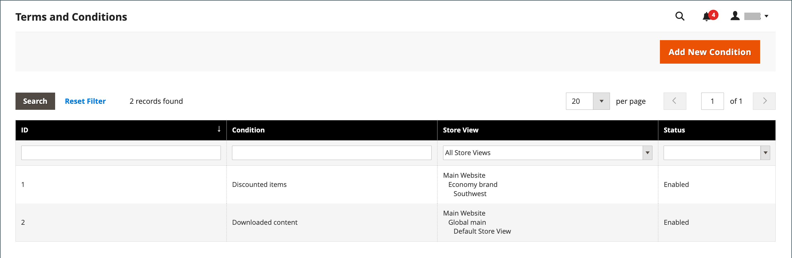
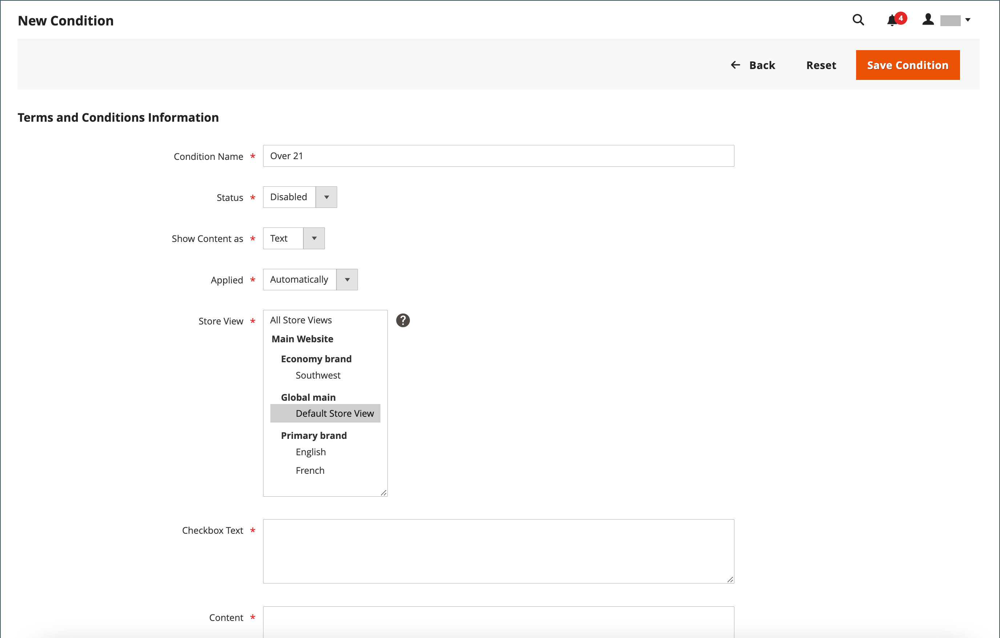

# 结账的条款和条件

手动时 _条款和条件_ 功能，客户必须在最终确定购买前同意销售条款和条件。 销售条款和条件通常包括法律可能要求对B2C或B2B站点进行披露的信息，并概述了买方和卖方的权利。 “条款和条件”消息显示在付款信息之后，紧接 _下单_ 按钮。

{width="700" zoomable="yes"}

## 步骤1：启用结账条款和条件

1. 在 _管理员_ 侧栏，转到 **[!UICONTROL Stores]** > _[!UICONTROL Settings]_>**[!UICONTROL Configuration]**.

1. 在左侧面板中，展开 **[!UICONTROL Sales]** 并选择 **[!UICONTROL Checkout]**.

1. 展开  该 **[!UICONTROL Checkout Options]** 部分。

   {width="600" zoomable="yes"}

1. 验证 **[!UICONTROL Enable Onepage Checkout]** 设置为 `Yes`.

1. 设置 **[!UICONTROL Enable Terms and Conditions]** 到 `Yes`.

1. 单击 **[!UICONTROL Save Config]**.

## 第2步：添加您自己的条款和条件信息

1. 在 _管理员_ 侧栏，转到 **[!UICONTROL Stores]** > _[!UICONTROL Settings]_>**[!UICONTROL Terms and Conditions]**.

   {width="600" zoomable="yes"}

1. 在右上角，单击 **[!UICONTROL Add New Condition]**.

1. 输入 **[!UICONTROL Condition Name]** 以供内部参考。

   {width="600" zoomable="yes"}

1. 设置 **[!UICONTROL Status]** 到 `Enabled`.

1. 设置 **[!UICONTROL Applied]** 更改为以下任一项：

   - `Automatically`  — 结账时自动接受条件。
   - `Manually`  — 客户需要手动接受订购条件。

1. 设置 **[!UICONTROL Show Content as]** 更改为以下任一项：

   - `Text`  — 将条款和条件内容显示为未格式化的文本。
   - `HTML`  — 将内容显示为HTML，可以设置其格式。

1. 选择每个 **[!UICONTROL Store View]** 您希望使用这些条款和条件的位置。

1. 向下滚动并完成要显示的信息：

   - 输入 **[!UICONTROL Checkbox Text]** 用作条款和条件链接的文本。 例如， `I understand and accept the terms and conditions of the sale`.

   - 在 **[!UICONTROL Content]** 框中，输入销售条款和条件的全文。

1. （可选）输入 **[!UICONTROL Content Height (css)]** 以像素为单位，用于确定签出期间显示条款和条件语句的文本框的高度。

   例如，要使文本框在96 dpi显示屏上变高1英寸，请输入 `96`. 如果内容超出框的高度，将显示滚动条。

1. 单击 **[!UICONTROL Save Condition]**.
