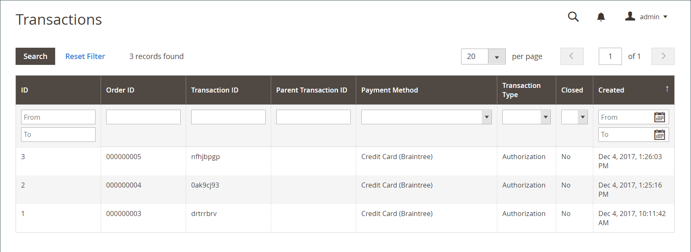

# 交易

此 _交易_ 页面列出了您的商店和支付系统之间发生的所有支付活动，并可访问更多详细信息。

## 查看交易记录

在 _管理员_ 侧栏，转到 **[!UICONTROL Sales]** > _[!UICONTROL Operations]_>**[!UICONTROL Transactions]**.

{width="600" zoomable="yes"}

| 列 | 描述 |
|--- |--- |
| [!UICONTROL ID] | 分配给每个交易的唯一数字标识符。 |
| [!UICONTROL Order ID] | 客户下订单时分配的唯一标识符。 |
| [!UICONTROL Transaction ID] | 客户下订单后进行交易时分配的唯一数字标识符。 |
| [!UICONTROL Parent Transaction ID] | 父交易记录的ID号。 |
| [!UICONTROL Payment Method] | 与交易记录关联的付款方式。 |
| [!UICONTROL Transaction Type] | 事务处理的类型，可以是“订单”、“授权”、“捕获”、“作废”或“退款”。 |
| [!UICONTROL Closed] | 事务是否关闭。 |
| [!UICONTROL Created] | 创建交易记录的时间和日期。 |

{style="table-layout:auto"}

## 查看交易记录详细信息

单击要查看的项目。

在事务详细信息页上，可以查看事务详细信息和子事务网格。

### 交易数据

本节包含有关交易的信息，并提供了中订单页的链接。 **订单ID** 列。

| 列 | 描述 |
|--- |--- |
| [!UICONTROL Transaction ID] | 交易ID号。 |
| [!UICONTROL Parent Transaction ID] | 父交易的对应ID号（如果适用）。 |
| [!UICONTROL Transaction Type] | 事务处理的类型，可以是“订单”、“授权”、“捕获”、“作废”或“退款”。 |
| [!UICONTROL Is Closed] | 事务是否关闭。 |
| [!UICONTROL Created At] | 创建交易记录的时间和日期。 |

{style="table-layout:auto"}

### 子交易记录

在为创建发票之后，子事务处理会显示在网格中 [订单](orders.md). 此格式允许您跟踪事务历史记录，并遵循事务层次结构。

### [!UICONTROL Transaction Details]

此部分包含给定交易的其他信息。 信息以键和值的形式显示。 可用的键包括：

- authAmont
- authCode
- VSResponse
- 收单方
- cardCodeResponse
- 客户
- customerIP
- 行项目
- marketType
- 订购
- 付款
- 产品
- recurringBilling
- responseCode
- responseReasonCode
- responseReasonDescription
- settlamount
- 解决方案
- submitTimeLocal
- submitTimeUTC
- 免税
- transactionstatus

>[!NOTE]
>
>如果事务详细信息不可用或已过时，请单击 **[!UICONTROL Fetch]** 以更新它们。
