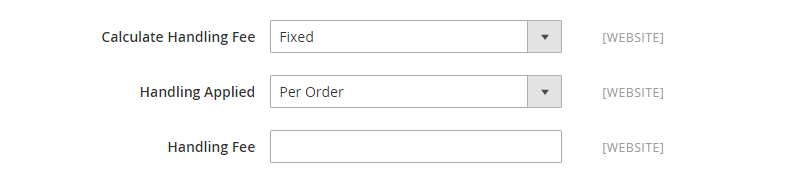

# 联合包裹服务(UPS)

联合包裹服务(UPS)向220多个国家提供国内和国际陆运和空运服务。

{{ups-api}}

>[!NOTE]
>
>UPS可以使用 [维度权重](carriers.md#dimensional-weight) 以确定一些运费。 但是，Adobe Commerce仅支持基于重量的运输成本计算。

## 步骤1：打开UPS发运帐户

要向客户提供此配送方式，您必须首先使用UPS开立帐户。

## 步骤2：为您的存储启用UPS

{{beta2-updates}}

1. 在 _管理员侧栏_，转到 **[!UICONTROL Stores]** > _[!UICONTROL Settings]_>**[!UICONTROL Configuration]**.

1. 在左侧的面板中，在 **[!UICONTROL Sales]**，选择 **[!UICONTROL Delivery Methods]**.

1. 展开  该 **[!UICONTROL UPS]** 部分。

1. 设置 **[!UICONTROL Enabled for Checkout]** 到 `Yes`.

1. 对于UPS XML帐户（默认），设置 **[!UICONTROL UPS Type]** 到 `United Parcel Service XML` 并执行以下操作：

   - 输入您的UPS凭据： **[!UICONTROL User ID]**， **[!UICONTROL Access License Number]** (16位UPS帐户 `Access Key`)，和 **[!UICONTROL Password]**

   - 设置 **[!UICONTROL Mode]** 到 `Live` 通过安全连接将数据发送到UPS运输系统。 （开发模式不会通过安全连接发送数据。）

   - 验证 **[!UICONTROL Gateway XML URL]** 通过XML文件发送请求时所需的文件。

   - 设置 **[!UICONTROL Origin of the Shipment]** 到发运所在的区域。

   - 如果您对UPS有特殊费率，请设置 **[!UICONTROL Enable Negotiated Rates]** 到 `Yes` 然后输入六位数字 **[!UICONTROL Shipper Number]** 由UPS分配给您。

1. 对于标准UPS帐户，设置 **[!UICONTROL UPS Type]** 到 `United Parcel Service` 并执行以下操作：

   >[!NOTE]
   >
   >标准联合包裹服务类型已计划弃用。 对于新配置，应使用默认值  `United Parcel Service XML` 类型。 还需要使用XML类型生成 [配送标签](shipping-labels.md).

   - 设置 **[!UICONTROL Live Account]** 更改为以下任一项：

      - `Yes`  — 在生产模式下运行UPS，并将UPS作为配送方式提供给您的客户。
      - `No`  — 在测试模式下运行UPS。

   - 在 **[!UICONTROL Gateway URL]** 字段中，输入用于计算UPS运费的URL。

     >[!IMPORTANT]
     >
     >UPS将停止支持HTTP，它用于当前默认值（系统值）。 清除 **[!UICONTROL Use system value]** 复选框，并修改URL以使用HTTPS。 示例： `https://www.ups.com/using/services/rave/qcostcgi.cgi`

1. 对象 **[!UICONTROL Title]**，输入此送货选项的名称，以使其在结帐时显示。

   默认情况下，此字段设置为 `United Parcel Service`.

   {width="600" zoomable="yes"}

## 步骤3：完成容器说明

1. 设置 **[!UICONTROL Packages Request Type]** 更改为以下任一项：

   - `Use origin weight (few requests)`
   - `Divide to equal weight (one request)`

1. 对象 **[!UICONTROL Container]**，指定用于装运的典型包装类型：

   - `Customer Packaging`
   - `UPS Letter Envelope`
   - `Customer Supplied Package`
   - `UPS Tube`
   - `PAK`
   - `UPS Express Box`
   - `UPS Worldwide 25 kilo`
   - `UPS Worldwide 10 kilo`
   - `Pallet`
   - `Small Express Box`
   - `Medium Express Box`
   - `Large Express Box`

1. 设置 **[!UICONTROL Weight Unit]** 用于测量产品重量的系统。

   UPS支持的重量系统因国家/地区而异。 如有疑问，请询问UPS您应该使用哪个配重系统。 选项包括：

   - `LBS`
   - `KGS`

1. 设置 **[!UICONTROL Destination Type]** 更改为以下任一项：

   - `Residential`  — 您的发货大部分是企业对消费者(B2C)。
   - `Commercial`  — 您的大多数发货都是企业到企业(B2B)。

1. 输入 **[!UICONTROL Maximum Package Weight]** 运营商允许。

1. 设置 **[!UICONTROL Pickup Method]** 更改为以下任一项：

   - `Regular Daily Pickup`
   - `On Call Air`
   - `One Time Pickup`
   - `Letter Center`
   - `Customer Counter`

1. 输入 **[!UICONTROL Minimum Package Weight]** 运营商允许。

   {width="600" zoomable="yes"}

## 第4步：设置手续费

处理费是可选的，显示为额外费用，将添加到UPS运输成本中。 如果要包括手续费，请执行以下操作：

1. 设置 **[!UICONTROL Calculate Handling Fee]** 更改为以下方法之一：

   - `Fixed`
   - `Percent`

1. 要确定如何应用手续费，请设置 **[!UICONTROL Handling Applied]** 更改为以下任一项：

   - `Per Order`
   - `Per Package`

1. 输入 **[!UICONTROL Handling Fee]** 将被收费。

   要输入百分比，请使用小数格式。 例如，输入 `0.25` 25%。

   {width="600" zoomable="yes"}

## 步骤5：指定允许的方法和适用的国家/地区

1. 对象 **[!UICONTROL Allowed Methods]**，选择可供客户使用的各种UPS配送方式。

   签出期间，这些方法显示在UPS下。 要选择多种方法，请按住Ctrl键(PC)或Command键(Mac)并单击每个选项。

1. 如果您要提供 [免费送货](shipping-free.md) 选项通过UPS，设置免费送货选项：

   - 设置 **[!UICONTROL Free Method]** 到您要用于免费配送的方法。 如果您不想通过UPS提供免费送货服务，请选择 `None`.

   - 要要求最低订单金额，以便能够使用UPS免费发运订单，请设置 **[!UICONTROL Enable Free Shipping Threshold]** 到 `Enable`. 然后，输入最小值 **[!UICONTROL Free Shipping Amount Threshold]**.

1. 如果需要，请更改 **[!UICONTROL Displayed Error Message]**.

   此文本框预设了默认消息，但您可以输入在UPS不可用时要显示的其它消息。

   {width="600" zoomable="yes"}

1. 设置 **[!UICONTROL Ship to Applicable Countries]** 更改为以下任一项：

   - `All Allowed Countries`  — 来自所有客户的客户 [国家/地区](../getting-started/store-details.md#country-options) 在商店配置中指定的可使用此投放方法。
   - `Specific Countries`  — 选择此选项时， _发运至特定国家/地区_ 列表出现。 选择列表中可使用此投放方法的每个国家/地区。

1. 设置 **[!UICONTROL Show Method if Not Applicable]** 更改为以下任一项：

   - `Yes`  — 列出结账期间所有可用的UPS配送方式，包括不适用于配送的方法。
   - `No`  — 仅列出适用于发运的UPS发运方法。

   {width="600" zoomable="yes"}

1. 要创建包含从您的商店发出的UPS装运详细信息的日志文件，请设置 **[!UICONTROL Debug]** 到 `Yes`.

1. 对象 **[!UICONTROL Sort Order]**，请输入数字以确定在结账期间与其他交付方法一起列出UPS时的显示顺序。

   `0` =第一个， `1` =秒， `2` =第三，依此类推。

1. 单击 **[!UICONTROL Save Config]**.

## 步骤6：设置发运来源地址

1. 确保您的 [存储信息](../getting-started/store-details.md#store-information) 完成。

1. 在 _管理员_ 侧栏，转到 **[!UICONTROL Stores]** > _[!UICONTROL Settings]_>**[!UICONTROL Configuration]**.

1. 在左侧面板中，展开 **[!UICONTROL Sales]** 并选择 **[!UICONTROL Shipping Settings]**.

1. 展开  **[!UICONTROL Origin]** ，并配置送货来源地址。

   {width="600" zoomable="yes"}

1. 单击 **[!UICONTROL Save Config]**.

>[!NOTE]
>
>Commerce在计算运费时不会向UPS声明完整的订单价格。 此行为无法更改。
