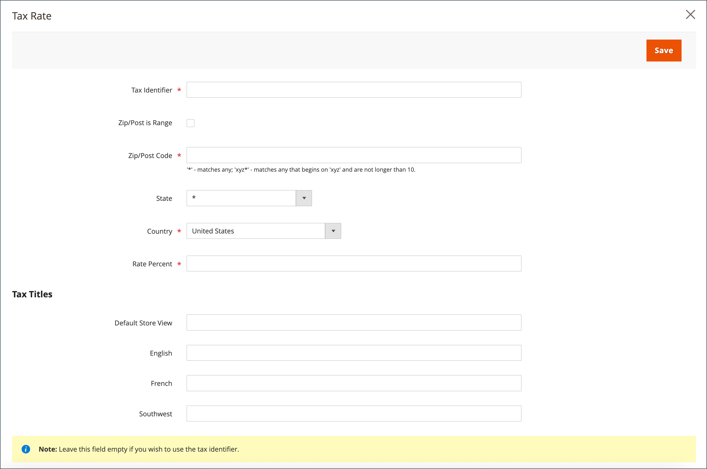
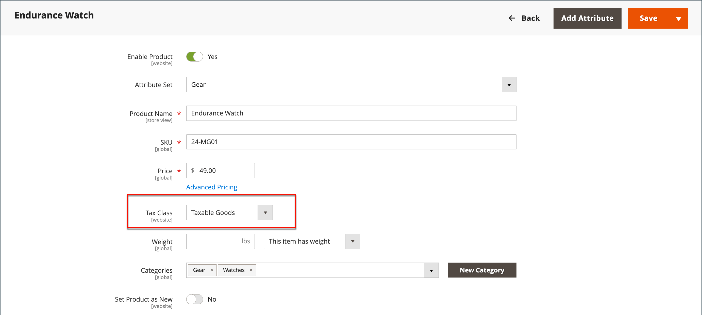

# 增值税(VAT)

有些国家征收货物和服务的增值税或增值税。 根据您向客户出售的制造或分销过程、材料或服务所处的阶段，增值税税率可能有所不同。 您可以应用多个增值税率以正确计算到期税额。

可以将Commerce配置为根据商家或客户地址（如果两者位于同一国家/地区）征收增值税。 增值税的计算通常基于发运目的地，而不是其原始点。 在大多数情况下，根据客户送货地址计算增值税的配置设置便已足够。

## 示例场景

- 对于在一个欧盟国家（地区）向另一个欧盟国家的个人供货的增值税注册业务，增值税根据商家位置计算为“远程销售”。

- 从英国商店购买产品（发运至英国地址）的荷兰企业必须支付英国增值税率。

- 对于[可下载产品](../catalog/product-create-downloadable.md)或&#x200B;_数字商品_&#x200B;的销售，增值税率基于送货目的地，而不是商家地点。 查看[数字商品的供应地点](taxes.md#place-of-supply-for-digital-goods-eu)。

>[!TIP]
>
>一些跨境和B2B运输的税务要求更为复杂。 要扩展Commerce安装的本机功能，请考虑从[市场](https://marketplace.magento.com/extensions/accounting-finance/taxes.html)添加税务管理解决方案。

## 配置增值税

以下说明包括一个在英国对零售客户销售设置20%增值税的示例过程。 对于其它税率和国家（地区），请遵循一般过程，但输入与您的国家（地区）、增值税税率、客户类型等相对应的特定信息。

>[!NOTE]
>
>在继续之前，请确保找出哪些规则和条例适用于您所在地区的增值税。

在某些企业到企业的交易中，不评定增值税。 Commerce可以验证客户的VAT ID，以确保正确评估（或未评估）VAT。 请参阅[VAT ID验证](#vat-id-validation)。

### 步骤1：设置客户税分类

创建税则的流程从添加税率开始。

1. 在&#x200B;_管理员_&#x200B;侧边栏上，转到&#x200B;**[!UICONTROL Stores]** > _[!UICONTROL Taxes]_>**[!UICONTROL Tax Zones and Rates]**。

   {width="600" zoomable="yes"}

1. 确保有一个适合用于VAT的客户税分类。

   对于此示例，请确保存在名为&#x200B;_零售客户_&#x200B;的客户税类。 如果此税种不存在，请单击&#x200B;**[!UICONTROL Add New Tax Rate]**。

1. 输入新税分类的&#x200B;**[!UICONTROL Tax Identifier]**。

   创建税则时，所有税率都显示在&#x200B;_税则信息_&#x200B;的&#x200B;_税率_&#x200B;字段中。

1. 要设置邮政编码范围（从/到），请选中&#x200B;**[!UICONTROL Zip/Post is Range]**&#x200B;复选框。

1. 选择适用税率的&#x200B;**[!UICONTROL Country]**。

1. 输入在购买时用于税率计算的&#x200B;**[!UICONTROL Rate Percent]**。

1. 完成后，单击&#x200B;**[!UICONTROL Save Rate]**。

您可以根据已提交的税率，创建后续税则。 没有税率，就不可能建立税则。

### 步骤2：设置产品税分类

1. 在&#x200B;_管理员_&#x200B;侧边栏上，转到&#x200B;**[!UICONTROL Stores]** > _[!UICONTROL Taxes]_>**[!UICONTROL Tax Rules]**。

1. 单击&#x200B;**[!UICONTROL Add New Tax Rule]**。

1. 展开&#x200B;**[!UICONTROL Additional Settings]**&#x200B;部分的。

   {width="600" zoomable="yes"}

1. 在&#x200B;_产品税类_&#x200B;下，单击&#x200B;**[!UICONTROL Add New Tax Class]**。

1. 要将新分类添加到可用产品税分类列表并创建三个新分类，请输入新税分类的&#x200B;**[!UICONTROL Name]**，然后单击复选标记：

   - `VAT Standard`
   - `VAT Reduced`
   - `VAT Zero`

1. 为您添加的每个新类单击&#x200B;**[!UICONTROL Save Class]**。

1. 单击&#x200B;**[!UICONTROL Save Rule]**。

### 步骤3：设置税区和税率

1. 在&#x200B;_管理员_&#x200B;侧边栏上，转到&#x200B;**[!UICONTROL Stores]** > _[!UICONTROL Taxes]_>**[!UICONTROL Tax Zones and Rates]**。

   在本例中，您可以删除美国税率，或保持原样。

1. 单击&#x200B;**[!UICONTROL Add New Tax Rate]**。

   {width="600" zoomable="yes"}

1. 新费率定义如下：

   **增值税标准**

   - 税务标识符： `VAT Standard`
   - 国家和州： `United Kingdom`
   - 费率百分比： `20.00`

   **增值税减少**

   - 税务标识符： `VAT Reduced`
   - 国家和州： `United Kingdom`
   - 费率百分比： `5.00`

1. 单击每个费率的&#x200B;**[!UICONTROL Save Rate]**。

### 步骤4：设置税则

税则由客户税分类、产品税分类和税率组成。

1. 在&#x200B;_管理员_&#x200B;侧边栏上，转到&#x200B;**[!UICONTROL Stores]** > _[!UICONTROL Taxes]_>**[!UICONTROL Tax Rules]**。

1. 按如下方式添加新税则：

   **增值税标准**

   - 名称： `VAT Standard`
   - 客户税分类： `Retail Customer`
   - 产品税分类： `VAT Standard`
   - 税率： `VAT Standard Rate`

   **增值税减少**

   - 名称： `VAT Reduced`
   - 客户税分类： `Retail Customer`
   - 产品税分类： `VAT Reduced`
   - 税率： `VAT Reduced Rate`

1. 单击每个费率的&#x200B;**[!UICONTROL Save Rule]**。

### 步骤5：将税分类应用于产品

1. 在&#x200B;_管理员_&#x200B;侧边栏上，转到&#x200B;**[!UICONTROL Catalog]** > **[!UICONTROL Manage Products]**。

1. 在编辑模式下从目录打开产品。

1. 在&#x200B;_常规_&#x200B;页面上，找到&#x200B;**[!UICONTROL Tax Class]**&#x200B;选项并选择适用于该产品的&#x200B;**[!UICONTROL VAT Class]**。

1. 完成后，单击&#x200B;**[!UICONTROL Save]**。

   {width="600" zoomable="yes"}

## 字段描述

### 存储信息

Commerce使用以下[商店信息配置设置](../configuration-reference/general/general.md#store-information)根据商家信息计算增值税。

**[!UICONTROL VAT Number]** — 分配给商家的增值税号。

**[!UICONTROL Validate VAT Number]** - [增值税验证](#vat-id-validation)确认增值税编号与[欧洲委员会](https://ec.europa.eu/taxation_customs/vies/)数据库中的相应记录匹配。

### 客户信息

Commerce使用以下字段根据[客户信息](../customers/account-dashboard-account-information.md)计算增值税。

#### 帐户信息

**[!UICONTROL Tax/VAT Number]** — 如果适用，为客户分配的税号或增值税号。

#### 地址

**[!UICONTROL VAT Number]** — 如果适用，是与客户的特定帐单或送货地址关联的增值税编号。 对于在欧盟内销售[数字商品](taxes.md#place-of-supply-for-digital-goods-eu))，增值税金额基于配送目的地。

### 客户帐户

Commerce使用以下[客户配置设置](../customers/account-options-new.md)计算增值税。

**[!UICONTROL Show VAT Number on Storefront]** — 确定“客户增值税编号”字段是否包含在客户帐户中可用的通讯簿中。

**[!UICONTROL Default Value for Disable Automatic Group Changes Based on VAT ID]** - VAT ID是在进行VAT验证时用于客户的增值税编号的内部标识符。 在增值税验证期间，Commerce会确认该数字与[欧洲委员会](https://ec.europa.eu/taxation_customs/vies/)数据库匹配。 客户可以根据验证结果自动分配到四个默认客户组之一。

## VAT ID验证

_VAT ID验证_&#x200B;根据商家和客户区域设置，自动计算在欧盟(EU)内发生的B2B交易记录的所需税额。 Commerce使用[欧盟委员会][1]服务器的Web服务执行VAT ID验证。

>[!NOTE]
>
>增值税相关税则不会影响其他税则，也不会阻止其他税则的应用。 在给定时间只能应用一个税则。

- 如果商户和客户位于同一欧盟国家/地区，则需收取VAT。
- 如果商人和客户位于不同的欧盟国家（地区），并且双方都是欧盟注册的业务实体，则不会收取增值税。

商店管理员会创建多个默认客户组，这些客户组可在帐户创建、地址创建或更新以及结账期间自动分配给客户。 结果是国内（国内）和欧盟内部销售使用了不同的税则。

>[!IMPORTANT]
>
>如果您销售虚拟或可下载的产品，并且这些产品不需要发运，则应将客户所在国家（地区）的增值税税率用于工会内部销售和国内销售。 为与虚拟产品对应的产品税分类创建其他单个税则。

### 客户注册工作流

如果启用了“增值税标识验证”，则在登记之后，建议每个客户输入增值税标识号。 但是，只有注册增值税客户的购物者才应填写此字段。

在客户指定了增值税编号和其他地址字段并选择保存之后，系统将保存该地址并向欧盟委员会服务器发送VAT ID验证请求。 根据验证结果，将其中一个默认组分配给客户。 如果客户或管理员更改默认地址的VAT ID或更改整个默认地址，则可以更改此组。 有时，在单页签出过程中可以临时更改组（模拟组更改）。

如果启用，则通过选中&#x200B;_[!UICONTROL Customer Information]_&#x200B;页面上的复选框，可以覆盖适用于单个客户的VAT ID验证。

### 签出工作流

如果在结账期间执行客户的增值税验证，则增值税请求标识符和增值税请求日期将保存在订单的“备注历史记录”部分。

在结账过程中，与VAT ID验证和客户组更改相关的系统行为取决于如何配置“验证每个事务处理”和“禁用自动组更改”设置。 本节介绍如何在前端为结账实施VAT ID验证功能。

如果客户使用Google Express Checkout、PayPal Express Checkout或其他外部签出方法，则会在外部支付网关的侧面完全执行签出。 对于这种情况，无法应用&#x200B;_Validate on Each Transaction_&#x200B;设置，并且客户组在签出期间无法更改。

{width="550" zoomable="yes"}

### 配置VAT ID验证

要配置VAT ID验证，您必须首先设置所需的客户组，然后创建相关的税种、税率和规则。 然后，启用商店的VAT ID验证，并完成配置。

以下示例显示如何使用税类和税率来验证VAT ID。 复查实例，然后按照说明设置商店所需的税类和规则。

#### 示例：验证VAT ID所需的最低税则

| 税则#1 |  |
|--- |--- |
| 客户税分类 | 客户税分类必须包括： 国内客户的分类。  类，适用于具有格式不正确的VAT ID的客户。 VAT ID验证失败的客户的类。 |
| 产品税分类 | 产品税分类必须包括除捆绑和虚拟以外的所有类型产品的分类。 |
| 税率 | 税率必须包括贸易商所在国家（地区）的增值税税率。 |

{style="table-layout:auto"}

| 税则#2 |   |
|--- |--- |
| 客户税分类 | 用于工会内部客户的类。 |
| 产品税分类 | 所有类型（虚拟产品除外）的产品的类。 |
| 税率 | 所有欧盟国家（地区）的增值税税率，商家所在国家（地区）除外。 当前此比率为0%。 |

{style="table-layout:auto"}

| 税则#3 | （虚拟和可下载产品需要） |
|--- |--- |
| 客户税分类 | 客户税分类必须包括： 国内客户的分类 VAT ID无效的客户分类A未通过VAT ID验证的客户的分类 |
| 产品税分类 | 虚拟产品的类。 |
| 税率 | 贸易商所在国家/地区的增值税率。 |

{style="table-layout:auto"}

| 税则#4 | （虚拟和可下载产品需要） |
|--- |--- |
| 客户税分类 | 用于工会内部客户的类。 |
| 产品税分类 | 虚拟产品的类。 |
| 税率 | 所有欧盟国家（地区）的增值税税率，商家所在国家（地区）除外。 当前此比率为0%。 |

{style="table-layout:auto"}

#### 步骤1：创建与增值税相关的客户组

“VAT ID验证”会根据VAT ID验证结果，自动将四个默认客户组之一分配给客户：

- 国内
- 欧盟内部
- VAT ID无效
- 验证错误

您可以创建用于验证VAT ID的客户组，或者如果现有客户组符合您的业务逻辑，则使用这些客户组。 在配置“VAT ID验证”时，您必须将每个创建的客户组分配为具有相应VAT ID验证结果的客户的默认客户组。

#### 步骤2：创建与增值税相关的分类、费率和规则

每个税则由三个实体定义：

- 客户税分类
- 产品税分类
- 税率

创建[税则](tax-rules.md)以便有效地使用VAT ID验证。

- 税则包括税率和[税类](tax-class.md)。
- 已将税分类分配给[客户组](../customers/customer-groups.md)。

#### 步骤3：启用并配置VAT ID验证

1. 在&#x200B;_管理员_&#x200B;侧边栏上，转到&#x200B;**[!UICONTROL Stores]** > _[!UICONTROL Settings]_>**[!UICONTROL Configuration]**。

1. 如有必要，请为配置设置&#x200B;**[!UICONTROL Store View]**。

1. 在左侧面板中，展开&#x200B;**[!UICONTROL Customers]**&#x200B;并选择&#x200B;**[!UICONTROL Customer Configuration]**。

1. 展开&#x200B;**[!UICONTROL Create New Account Options]**&#x200B;部分的。

   在以下示例中，与VAT验证无关的一般客户设置是暗的。

   {width="600" zoomable="yes"}

1. 将&#x200B;**[!UICONTROL Enable Automatic Assignment to Customer Group]**&#x200B;设置为`Yes`并根据需要完成以下字段。

   - **[!UICONTROL Default Group]**
   - **[!UICONTROL Default Value for Disable Automatic Group Changes Based on VAT ID]**
   - **[!UICONTROL Show VAT Number on Storefront]**

1. 完成后，单击&#x200B;**[!UICONTROL Save Config]**。

#### 步骤4：设置您的VAT ID和地点国家

1. 在左侧面板中，展开&#x200B;**[!UICONTROL General]**&#x200B;并在下面选择&#x200B;**[!UICONTROL General]**。

1. 展开&#x200B;**[!UICONTROL Store Information]**&#x200B;部分的。

   {width="600" zoomable="yes"}

1. 选择您的&#x200B;**[!UICONTROL Country]**。

1. 输入您的&#x200B;**[!UICONTROL VAT Number]**&#x200B;并单击&#x200B;**[!UICONTROL Validate VAT Number]**。

   结果会立即显示。

1. 完成后，单击&#x200B;**[!UICONTROL Save Config]**。

#### 第5步：核实欧盟成员国名单

1. 在&#x200B;_常规_&#x200B;配置页面中继续，展开&#x200B;**[!UICONTROL Countries Options]**&#x200B;部分的。

   {width="600" zoomable="yes"}

1. 在&#x200B;**[!UICONTROL European Union Countries]**&#x200B;列表中，验证是否选择了欧盟的每个成员国。

   要更改默认设置，请清除&#x200B;**使用系统值**&#x200B;复选框。 按住Ctrl键(PC)或Command键(Mac)，然后单击要添加或删除的每个国家/地区。

1. 完成后，单击&#x200B;**[!UICONTROL Save Config]**。

[1]: https://ec.europa.eu/taxation_customs/vies/
