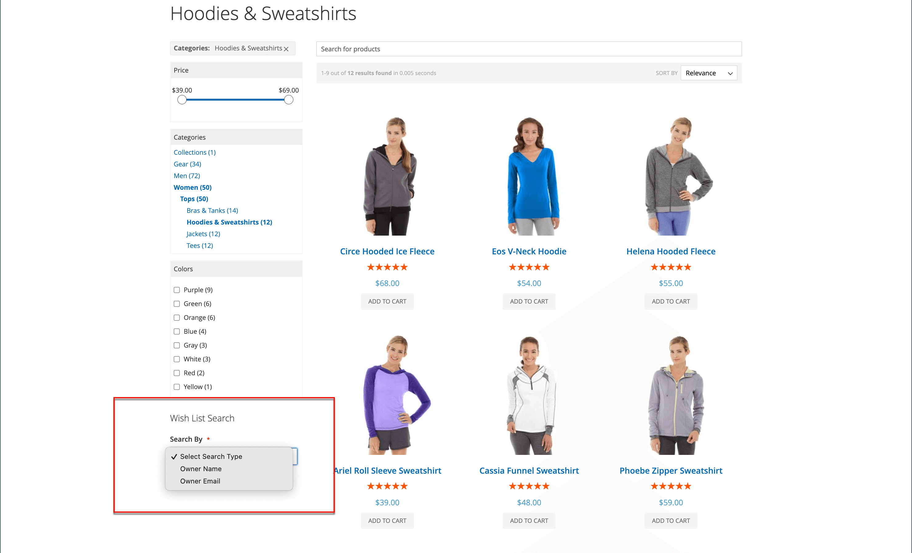

# 配置希望列表

希望列表配置启用希望列表并确定在共享希望列表时使用的电子邮件模板和电子邮件发件人。

## 启用愿望清单功能

1. 在&#x200B;_管理员_&#x200B;侧边栏上，转到&#x200B;**[!UICONTROL Stores]** > _[!UICONTROL Settings]_>**[!UICONTROL Configuration]**。

1. 在左侧面板中，展开&#x200B;**[!UICONTROL Customers]**&#x200B;并选择&#x200B;**[!UICONTROL Wish List]**。

1. 展开&#x200B;**[!UICONTROL General Options]**&#x200B;部分中的并执行以下操作：

   {width="600" zoomable="yes"}

   - 将&#x200B;**[!UICONTROL Enabled]**&#x200B;切换为`Yes`，这将为存储激活愿望列表模块。

   - (仅限Adobe Commerce)将&#x200B;**[!UICONTROL Enable Multiple Wish Lists]**&#x200B;切换为`Yes`，这允许客户创建和维护多个愿望清单。

   - (仅限Adobe Commerce)若要限制客户可与其帐户关联的愿望清单数量，请输入&#x200B;**[!UICONTROL Number of Multiple Wish Lists]**&#x200B;的值。

   - 将&#x200B;**[!UICONTROL Show in Sidebar]**&#x200B;切换为`Yes`，这将在侧栏中显示愿望清单。

1. 展开&#x200B;**[!UICONTROL Share Options]**&#x200B;部分中的并执行以下操作：

   {width="600" zoomable="yes"}

   - 将&#x200B;**[!UICONTROL Email Sender]**&#x200B;设置为应显示为邮件发件人的商店联系人。 选项：一般联系人、销售代表、客户支持、自定义电子邮件。

   - 设置客户共享愿望清单时要使用的&#x200B;**[!UICONTROL Email Template]**。

   - 要限制客户可以发送的电子邮件总数，请输入&#x200B;**[!UICONTROL Max Emails Allowed to be Sent]**&#x200B;值。 默认值为10，允许的最大值为10,000。

   - 要限制消息的大小，请输入&#x200B;**[!UICONTROL Email Text Length Limit]**&#x200B;的值。 默认值为255。

1. 展开&#x200B;**[!UICONTROL My Wish List Link]**&#x200B;部分的，并将&#x200B;**[!UICONTROL Display Wish List Summary]**&#x200B;设置为以下项之一：

   - `Display number of items in wish list`
   - `Display item quantities`

   {width="600" zoomable="yes"}

1. 完成后，单击&#x200B;**[!UICONTROL Save Config]**。

## 添加愿望清单搜索

(仅限Adobe Commerce)

可以使用愿望清单搜索[小组件](../content-design/widgets.md)找到任何公开的愿望清单。 该构件允许客户按希望列表所有者的姓名或电子邮件地址进行搜索。 商店客户可以找到属于其他客户的愿望清单、查看这些愿望清单并从他们那里订购产品，或者将产品添加到他们自己的愿望清单中。 如果某个项目是由另一个客户从公共愿望清单购买的，则它不会从原始愿望清单中删除。 可以将&#x200B;_愿望清单搜索_&#x200B;构件添加到商店的任何页面，以便客户轻松查找朋友和家人的愿望清单。

{width="700" zoomable="yes"}

1. 在&#x200B;_管理员_&#x200B;侧边栏上，转到&#x200B;**[!UICONTROL Content]** > _[!UICONTROL Elements]_>**[!UICONTROL Widgets]**。

1. 单击右上角的&#x200B;**[!UICONTROL Add Widget]**。

1. 在&#x200B;_[!UICONTROL Settings]_&#x200B;选项卡中，执行以下操作：

   - 将&#x200B;**[!UICONTROL Type]**&#x200B;设置为`Wish List Search`。

   - 将&#x200B;**[!UICONTROL Design Theme]**&#x200B;设置为添加愿望清单的存储的主题。

   - 单击&#x200B;**[!UICONTROL Continue]**。

1. 完成&#x200B;_[!UICONTROL Storefront Properties]_：

   - 输入&#x200B;**[!UICONTROL Widget Title]**。

   - 将&#x200B;**[!UICONTROL Assign to Store Views]**&#x200B;设置为要使用小组件的视图或网站。

   - 对于&#x200B;**[!UICONTROL Sort Order]**，输入一个数字以确定构件在其容器中的放置位置。

     `0` =第一个（默认）、`1` =第二个、`2` =第三个，依此类推。

1. 在&#x200B;_[!UICONTROL Layout Updates]_&#x200B;部分中，单击&#x200B;**[!UICONTROL Add Layout Update]**&#x200B;并将&#x200B;**[!UICONTROL Display on]**&#x200B;设置为以下项之一：

   - _[!UICONTROL Categories]_

      - `Anchor Categories`
      - `Non-Anchor Categories`

   - _[!UICONTROL Products]_

      - `All Product Type`
      - `Simple Product`
      - `Virtual Product`
      - `Bundle Product`
      - `Configurable Product`
      - `Downloadable Product`
      - `Gift Card`
      - `Grouped Product`

   - _[!UICONTROL Generic Page]_

      - `All Pages`
      - `Specified Page`
      - `Page Layouts`

1. 在&#x200B;**[!UICONTROL Container]**&#x200B;列表中，选择要放置它的页面布局区域。

   {width="700" zoomable="yes"}

1. 在左侧面板中，选择&#x200B;**[!UICONTROL Widget Options]**。

1. 将&#x200B;**[!UICONTROL Quick Search Form Types]**&#x200B;设置为以下项之一：

   - `All Forms` — 客户可以按所有可用参数进行搜索。
   - `Owner Name` — 客户可以按所有者名称搜索愿望清单。
   - `Owner Email` — 客户可以按所有者电子邮件地址搜索愿望清单。

   >[!NOTE]
   >
   >送货地址不包括在愿望清单中。

1. 按照标准[说明](../content-design/widget-create.md)，根据需要配置任何剩余的Widget属性。

1. 完成后，单击&#x200B;**[!UICONTROL Save]**。

1. 出现提示时，刷新所有无效缓存。
