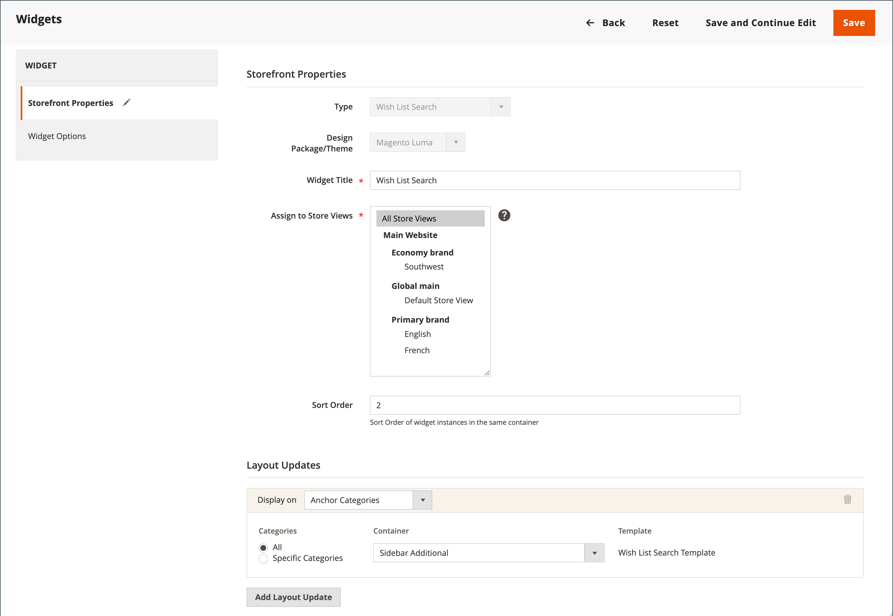

# 配置希望列表

希望列表配置启用希望列表并确定在共享希望列表时使用的电子邮件模板和电子邮件发件人。

## 启用愿望清单功能

1. 在 _管理员_ 侧栏，转到 **[!UICONTROL Stores]** > _[!UICONTROL Settings]_>**[!UICONTROL Configuration]**.

1. 在左侧面板中，展开 **[!UICONTROL Customers]** 并选择 **[!UICONTROL Wish List]**.

1. 展开  该 **[!UICONTROL General Options]** 部分并执行以下操作：

   {width="600" zoomable="yes"}

   - 切换 **[!UICONTROL Enabled]** 到 `Yes`，这将为存储激活愿望列表模块。

   -  (仅限Adobe Commerce)切换 **[!UICONTROL Enable Multiple Wish Lists]** 到 `Yes`，允许客户创建和维护多个愿望清单。

   -  (仅限Adobe Commerce)要限制客户可以与其帐户关联的愿望清单数量，请为 **[!UICONTROL Number of Multiple Wish Lists]**.

   - 切换 **[!UICONTROL Show in Sidebar]** 到 `Yes`，在侧栏中显示愿望清单。

1. 展开  该 **[!UICONTROL Share Options]** 部分并执行以下操作：

   {width="600" zoomable="yes"}

   - 设置 **[!UICONTROL Email Sender]** 将显示为邮件发件人的商店联系人。 选项：一般联系人、销售代表、客户支持、自定义电子邮件。

   - 设置 **[!UICONTROL Email Template]** 当客户共享愿望清单时使用。

   - 要限制客户可发送的电子邮件总数，请输入 **[!UICONTROL Max Emails Allowed to be Sent]** 值。 默认值为10，允许的最大值为10,000。

   - 要限制消息的大小，请输入 **[!UICONTROL Email Text Length Limit]**. 默认值为255。

1. 展开  该 **[!UICONTROL My Wish List Link]** 分区和设置 **[!UICONTROL Display Wish List Summary]** 更改为以下任一项：

   - `Display number of items in wish list`
   - `Display item quantities`

   {width="600" zoomable="yes"}

1. 完成后，单击 **[!UICONTROL Save Config]**.

## 添加愿望清单搜索

 (仅限Adobe Commerce)

任何公开的愿望清单都可以使用“愿望清单搜索”找到 [构件](../content-design/widgets.md). 该构件允许客户按希望列表所有者的姓名或电子邮件地址进行搜索。 商店客户可以找到属于其他客户的愿望清单、查看这些愿望清单并从他们那里订购产品，或者将产品添加到他们自己的愿望清单中。 如果某个项目是由另一个客户从公共愿望清单购买的，则它不会从原始愿望清单中删除。 此 _希望列表搜索_ 可以在您商店的任何页面中添加构件，以便客户查找朋友和家人的愿望清单。

{width="700" zoomable="yes"}

1. 在 _管理员_ 侧栏，转到 **[!UICONTROL Content]** > _[!UICONTROL Elements]_>**[!UICONTROL Widgets]**.

1. 在右上角，单击 **[!UICONTROL Add Widget]**.

1. 在 _[!UICONTROL Settings]_选项卡，执行以下操作：

   - 设置 **[!UICONTROL Type]** 到 `Wish List Search`.

   - 设置 **[!UICONTROL Design Theme]** 添加到希望列表的商店主题。

   - 单击 **[!UICONTROL Continue]**.

1. 完成 _[!UICONTROL Storefront Properties]_：

   - 输入 **[!UICONTROL Widget Title]**.

   - 设置 **[!UICONTROL Assign to Store Views]** 到将使用该小部件的视图或网站。

   - 对象 **[!UICONTROL Sort Order]**，输入一个数字以确定构件在其容器中的放置位置。

     `0` =第一个（默认）， `1` =秒， `2` =第三，依此类推。

1. 在 _[!UICONTROL Layout Updates]_部分，单击&#x200B;**[!UICONTROL Add Layout Update]**并设置&#x200B;**[!UICONTROL Display on]**更改为以下任一项：

   - _[!UICONTROL Categories]_

      - `Anchor Categories`
      - `Non-Anchor Categories`

   - _[!UICONTROL Products]_

      - `All Product Type`
      - `Simple Product`
      - `Virtual Product`
      - `Bundle Product`
      - `Configurable Product`
      - `Downloadable Product`
      - `Gift Card`
      - `Grouped Product`

   - _[!UICONTROL Generic Page]_

      - `All Pages`
      - `Specified Page`
      - `Page Layouts`

1. 在 **[!UICONTROL Container]** 列表，选择要放置它的页面布局区域。

   {width="700" zoomable="yes"}

1. 在左侧面板中，选择 **[!UICONTROL Widget Options]**.

1. 设置 **[!UICONTROL Quick Search Form Types]** 更改为以下任一项：

   - `All Forms`  — 客户可以按所有可用参数进行搜索。
   - `Owner Name`  — 客户可以按所有者名称搜索愿望清单。
   - `Owner Email`  — 客户可以按所有者电子邮件地址搜索愿望清单。

   >[!NOTE]
   >
   >送货地址不包括在愿望清单中。

1. 按照标准配置，根据需要配置任何剩余的构件属性 [说明](../content-design/widget-create.md).

1. 完成后，单击 **[!UICONTROL Save]**.

1. 出现提示时，刷新所有无效缓存。
