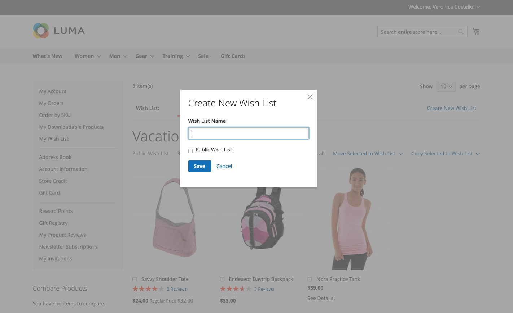

# 希望列表店面体验

愿望清单是客户回忆自己喜欢但还没准备好购买的产品的一种便捷方式。 可以将愿望清单中的商品与他人共享或添加到购物车。 如果客户有多个愿望清单，则当前愿望清单的名称将显示在页面顶部。 客户可以从其帐户信息板管理其愿望清单。 商店管理员还可以帮助客户从管理员那里管理他们的愿望清单。

{width="700" zoomable="yes"}

 Adobe Commerce支持每个客户帐户使用多个愿望清单。

 Magento Open Source代码库支持每个客户帐户使用一个愿望清单。

## 创建愿望清单

 (仅限Adobe Commerce)

在店面，客户可以从其帐户仪表板、产品页面、目录页面和购物车创建愿望清单。

### 方法1：来自客户帐户

1. 在其帐户仪表板的侧边栏中，客户选择 **[!UICONTROL My Wish List]**.

1. 在右上角，单击 **[!UICONTROL Create New Wish List]**.

1. 输入愿望清单名称。

1. 要允许其他人查看其愿望清单，请选择 **[!UICONTROL Public Wish List]** 复选框。

   >[!NOTE]
   >
   >两者之间的主要区别 `Public` 和 `Private` 愿望清单是个人愿望清单不是 [可搜索](wishlist-configuration.md#add-wish-list-search) 通过愿望清单。

1. 完成后，单击 **[!UICONTROL Save]**.

   {width="700" zoomable="yes"}

### 方法2：从目录页面

1. 从店面，客户转到目录页面，其中包含要添加到愿望清单中的产品。

1. 将鼠标悬停在产品上。

1. 客户单击“ ”旁边的箭头 _添加到愿望清单_ 图标并选择 **[!UICONTROL Create New Wish List]**.

1. 输入愿望清单名称。

1. 要允许其他人查看其愿望清单，请选择 **[!UICONTROL Public Wish List]** 复选框。

1. 完成后，单击 **[!UICONTROL Save]**.

### 方法3：从产品详细信息页面

1. 从店面，客户进入要添加到愿望清单中的产品的详细页面。

1. 单击旁边的箭头 **[!UICONTROL Add to Wish List]** 并选择 **[!UICONTROL Create New Wish List]**.

1. 进入 **[!UICONTROL Wish List Name]**.

1. 要允许其他人查看其愿望清单，请选择 **[!UICONTROL Public Wish List]** 复选框。

1. 完成后，单击 **[!UICONTROL Save]**.

   {width="700" zoomable="yes"}

### 方法4：从购物车

1. 客户打开 **[!UICONTROL Shopping Cart]** 页面。

1. 在项目下，单击旁边的箭头 **[!UICONTROL Move to Wishlist]** 并选择 **[!UICONTROL Create New Wish List]**.

1. 进入 **[!UICONTROL Wish List Name]**.

1. 要允许其他人查看其愿望清单，请选择 **[!UICONTROL Public Wish List]** 复选框。

1. 完成后，单击 **[!UICONTROL Save]**.

{width="700" zoomable="yes"}

## 更新产品清单

1. 在愿望清单中，客户指向产品以显示选项。

1. 添加 **[!UICONTROL Comment]** 有关产品，请在价格下方的框中输入文本。

   {width="700" zoomable="yes"}

1. 要更改产品选项选择，请单击 **[!UICONTROL Edit]** 并执行以下操作：

   - 更新产品详细信息页面上的选项。
   - 点击次数 **[!UICONTROL Update Wish List]**.

## 将愿望清单产品添加到购物车

1. 在愿望清单中，客户指向要添加的产品。

1. 更新 **[!UICONTROL Qty]** 并根据需要编辑其他选项。

1. 点击次数 **[!UICONTROL Add to Cart]**.

## 共享愿望清单

1. 客户点击 **[!UICONTROL Share Wishlist]**.

1. 输入每个要接收愿望清单的人员的电子邮件地址，用逗号分隔。

1. 添加 **[!UICONTROL Message]** 以包含在电子邮件中。

1. 点击次数 **[!UICONTROL Share Wish List]**.

   {width="700" zoomable="yes"}

   该消息从您的主用户处发送 [商店联系人](../getting-started/store-details.md#store-email-addresses) 并包括每个产品的缩略图图像，以及指向您商店的链接。

   {width="500" zoomable="yes"}

## 编辑愿望清单

客户可以从其帐户仪表板以多种方式修改其愿望清单。

### 将项目移动到其他列表

 (仅限Adobe Commerce)

1. 客户选中要移动的每个项目的复选框。

1. 点击次数 **[!UICONTROL Move Selected to Wish List]** 并执行以下操作之一：

   - 选择现有的愿望清单。
   - 点击次数 **[!UICONTROL Create New Wish List]**.

### 将项目复制到其他列表

 (仅限Adobe Commerce)

1. 选中要移动的每个项目的复选框。

1. 点击次数 **[!UICONTROL Copy Selected to Wish List]** 并执行以下操作之一：

   - 选择现有的愿望清单。
   - 点击次数 **[!UICONTROL Create New Wish List]**.

## 删除愿望清单

 (仅限Adobe Commerce)

1. 客户打开要删除的愿望清单。

1. 点击次数 **[!UICONTROL Delete Wish List]**.

1. 提示确认时，单击 **[!UICONTROL OK]**.

>[!IMPORTANT]
>
>此操作无法撤消。

## 将愿望清单项目转移到购物车

要将所有愿望清单项目转移到购物车，客户单击 **[!UICONTROL Add All to Cart]**.

要添加单个物料，客户将执行以下操作：

1. 将鼠标悬停在该项目上并进入 **[!UICONTROL Qty]** 将它们添加到购物车。

1. 点击次数 **[!UICONTROL Add to Cart]**.

## 查找客户的愿望清单

如果 [愿望清单搜索小组件](wishlist-configuration.md#add-wish-list-search) 在您的商店页面中，客户可以按愿望清单所有者的姓名或电子邮件地址进行搜索。

1. 客户从愿望清单搜索小部件中选择搜索选项。

1. 输入愿望清单所有者的姓名或电子邮件地址并单击 **[!UICONTROL Search]**.

   此 _希望列表搜索_ 页面将打开，并且任何匹配的愿望清单都会显示在搜索结果部分中。

   >[!NOTE]
   >
   >搜索结果中仅显示公开的愿望清单 — 客户的私人愿望清单不会公开显示。

1. 要查看希望列表项的列表，请单击 **[!UICONTROL View]**.

   将显示每个愿望清单的所有者名称和上次更新日期。

1. 要将产品添加到购物车，客户将选中产品下方的复选框，然后单击 **[!UICONTROL Add to Cart]**.

   您也可以将喜欢的其他客户的愿望清单中的商品添加到您自己的愿望清单中。
