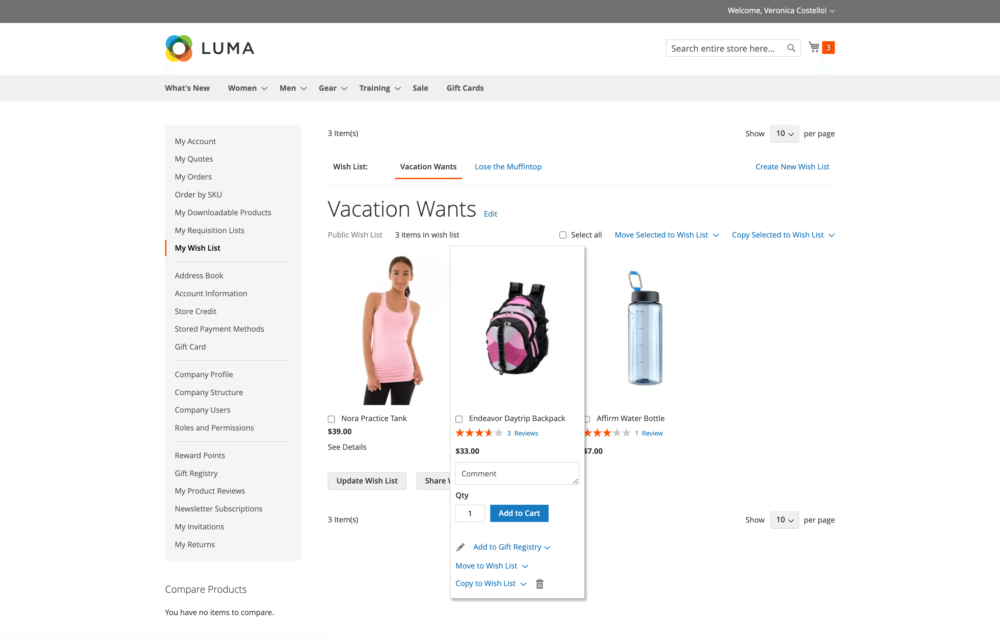

# 愿望清单

愿望清单是注册客户可与好友共享或保存以便稍后转移到购物车的产品列表。 启用愿望清单后，添加到愿望清单链接会出现在商店中每个产品的类别和产品页面上。 根据主题，它可能是文本链接或图形图像。

 Adobe Commerce支持每个客户帐户使用多个愿望清单。

Magento Open Source支持为每个客户帐户使用单一愿望清单。

共享愿望清单从商店电子邮件地址发送，但邮件正文包含来自客户的个性化注释。 您可以自定义在共享愿望清单时使用的电子邮件模板，并选择显示为发件人的商店联系人。

可以从[客户帐户](../customers/account-dashboard.md)的仪表板更新愿望清单。 客户或商店管理员可以在愿望清单和购物车之间添加或转移商品。

{width="700" zoomable="yes"}

将具有多个选项的产品添加到愿望列表时，客户选择的任何选项都包含在愿望列表项描述中。 例如，如果客户将同一对鞋以三种不同的颜色添加，则每对鞋都会显示为单独的愿望清单项目。 但是，如果客户将同一产品多次添加到希望列表中，则该产品只会出现一次，但会从产品页面中选择数量。

## 希望在管理员中提供列表帮助

客户可以通过登录到店面上的帐户来[管理他们的愿望清单](wishlist-storefront.md)。 作为商店管理员，您还可以从管理员管理客户愿望清单。

**_要从管理员更新愿望清单项目：_**

1. 在&#x200B;_管理员_&#x200B;侧边栏上，转到&#x200B;**[!UICONTROL Customers]** > **[!UICONTROL All Customers]**。

1. 在列表中查找该客户并单击&#x200B;_[!UICONTROL Action]_列中的&#x200B;**[!UICONTROL Edit]**。

1. 在左侧面板中，选择&#x200B;**[!UICONTROL Wish List]**&#x200B;并在列表中查找要编辑的项目。

   为产品选择的任何选项都会显示在产品名称下方。

   {width="600" zoomable="yes"}

1. 要编辑产品选项，请执行以下操作：

   - 在&#x200B;**[!UICONTROL Action]**&#x200B;列中，单击&#x200B;**[!UICONTROL Configure]**。

   - 在产品页面上，根据需要更新选项和&#x200B;**[!UICONTROL Quantity]**。

   - 单击&#x200B;**[!UICONTROL OK]**。

1. 完成后，单击&#x200B;**[!UICONTROL Save Customer]**&#x200B;或&#x200B;**[!UICONTROL Save and Continue Edit]**。
