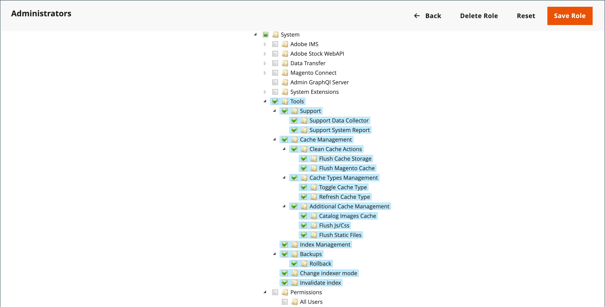

# 缓存管理

Adobe Commerce和Magento Open Source缓存管理系统提供了一种提高站点性能的简单方法。 每当缓存需要刷新时，都会在工作区顶部显示一条通知，其中包含指向 [!UICONTROL Cache Management] 可在其中查看和刷新缓存的页面。

{width="500"}

此 _[!UICONTROL Cache Management]_页面显示每个主缓存及其关联标记的状态。 右上角的大按钮可用于刷新缓存或包含所有内容的缓存存储。 在页面底部，通过其他按钮可刷新目录产品图像缓存和JavaScript/CSS缓存。

>[!IMPORTANT]
>
>当目录实体发生更改时，可能会影响其他页面，同时使多个缓存失效。 在查看缓存管理页面时，您可能会看到需要刷新的无效项目 _**未直接编辑**_. 例如，当您编辑目录中分配给任何类别的任何产品，或更改任何相关的产品规则时，就会发生此失效。

清除缓存后，请始终刷新浏览器，以确保您能够看到最新文件。 清除Commerce缓存不会清除Web浏览器缓存。 您可能需要清除浏览器缓存才能查看更新的内容。

有关Adobe Commerce缓存的其他技术信息，请参阅 [缓存概述](https://developer.adobe.com/commerce/frontend-core/guide/caching/){：target=&quot;_blank&quot;}在 _Commerce前端开发指南_.

访问 _[!UICONTROL Cache Management]_执行下列操作之一，创建页面：

- 单击 **[!UICONTROL Cache Management]** 工作区上方消息中的链接。
- 在 _管理员_ 侧栏，转到 **[!UICONTROL System]** > _[!UICONTROL Tools]_>**[!UICONTROL Cache Management]**.

{width="700" zoomable="yes"}

## 缓存最佳实践

在Commerce中，重新索引和缓存具有不同的目的。 [索引](index-management.md) 跟踪数据库信息以提高搜索性能、加快存储前端的数据检索等等。 缓存可保存加载的数据、图像、格式等，以提高加载和访问店面的性能。

- 安装扩展/模块后，请始终刷新缓存。 您可以安装一个或多个扩展，然后刷新缓存。
- 安装Commerce后刷新缓存。 对于全新安装，您还应重新编入索引。
- 从一种开源版本或商业版本升级到另一种版本后刷新缓存。
- 刷新缓存时，请考虑缓存类型并计划在非高峰期进行刷新。 例如，选择一个很少客户访问网站的时间，如深夜或清晨。 高峰期清除某些缓存类型会导致管理员负载过高，并可能导致站点停机，直到运行完毕。
- 时间 [重新索引](index-management.md)，您无需同时执行刷新缓存。

## 缓存管理角色资源

特定缓存维护操作的访问权限可以按角色分配给用户，包括查看、切换和刷新缓存的选项。 Adobe建议仅对管理员级别的用户启用刷新操作。 提供对所有缓存管理功能的访问可能会影响您店面的性能。

{width="600" zoomable="yes"}

有关分配资源以授予管理员用户帐户访问权限的信息，请参阅 [角色资源](permissions-user-roles.md#role-resources). 以下资源控制对缓存管理工具的访问：

- [!UICONTROL Clean Cache Actions]

   - [!UICONTROL Flush Cache Storage]
   - [!UICONTROL Flush Magento Cache]

- [!UICONTROL Cache Type Management]

   - [!UICONTROL Toggle Cache Type]
   - [!UICONTROL Refresh Cache Type]

- [!UICONTROL Additional Cache Management]

   - [!UICONTROL Catalog Images Cache]
   - [!UICONTROL Flush Js/Css]
   - [!UICONTROL Flush Static Files]

## 刷新特定缓存

1. 对于每个要刷新的缓存，选中行开头的复选框。

1. 设置 **[!UICONTROL Actions]** 到 `Refresh` 并单击 **[!UICONTROL Submit]**.

## 执行成批活动刷新

1. 要选择一组缓存，请设置 **[!UICONTROL Mass Actions]** 更改为以下任一项：

   - `Select All`
   - `Select Visible`

1. 选中操作要定位的每个缓存对应的复选框。

1. 设置 **[!UICONTROL Actions]** 到 `Refresh` 并单击 **[!UICONTROL Submit]**.

## 刷新产品图像缓存

1. 下 _[!UICONTROL Additional Cache Management]_，单击&#x200B;**[!UICONTROL Flush Catalog Images Cache]**以清除预生成的产品图像文件。

   此 `Image cache was cleaned` 消息显示在工作区顶部。

1. 清除浏览器的缓存。

## 刷新JavaScript/CSS缓存

1. 下 _[!UICONTROL Additional Cache Management]_，单击&#x200B;**[!UICONTROL Flush JavaScript/CSS Cache]**清除已合并到单个文件中的任何JavaScript和CSS文件。

   此 `The JavaScript/CSS cache has been cleaned` 消息显示在工作区顶部。

1. 清除浏览器的缓存。

## 使用命令行刷新

有权访问Commerce应用程序服务器的系统管理员和开发人员还可以使用Commerce CLI从命令行管理缓存和缓存配置。 请参阅 [管理缓存](https://experienceleague.adobe.com/en/docs/commerce-operations/configuration-guide/cli/manage-cache#:~:text=You%20can%20also%20clean%20and,bin%2Fmagento%20cache%3Aclean%20.) 在 _配置指南_.{：target=&quot;_blank&quot;}.

## 控件

| 控件 | 描述 |
|---------------------------|------------------------------------------------------------------------------------------------------------------------------------------------------------------------------------------------------------------------------------------------------------------------------------------------------------------------------------------------------------|
| [!UICONTROL Mass Actions] | 选中多个缓存的复选框。 选项：  **[!UICONTROL Select All]**— 选中所有缓存的复选框。 **&#x200B;取消全选&#x200B;**— 清除所有缓存的复选框。 **[!UICONTROL Select Visible]**  — 选中所有可见缓存的复选框。  **[!UICONTROL Unselect Visible]**— 清除所有可见缓存的复选框。 |
| [!UICONTROL Actions] | 确定要应用于所有选定缓存的操作。 选项：  **[!UICONTROL Enable]**— 启用所有选定的缓存。 **[!UICONTROL Disable]**  — 禁用所有选定的缓存。  **[!UICONTROL Refresh]**— 刷新所有选定的缓存。 |
| [!UICONTROL Submit] | 将操作应用于所有选定的缓存。 |

{style="table-layout:auto"}

### 按钮

| 按钮 | 描述 |
|-----------------------------------------|----------------------------------------------------------------------------------------------------------------------------------------------------------------------------------------------------------------------------------------|
| [!UICONTROL Flush Magento Cache] | 删除默认Commerce缓存中的所有项目(`var/cache`)，根据他们关联的Commerce标记。 |
| [!UICONTROL Flush Cache Storage] | 从缓存中删除所有项目，而不考虑Commerce标记。 如果您的系统使用备用缓存位置，则其他应用程序使用的任何缓存文件都将在此过程中删除。 |
| [!UICONTROL Flush Catalog Images Cache] | 删除存储在中的所有自动调整大小的带水印的目录图像 `media/catalog/product/cache`. 如果最近上传的图像未反映在目录中，请尝试刷新目录并刷新浏览器。 |
| [!UICONTROL Flush JavaScript/CSS Cache] | 从缓存中删除JavaScript和CSS文件的合并副本。 如果最近对样式表或JavaScript所做的更改未反映在存储中，请尝试刷新JavaScript/CSS缓存并刷新浏览器。 |
| [!UICONTROL Flush Static Files Cache] | 删除预处理视图文件和静态文件。 |

{style="table-layout:auto"}

### 缓存

此 [!UICONTROL Cache Management] 页面列出了可从管理员管理的缓存类型及其当前状态。 此部分介绍Adobe Commerce支持的默认缓存类型。 此 _缓存标记_ 和 _缓存ID_ 列描述Commerce应用程序代码中使用的值：

- `cache_type_id` 定义缓存类型的唯一标识符。

- `%CACHE_TYPE_TAG%` 定义要在缓存类型范围中使用的唯一标记。

在自定义或与Adobe Commerce集成时(例如使用GraphQL API开发集成)，开发人员和系统集成商可以使用这些值配置和管理缓存。 此 `cache type id` 也用于使用Commerce CLI从应用程序服务器命令行进行缓存管理，例如 ` bin/magento cache:status config` 显示配置缓存的当前状态。

>[!NOTE]
>
>开发人员和系统集成商可以自定义和扩展Commerce缓存管理系统，以支持自定义模块和集成。 有关详细信息，请参阅 [配置缓存](https://experienceleague.adobe.com/en/docs/commerce-operations/configuration-guide/cache/caching-overview) 在 _Adobe Commerce配置指南_.

<!-- prettier-ignore -->

#### 缓存列表详细信息

| 缓存 | 描述 | 缓存标记 | 缓存ID |
|-------|------------|----------|----------|
| [!UICONTROL Configuration] | Commerce从所有模块收集XML配置，将其合并，并将合并的结果保存到缓存中。 **[!UICONTROL System]**-  `config.xml`，`local.xml` **[!UICONTROL Module]** - `config.xml`  此缓存还包含存储在文件系统和数据库中的特定于存储的设置。 修改配置文件后，清除或刷新此缓存类型。 | `CONFIG` | `config` |
| [!UICONTROL Layouts] | 已编译的页面布局，即来自所有组件的布局组件。 在修改布局文件后，清理或刷新此缓存类型。 | `LAYOUT_GENERAL_CACHE_TAG` | `layout` |
| [!UICONTROL Blocks HTML output] | 每个块的页面片段HTML。 在修改视图层后，清理或刷新此缓存类型。 | `BLOCK_HTML` | `block_html` |
| [!UICONTROL Collections Data] | 存储数据库查询结果的集合数据文件。 如有必要，Commerce会自动清理此缓存，但第三方开发人员可以将任何数据放入缓存的任何区段中。 如果自定义模块使用的逻辑导致Commerce无法清理的缓存条目，请清理或刷新此缓存类型。 | `COLLECTION_DATA` | `collections` |
| [!UICONTROL Reflections] | 清除通常在运行时生成的API接口反射数据。 | `REFLECTION` | `reflection` |
| `Database DDL operations` | 数据库模式。 如有必要，Commerce会自动清理此缓存，但第三方开发人员可以将任何数据放入缓存的任何区段中。 在对数据库架构进行自定义更改后，清除或刷新此缓存类型。 （换言之，这些是Commerce本身不提供的更新。） 自动更新数据库架构的一种方法是使用magento设置:db-schema:升级命令。 | `DB_DDL` | `db_ddl` |
| [!UICONTROL Compiled Config] | 代码编译的结果。 | `COMPILED_CONFIG` | `compiled_config` |
| [!UICONTROL Webhooks Response Cache] | 缓存对webhook请求的响应。 欲了解更多信息，请参见 [Webhooks指南](https://developer.adobe.com/commerce/extensibility/webhooks/release-notes/#enhancements-2) 在Commerce开发人员文档中。 | `WEBHOOKS_RESPONSE` | `webhooks_response` |
| [!UICONTROL EAV types and attributes] | 与EAV属性相关的元数据的实体类型声明缓存（例如，存储标签、指向相关PHP代码的链接、属性渲染、搜索设置等）。 您通常不需要清理或刷新此缓存类型。 | `EAV` | `eav` |
| [!UICONTROL Customer Notification] | 显示在用户界面中的临时通知。 | `CUSTOMER_NOTIFICATION` | `customer_notification` |
| [!UICONTROL GraphQL Query Resolver Results] | 缓存来自客户、CMS页面、CMS块和产品媒体集实体的GraphQL查询解析器的结果。 启用此缓存可提高GraphQL性能。 | `GRAPHQL_QUERY_RESOLVER_RESULT` | `graphql_query_resolver_result` |
| [!UICONTROL Integrations Configuration] | 集成配置文件。 在更改或添加集成后，清理或刷新此缓存。 | `INTEGRATION` | `config_integration` |
| [!UICONTROL Integrations API Configuration] | 为存储集成编译了集成API配置。 | `INTEGRATION_API_CONFIG` | `config_integration_api` |
| [!UICONTROL Admin UI SDK Cache] | 将自定义项缓存给管理员。 请参阅 [管理员配置和测试](https://developer.adobe.com/commerce/extensibility/admin-ui-sdk/configuration/) 在 _管理UI SDK指南_. | `ADMIN_UI_SDK` | `admin_ui_sdk` |
| [!UICONTROL Page Cache] | 全页缓存。 | `FPC` | `full_page` |
| [!UICONTROL Target Rule] | Target规则索引 | `TARGET_RULE` | `target_rule` |
| [!UICONTROL Web Services Configuration] | 正在缓存Web API结构。 | `WEBSERVICE` | `config_webservice` |
| [!UICONTROL Translations] | 翻译文件。 | `TRANSLATE` | `translate` |

{style="table-layout:auto"}

## 全页缓存

Adobe Commerce和Magento Open Source使用服务器上的全页缓存快速显示类别、产品和CMS页面。 全页缓存可缩短响应时间并降低服务器的负载。 如果没有缓存，每个页面可能需要运行代码块并从数据库中检索信息。 但是，在启用全页缓存的情况下，可以直接从缓存中读取完全生成的页面。

>[!NOTE]
>
>建议 [清漆缓存](https://varnish-cache.org/){：target=&quot;_blank&quot;}只能在生产环境中使用。

缓存的内容可用于处理来自类似访问类型的请求。 因此，向临时访客显示的页面可能与向客户显示的页面不同。 对于缓存，每次访问属于以下三种类型之一：

- `Non-sessioned`  — 在非会话访问期间，购物者会查看页面，但不会与商店进行交互。 系统缓存每个查看页面的内容，并将它们提供给其他无会话购物者。
- `Sessioned`  — 在会话访问期间，会为通过比较产品或向购物车添加产品等活动与商店进行交互的购物者分配一个会话ID。 会话期间生成的缓存页面仅供该购物者在会话期间使用。
- `Customer`  — 为已在您的商店和商店中注册了帐户并登录到其帐户的用户创建客户会话。 在该会议中，可以向客户显示基于其分配的客户组的特殊优惠、促销和价格。

有关技术信息，请参阅 [配置和使用清漆](https://experienceleague.adobe.com/docs/commerce-operations/configuration-guide/cache/varnish/config-varnish.html){：target=&quot;_blank&quot;}和 [将Redis用于Commerce页面和默认缓存](https://experienceleague.adobe.com/docs/commerce-operations/configuration-guide/cache/redis/redis-pg-cache.html){：target=&quot;_blank&quot;}在 _配置指南_.

**_要配置全页缓存，请执行以下操作：_**

1. 在 _管理员_ 侧栏，转到 **[!UICONTROL Stores]** > _[!UICONTROL Settings]_>**[!UICONTROL Configuration]**.

1. 在左侧面板中，展开 **[!UICONTROL Advanced]** 并选择 **[!UICONTROL System]**.

1. 展开  该 **[!UICONTROL Full Page Cache]** 部分。

   {width="600" zoomable="yes"}

1. 设置 **[!UICONTROL Caching Application]** 更改为以下任一项：

   - `Built-in Application`
   - `Varnish Caching`

1. 要设置页面缓存的超时，请输入 **[!UICONTROL TTL for public content]**. (默认值为 `86400`)

1. 要指定最大数量 [布局句柄](https://developer.adobe.com/commerce/frontend-core/guide/layouts/#layout-handles) 处理 [`{BASE-URL}/page_cache/block/esi`](https://experienceleague.adobe.com/docs/commerce-operations/configuration-guide/cache/use-varnish-esi.html) HTTP端点，输入 **[!UICONTROL Handles param size]**. 限制大小可以提高安全性和性能。 (默认值为 `100`)

1. 如果使用清漆，请完成 **[!UICONTROL Varnish Configuration]** 部分如下所示：

   - **[!UICONTROL Access list]**  — 输入可以清除Varnish配置以生成配置文件的IP地址。 用逗号分隔多个条目。 默认值为 `localhost`.

   - **[!UICONTROL Backend host]**  — 输入生成配置文件的后端主机的IP地址。 默认值为 `localhost`.

   - **[!UICONTROL Backend port]**  — 标识用于生成配置文件的后端端口。 默认值为： `8080`.

   - **[!UICONTROL Grace period]**  — 指定用作生成配置文件的宽限期的秒数。 请参阅 [高级清漆配置](https://experienceleague.adobe.com/docs/commerce-operations/configuration-guide/cache/config-varnish-advanced.html) 在 _配置指南_.

   - 要将配置导出为 `varnish.vcl` 文件，单击您使用的Varnish版本的按钮。

   {width="600" zoomable="yes"}

1. 完成后，单击 **[!UICONTROL Save Config]**.
