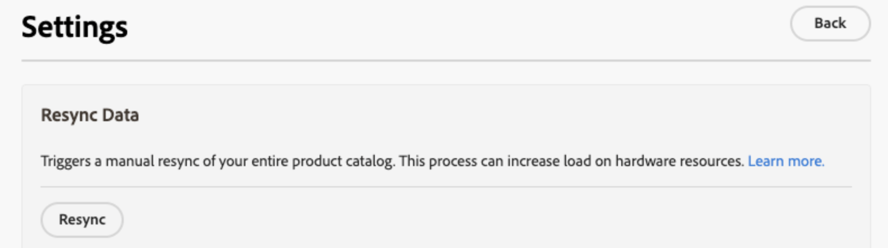

# 数据管理功能板

数据管理功能板提供了从Commerce数据库传输到Commerce SaaS服务的产品数据的同步状态的概述。 用户可以方便地监视产品同步状态，并从统一仪表板启动数据重新同步。 此功能为您的店面产品数据的可用性提供了宝贵的见解，确保可及时向购物者显示这些数据。

## 受众

所有使用有效许可证的[[!DNL Product Recommendations v6.0.0]](https://experienceleague.adobe.com/en/docs/commerce-merchant-services/product-recommendations/guide-overview)、[[!DNL Live Search v4.1.0]](https://experienceleague.adobe.com/en/docs/commerce-merchant-services/live-search/guide-overview)或[[!DNL Catalog Service v1.17]](https://experienceleague.adobe.com/en/docs/commerce-merchant-services/catalog-service/guide-overview)的Commerce商家均可免费使用数据管理功能板。

数据管理仪表板位于&#x200B;*系统* >数据传输> *数据管理仪表板*。

仪表板包含以下字段：

| 字段 | 描述 |
|--- |--- |
| 范围 | 同步数据的特定网站。 |
| [!DNL Product Recommendations] | 显示[!DNL Product Recommendations]的同步状态、已同步的产品数以及[可显示](https://experienceleague.adobe.com/en/docs/commerce-admin/config/catalog/inventory#stock-options)已同步产品的表。 |
| [!DNL Live Search] | 显示[!DNL Live Search]的同步状态、已同步的产品数以及[可显示](https://experienceleague.adobe.com/en/docs/commerce-admin/config/catalog/inventory#stock-options)已同步产品的表。 |
| [!DNL Catalog Service] | 显示[!DNL Catalog Service]的同步状态、已同步的产品数和已同步产品的表。 |
| 设置 | 打开一个对话框，您可以[手动重新同步目录数据](#resync-catalog-data)。 |
| 同步状态 | 显示过去三小时内已从Commerce数据库传输到任何SaaS服务的产品数。 如果您不经常更新目录，此值通常为零。 如果正在进行同步，请单击&#x200B;**[!UICONTROL Refresh]**&#x200B;以获取更新的计数。 |
| 产品计数 | 反映可供该服务使用的目录产品的总数。 [!DNL Product Recommendations]和[!DNL Live Search]功能板显示&#x200B;_可显示_&#x200B;产品的总数。 [!DNL Catalog Service]无法按可显示内容筛选产品，因此如果您同时安装了[!DNL Catalog Service]和[!DNL Live Search]或[!DNL Product Recommendations]，则两个功能板可能会显示两个不同的产品计数值。 |
| 已同步的产品 | 提供了有关核心Commerce索引中产品的详细信息。 默认情况下，此表按“上次更新时间”排序。 要查找特定产品，请使用&#x200B;**[!UICONTROL Search by SKU]**&#x200B;字段。 要控制显示的列，请单击表右侧的&#x200B;**[!UICONTROL Customize Table]**。 |

## 使用数据管理功能板

当您更新Commerce数据库中的产品时，产品数据会根据您的系统配置传输到SaaS服务。 同步进程启动时，**产品计数**&#x200B;指示发送到SaaS服务的产品数。

>[!IMPORTANT]
>
>完成同步所需的时间因目录大小和更新数据的数量而异。

当处理的产品数与更新的产品数匹配时，表示同步已完成。

>[!NOTE]
>
>Adobe还提供了命令行界面和系统日志，开发人员和系统集成人员可以使用它们来管理和跟踪Commerce SaaS服务的同步操作以及排除错误。 有关详细信息，请参阅[SaaS数据导出指南](https://experienceleague.adobe.com/en/docs/commerce-merchant-services/saas-data-export/overview)。

### 已同步的产品列表

要查看同步产品的详细信息，请单击表中的产品。

### 重新同步目录数据

为确保您的Commerce SaaS服务始终保持最新的产品信息，您应[实施同步目录数据的计划](https://experienceleague.adobe.com/en/docs/commerce-operations/configuration-guide/cli/manage-indexers#reindex)。

虽然您可以[手动启动](#manually-resync-catalog)将目录数据从Commerce数据库重新同步到SaaS服务，但不建议这样做，因为它可能会增加硬件资源的负载。 但是，在以下情况下，可能需要手动重新同步目录：

- 每当对产品目录进行重大更改时，例如添加新产品、更新产品详细信息或修改类别

- 如果您注意到在店面显示产品数据时出现任何差异或性能问题

- 在对Commerce数据库和SaaS服务之间的集成进行任何更新或更改后

- 在部署影响产品数据管理或同步过程的自定义项或配置时

通过遵守这些准则并根据需要主动重新同步目录数据，您可以维护整个Adobe Commerce生态系统中的数据一致性、准确性和可靠性。

#### 手动重新同步目录

如果需要重新同步目录数据，请单击页面右侧的&#x200B;**[!UICONTROL Settings]**&#x200B;以显示一个对话框，您可以在该对话框中启动重新同步。 重新同步目录数据会强制服务将数据从Commerce数据库重新提取到SaaS服务。

