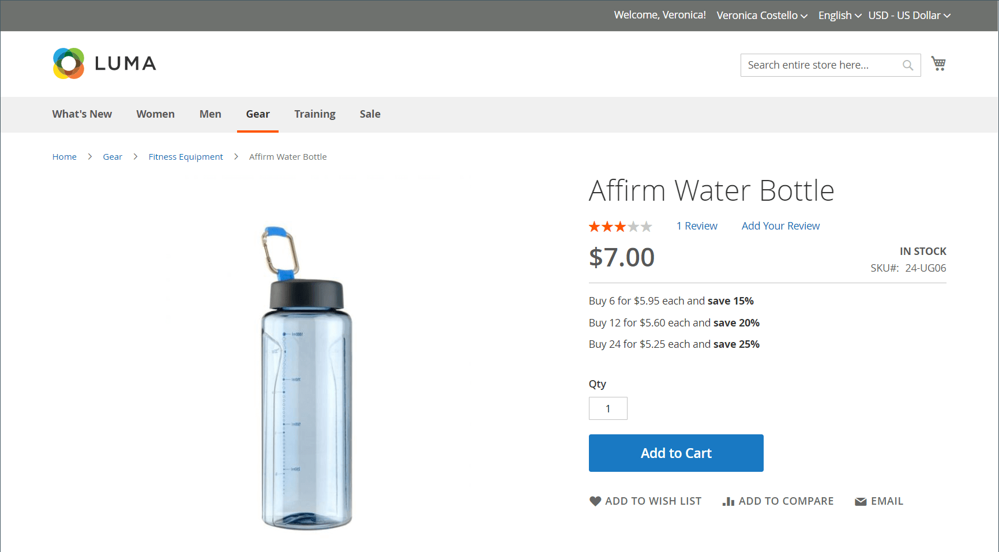

# 导入层价格

无需为每个产品手动输入[层价格](../catalog/product-price-tier.md)，可以[导入](data-import.md)定价数据更为有效。 在开始之前，请创建一个导出层价格数据的样例文件，以将其用作模板。

{width="700" zoomable="yes"}

## 步骤1：导出层价格数据

以下示例导出单个产品的层定价数据。 然后，您可以使用导出的数据作为批量导入层价格数据的模板。 要了解有关导出高级定价数据的更多信息，请参阅[高级定价数据](data-attributes-product.md#advanced-pricing-attributes)。

{width="600" zoomable="yes"}

1. 在&#x200B;_管理员_&#x200B;侧边栏上，转到&#x200B;**[!UICONTROL System]** > _[!UICONTROL Data Transfer]_>**[!UICONTROL Export]**。

1. 在&#x200B;_[!UICONTROL Export Settings]_&#x200B;下，将&#x200B;**[!UICONTROL Entity Type]**&#x200B;设置为`Advanced Pricing`。

1. 在&#x200B;**[!UICONTROL Entity Attributes]**&#x200B;网格中，向下滚动到SKU属性并执行以下操作：

   - 对于基于折扣百分比的层价格，输入要导出的每个产品的SKU，以逗号分隔。

     {width="600" zoomable="yes"}

   - 对于基于固定金额的层价格，请输入每个产品的SKU。

   - 向下滚动并单击&#x200B;**[!UICONTROL Continue]**。

1. 在Web浏览器的下载位置找到导出文件，然后打开该文件。

   {width="600" zoomable="yes"}

**_已导出层价格数据_**

导出的数据中包含以下列：

- `sku`
- `tier_price_website`
- `tier_price_customer_group`
- `tier_price_qty`
- `tier_price`
- `tier_price_value_type`

您可以使用导出的数据作为模板来导入层价格数据。

## 步骤2：更新数据

1. 根据需要更新每个产品的层价格数据。

   任何没有层价格更新的产品都可以从CSV文件删除。 无需重新导入未更改的产品。

1. **[!UICONTROL Save]**&#x200B;更新的CSV文件。

>[!NOTE]
>
>导入文件的大小不能大于2 MB。

## 步骤3：导入更新的数据

1. 在&#x200B;_管理员_&#x200B;侧边栏上，转到&#x200B;**[!UICONTROL System]** > _[!UICONTROL Data Transfer]_>**[!UICONTROL Import]**。

1. 在&#x200B;_导入设置_&#x200B;下，将&#x200B;**[!UICONTROL Entity Type]**&#x200B;设置为`Advanced Pricing`。

1. 将&#x200B;**[!UICONTROL Import Behavior]**&#x200B;设置为`Add/Update`。

1. 在&#x200B;**[!UICONTROL File to Import]**&#x200B;下，单击&#x200B;**[!UICONTROL Choose File]**&#x200B;并选择您准备从目录中导入的文件。

1. 单击右上角的&#x200B;**[!UICONTROL Check Data]**。

1. 如果文件有效，请单击&#x200B;**[!UICONTROL Import]**。

   否则，请纠正消息中列出的数据存在的每个问题，然后再次尝试导入文件。
