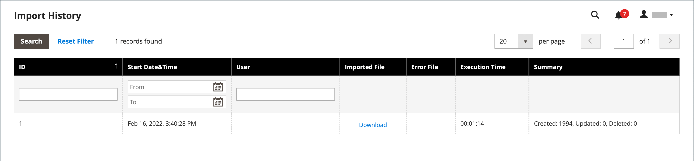

# 导入数据

所有产品类型的数据均可导入到存储中。 此外，您还可以导入产品、高级定价数据、客户数据、客户地址数据和产品图像。 导入支持以下操作：

- 添加/更新
- 替换
- 删除

## 导入准则

### 新实体

- 实体将使用CSV文件中指定的属性值添加。
- 对于未设置默认值的必需属性，如果没有值或无效值，则无法导入实体（对应的行）。
- 对于具有默认值设置的必需属性，如果没有值或无效值，则会导入实体（对应的行）并为属性设置默认值。
- 如果复杂数据无效，则无法导入实体（对应的行）。

### 现有实体

- 对于非复杂数据的属性，导入文件中的值（包括非必需属性的空值）将替换现有值。
- 如果所需属性没有值或存在无效值，则不会替换现有值。
- 如果实体的复杂数据无效，则无法导入该实体（对应的行或行），除非在“导入行为”下拉菜单中选择“删除实体”。

### 复杂数据

如果导入文件中指定的属性存在，且其值派生自定义的值集，则适用以下情况：

- 如果定义的值集中尚未包含该值，则可以导入该行并为属性设置默认值（如果已定义）。
- 如果该值已包含在定义的集中，则无法导入相应的行。
- 如果导入文件指定的属性名称尚未在系统中定义，则不会创建该文件，也不会导入其值。

### 无效文件

- 如果所有行都无效，则无法导入文件。
- 在导入文件中指定了不存在的服务数据或复杂的数据名称，如具有`_<non-existing name>`标题的列。

Adobe Commerce的导入过程可能无法正确识别使用字节顺序标记(BOM)的UTF-8编码的文件。 在导入过程中，包含BOM的文件可能会导致问题或失败。

## 导入操作

| 操作 | 描述 |
| --------- | ----------- |
| 添加/更新 | 新产品数据将添加到数据库中现有条目的现有产品数据中。 可以更新除`sku`之外的所有字段。  导入数据中指定的新税种是自动创建的。  导入文件中指定的新产品类别将自动创建。  导入文件中指定的新SKU是自动创建的&#x200B;  **_注意：_**&#x200B;对于产品，您可以通过导入来更新除SKU之外的所有字段。  **_重要提示：_**&#x200B;使用&#x200B;_添加/更新_&#x200B;导入行为无法删除多个字段值，例如网站或类别。 导入后，如果这些字段未在CSV文件中列出，则它们会保留在数据库中。 |
| 替换 | 现有产品数据将被新数据替换。  **_重要信息：_**&#x200B;替换数据时请务必小心，因为现有产品数据已被清除，并且系统中的所有引用都将丢失。  如果导入数据中的SKU与现有实体的SKU匹配，则所有字段（包括SKU）都将被删除，并使用CSV数据创建新记录。 如果CSV文件引用的SKU在数据库中不存在，则会发生错误。 您可以检查数据以显示错误。 |
| 删除 | 导入数据中存在于数据库中的任何实体都将从数据库中删除。  Delete忽略导入数据中的所有列（SKU除外）。 您可以忽略数据中的所有其他属性。  如果CSV文件引用的SKU在数据库中不存在，则会发生错误。 您可以检查数据以显示错误。 |

{style="table-layout:auto"}

## 导入流程

导入文件的大小由服务器上`php.ini`文件中的设置决定。 _导入_&#x200B;页上的系统消息指示当前的大小限制。 默认大小为2 MB。

特殊字符（如等号、大于和小于符号、单引号和双引号、反斜杠、管道和&amp;符号）可能会导致数据传输过程中出现问题。 为确保正确解释此类特殊字符，可以将它们标记为&#x200B;_转义序列_。 例如，如果数据包含诸如`code="str"`、`code="str2"`之类的文本字符串，则选择用双引号将文本括起来可确保将原始双引号理解为数据的一部分。 当系统遇到双引号集时，它知道外双引号集将实际数据括起来。

导入产品数据时，新产品数据将添加到数据库中的现有产品数据条目中。 除SKU外的所有字段均可通过导入进行更新。 所有现有产品数据都将被导入的新数据替换。 替换数据时请务必谨慎。 所有现有的产品数据都将被清除，并且系统中的所有引用都将丢失。

{width="600" zoomable="yes"}

### 步骤1：准备数据

1. 在&#x200B;_管理员_&#x200B;侧边栏上，转到&#x200B;**[!UICONTROL System]** > _[!UICONTROL Data Transfer]_>**[!UICONTROL Import]**。

1. 在&#x200B;_导入设置_&#x200B;下，将&#x200B;**[!UICONTROL Entity Type]**&#x200B;设置为以下项之一：

   - `Advanced Pricing`
   - `Products`
   - `Customer Finances`
   - `Customers and Addresses`
   - `Customers Main File`
   - `Customer Addresses`
   - `Stock Sources`

1. 单击&#x200B;**[!UICONTROL Download Sample File]**。

1. 在Web浏览器的下载位置找到导出文件，然后打开该文件。

   样例文件包含列标题，其中带有产品类型的占位符数据。

   {width="600" zoomable="yes"}

1. 检查样例文件的结构，并使用它准备CSV导入文件，确保列标题拼写正确。

1. 验证导入文件的大小是否不超过消息中显示的限制。

   {width="600"}

1. 如果导入数据包含指向产品图像的路径，请确保已将图像文件上传到相应的位置。

   Commerce服务器上的默认位置为： `pub/media/import`。

   如果映像驻留在外部服务器上，请确保您具有包含映像的目录的完整URL。

### 步骤2：选择导入行为

{width="600" zoomable="yes"}

1. 将&#x200B;**[!UICONTROL Import Behavior]**&#x200B;设置为以下项之一：

   - `Add/Update` （对于产品，您可以通过导入更新除SKU之外的所有字段。）
   - `Replace`
   - `Delete`

1. 要确定导入数据时遇到错误时会发生什么情况，请选择以下选项之一：

   - `Stop on Error`
   - `Skip error entries`

1. 对于&#x200B;**[!UICONTROL Allowed Errors Count]**，输入在取消导入之前可能发生的错误数。

   默认值为10。

1. 接受&#x200B;**[!UICONTROL Field separator]**&#x200B;的逗号(`,`)默认值。

1. 接受&#x200B;**[!UICONTROL Multiple value separator]**&#x200B;的逗号(`,`)默认值。

   在CSV文件中，逗号是默认分隔符。 要使用其他字符，请确保CSV文件中的数据与您指定的字符匹配。

1. 接受&#x200B;**[!UICONTROL Empty attribute value constant]**&#x200B;的默认值`_EMPTY_VALUE_`。

1. 如果要以&#x200B;_转义序列_&#x200B;形式包含数据中可能存在的任何特殊字符，请选中&#x200B;**[!UICONTROL Fields Enclosure]**&#x200B;复选框。

### 步骤3：标识导入文件

{width="600" zoomable="yes"}

1. 单击&#x200B;**[!UICONTROL Choose File]**&#x200B;选择要导入的文件。

1. 查找您准备导入的CSV文件，然后单击&#x200B;**[!UICONTROL Open]**。

1. 对于&#x200B;**[!UICONTROL Images File Directory]**，输入Commerce服务器上存储上载图像的位置的相对路径。

   例如： `product_images`。

   >[!NOTE]
   >
   >从Adobe Commerce和Magento Open Source`2.3.2`版本开始，_[!UICONTROL Images File Directory]_&#x200B;中指定的路径将连接以导入到映像基目录： `<Magento-root-folder>/var/import/images`。 例如，将`product_images`文件放置在`<Magento-root-directory>/var/import/images/product_images`文件夹中。 可以在`\Magento\ImportExport\etc\config.xml`文件中配置导入映像基目录。 如果启用了远程存储模块，请将文件导入到`<remote-storage-root-directory>/var/import/images/product_images`文件夹。

   要了解有关导入产品映像的详细信息，请参阅[导入产品映像](data-import-product-images.md)。

### 步骤4：检查导入数据

1. 单击右上角的&#x200B;**[!UICONTROL Check Data]**。

1. 请稍等片刻，等待验证过程完成。

   如果导入数据有效，将显示以下消息：

   {width="600"}

1. 如果文件有效，请单击&#x200B;**[!UICONTROL Import]**。

   否则，请纠正消息中列出的数据存在的每个问题，然后再次尝试导入文件。

1. 导入过程将持续到数据的结尾，除非遇到错误。

   如果“验证结果”中显示错误消息，请更正数据中的问题并再次导入文件。

   {width="600"}

   导入完成后，将显示一条消息。

## 导入历史记录

Commerce会保留已导入存储的数据记录，包括开始日期和时间、用户、执行时间以及导入文件的链接。 _执行时间_&#x200B;是导入过程的持续时间。

**_要查看导入历史记录：_**

在&#x200B;_管理员_&#x200B;侧边栏上，转到&#x200B;**[!UICONTROL System]** > _[!UICONTROL Data Transfer]_>**[!UICONTROL Import History]**。

{width="600" zoomable="yes"}

>[!NOTE]
>
>默认情况下，导入历史记录文件位于`<Magento-root-directory>/var/import_history`文件夹中。 如果启用了远程存储模块，则导入历史记录文件位于`<remote-storage-root-directory>/import_export/import_history`文件夹中。

| 字段 | 描述 |
|--- |--- |
| [!UICONTROL ID] | 用于指定转移的内部编号。 |
| [!UICONTROL Start Date & Time] | 进行转移的特定日期和时间。 |
| [!UICONTROL User] | 进行转移的客户。 |
| [!UICONTROL Imported file] | 用于下载导入文件的链接。 |
| [!UICONTROL Error file] | 相应的错误文件。 |
| [!UICONTROL Execution Time] | 导入进程的时间间隔。 |
| [!UICONTROL Summary] | 创建、更新和删除的项目数或错误消息。 |

{style="table-layout:auto"}

要下载&#x200B;_导入/错误_&#x200B;文件，请单击&#x200B;**[!UICONTROL Download]**。
