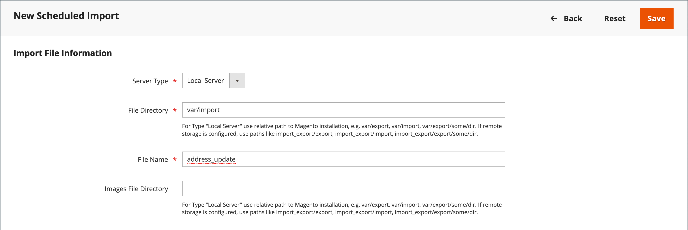
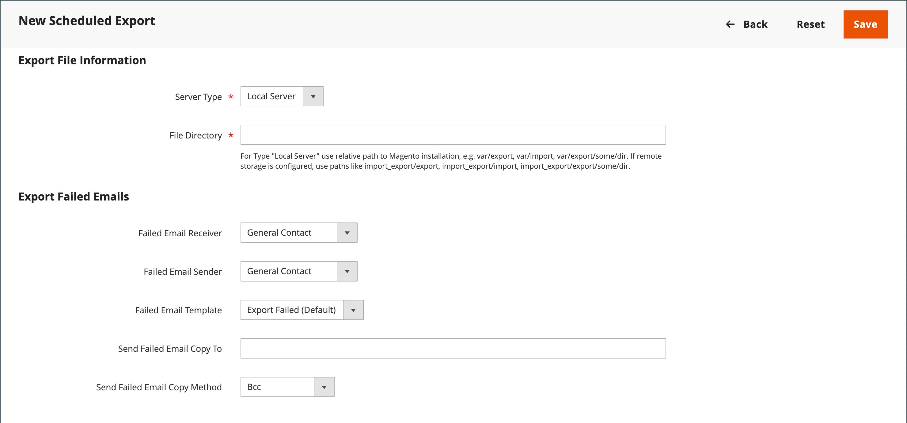

# 计划的导入和导出

{{ee-feature}}

计划的导入和导出可以每天、每周或每月运行。 要导入或导出的文件可以驻留在本地Adobe Commerce服务器或远程FTP服务器上。 默认情况下，会实施计划的导入/导出，并且不需要进行额外的配置。 所有计划的导入和导出都由Cron作业计划程序管理。

## 访问计划的导入/导出

1. 在 _管理员_ 侧栏，转到 **[!UICONTROL System]** > _[!UICONTROL Data Transfer]_>**[!UICONTROL Scheduled Imports/Exports]**.

   {width="700" zoomable="yes"}

1. 要创建新的计划导入或导出作业，请单击相应的按钮，然后按照计划作业类型的说明进行操作。

   - [添加计划导出](#schedule-an-export)
   - [添加计划导入](#schedule-an-import)

1. 保存记录后，作业将显示在 _[!UICONTROL Scheduled Import/Export]_网格。

   >[!NOTE]
   >
   >创建或更新计划的导入/导出时，会导致系统配置发生更改。 保存后，请确保您解决了显示在管理员页面顶部的缓存失效通知，并刷新缓存以应用新的或更新后的计划。

1. 在每个计划作业之后，文件副本将放在 `var/log/import_export` Adobe Commerce目录。

   每个操作的详细信息不会写入日志。 如果发生错误，则会发送有关失败的导入/导出作业的通知，并附上错误描述。

## 计划导入

对于可用的导入文件格式和导入实体的类型，计划的导入过程与手动导入过程类似：

- 导入文件应为.CSV格式
- 您可以导入产品和客户数据

使用计划导入的优点是，您可以在指定导入参数后多次自动导入数据文件，并且只安排一次。

每个导入操作的详细信息不会写入日志，但是当出现失败时，您会收到 _导入失败_ 包含错误说明的电子邮件。 上次计划导入作业的结果显示在“计划的导入/导出”页面的“上次结果”列中。

每次导入操作后，导入文件的副本将放在 `var/log/import_export` 部署Adobe Commerce或Magento Open Source的服务器上的目录。 时间戳、导入实体（产品或客户）的标记以及操作类型（在本例中为“导入”）将添加到导入文件名中。

在每个计划的导入作业之后，将自动执行重新索引操作。 前端，更新后的数据进入数据库后，描述等文字信息的变化才会反映出来，价格的变化只反映在重新索引操作之后。

### 步骤1：完成导入设置

1. 在 _管理员_ 侧栏，转到 **[!UICONTROL System]** > _[!UICONTROL Data Transfer]_>**[!UICONTROL Scheduled Import/Export]**.

1. 在右上角，单击 **[!UICONTROL Add Scheduled Import]**.

1. 设置计划和导入选项：

   - **[!UICONTROL Name]**  — 输入计划导入的名称。

   - **[!UICONTROL Description]**  — 输入简要说明，说明导入的用途及其使用方式。

   - **[!UICONTROL Entity Type]**  — 设置为以下任一项：

      - `Products`
      - `Advanced Pricing`
      - `Customers and Addresses (single file)`
      - `Customer Addresses`
      - `Customer Finances`
      - `Customers Main File`
      - `Stock Sources`

   - **[!UICONTROL Import Behavior]**  — 设置为以下任一项：

      - `Add/Update Complex Data`  — 将新的复杂数据添加到或更新到数据库中现有条目的现有复杂数据中。 这是默认值。
      - `Replace`  — 覆盖数据库中现有实体的现有复合体。
      - `Delete Entities`  — 删除数据库中的现有条目。
      - `Custom Action`  — 自定义数据库中的现有实体。

     >[!NOTE]
     >
     >对于 _[!UICONTROL Advanced Pricing]_，_[!UICONTROL Products]_， _[!UICONTROL Customers and Addresses (single file)]_、和_[!UICONTROL Stock Sources]_ 实体类型时，将显示以下导入行为： `Add/Update`， `Replace`、和 `Delete`. 对于 _客户财务_， _客户主文件_、和 _客户和地址_ 实体类型时，将显示以下导入行为： `Add/Update Complex Data`， `Delete Entities`、和 `Custom Action`.

   - **[!UICONTROL Start Time]**  — 设置为计划开始导入的小时、分钟和秒。

   - **[!UICONTROL Frequency]**  — 设置为以下任一项： `Daily`， `Weekly`，或 `Monthly`

   - **[!UICONTROL On Error]**  — 设置为以下任一项： `Stop Import` 或 `Continue Processing`

   - **[!UICONTROL Status]**  — 要激活计划的导入，请将设置为 `Enabled`.

   - **[!UICONTROL Field Separator]**  — 输入用于在导入文件中分隔字段的字符。 默认字符为逗号。

   - **[!UICONTROL Multiple Value Separator]**  — 输入用于在字段中分隔多个值的字符。

   {width="600" zoomable="yes"}

### 第2步：完成导入文件信息

1. 设置 **[!UICONTROL Server Type]** 更改为以下任一项：

   - `Local Server`  — 从安装了Adobe Commerce的同一服务器导入数据。
   - `Remote FTP`  — 从远程服务器导入数据。

   {width="600" zoomable="yes"}

   >[!NOTE]
   >
   >启用远程存储模块后， `Local Server` 自动切换到 `Remote Storage`.

1. 输入 **[!UICONTROL File Directory]** 导入文件的来源。

   - `Local Server`  — 在Commerce安装中输入相对路径。 例如， `var/import`. 如果已配置远程存储模块，请使用 `import_export/import`.
   - `Remote FTP server`  — 输入远程服务器上导入文件夹的完整URL和路径。

1. 输入 **[!UICONTROL File Name]** 以导入。

1. 对象 **[!UICONTROL Images File Directory]**，输入存储产品图像的目录的路径。

   在本地服务器上，输入相对路径，例如： `var/import`. 在远程存储上，输入相对路径，例如： `import_export/import` 或 `import_export/import/some/dir`.

### 步骤3：配置导入失败的电子邮件

{width="600" zoomable="yes"}

1. 设置 **[!UICONTROL Failed Email Receiver]** 给将在导入期间发生错误时收到通知的存储区联系人。

1. 设置 **[!UICONTROL Failed Email Sender]** 将显示为通知发件人的商店联系人。

1. 设置 **[!UICONTROL Failed Email Template]** 到用于通知的模板。

1. 对象 **[!UICONTROL Send Failed Email Copy To]**，输入接收通知副本的人员的电子邮件地址。

   用逗号分隔多个电子邮件地址。

1. 设置 **[!UICONTROL Failed Email Copy Method]** 更改为以下任一项：

   - `Bcc`  — 发送失败的导入通知的盲副本。 收件人的姓名和地址会包含在原始电子邮件分发中，但不会显示在视图中。
   - `Separate Email`  — 以单独的电子邮件发送失败的导入通知的副本。

1. 完成后，单击 **[!UICONTROL Save]**.

   新的计划导入作业将添加到 _[!UICONTROL Scheduled Import/Export]_页面。 在此页面中，可以立即运行它以进行测试和编辑。 在执行每个导入作业之前，将验证导入文件。

>[!NOTE]
>
>创建或更新计划的导入/导出时，会导致系统配置发生更改。 保存后，请确保您解决了显示在管理员页面顶部的缓存失效通知，并刷新缓存以应用新的或更新后的计划。

### 字段描述

#### [!UICONTROL Import Settings]

| 字段 | 描述 |
| ----- | ----------- | 
| [!UICONTROL Name] | 导入的名称。 帮助您区分是否创建了许多不同的计划导入。 |
| [!UICONTROL Description] | （可选）您可以输入说明。 |
| [!UICONTROL Entity Type] | 定义要导入的数据。 |
| [!UICONTROL Import Behavior] | 定义当要导入的实体存在于数据库中时如何处理复杂数据。 产品的复杂数据包括类别、网站、自定义选项、层价格、相关产品、向上销售、交叉销售和相关产品数据。 客户的复杂数据包括地址。 选项： **[!UICONTROL Add/Update Complex Data]**— 将新的复杂数据添加到或更新到数据库中现有条目的现有复杂数据中。 这是默认值。 **[!UICONTROL Add/Update]**  — 新数据将添加到数据库中的现有条目。 除外的所有字段 `sku` 可以针对产品进行更新。 导入后，CSV文件中未列出的任意多个字段值（例如类别或网站）将保留在数据库中。 **[!UICONTROL Replace]**— 替换现有实体的现有复杂数据。 **[!UICONTROL Delete Entities]**  — 如果导入的实体存在于数据库中，则会从数据库中删除它们。 **[!UICONTROL Custom Action]**— 在导入过程中自定义现有的复杂图元。 |
| [!UICONTROL Start Time] | 设置导入的开始时间（小时、分钟和秒）。 |
| [!UICONTROL Frequency] | 定义导入的运行频率。 选项： `Daily` / `Weekly` / `Monthly` |
| [!UICONTROL On Error] | 定义在文件验证期间发现错误时的系统行为。 选项： **停止导入**  — 如果在验证期间发现任何错误，则不导入文件。 这是默认值。 **继续处理**  — 如果在验证期间发现错误，但可以进行导入，则会导入文件。 |
| [!UICONTROL Status] | 默认情况下，会启用导入。 您可以通过将“状态”设置为来暂停它 `Disabled`. |
| [!UICONTROL Field Separator] | 确定用于分隔字段的字符。 默认值： `,` （逗号） |
| [!UICONTROL Multiple Value Separator] | 确定用于分隔字段中多个值的字符。 默认值： `,` （逗号） |

{style="table-layout:auto"}

#### [!UICONTROL Import File Information]

| 字段 | 描述 |
| ----- | ----------- | 
| [!UICONTROL Server Type] | 您可以从部署Commerce的同一服务器上的文件导入(选择 `Local Server`)或从远程FTP服务器(选择 `Remote FTP`)。 如果您选择 _[!UICONTROL Remote FTP]_，会出现其他凭据和文件传输设置选项。 如果启用了远程存储模块， `Local Server` 类型自动切换到 `Remote Storage`. |
| [!UICONTROL File Directory] | 指定导入文件所在的目录。 如果服务器类型设置为 _[!UICONTROL Local Server]_，指定相对于Commerce安装目录的路径。 例如： `var/import` 或 `import_export/import` 用于远程存储。 |
| [!UICONTROL File Name] | 指定导入文件的名称。 |
| [!UICONTROL Images File Directory] | 输入存储产品图像的目录的路径。 对于本地服务器，请输入相对路径。 例如： `var/import` 或 `import_export/import` 用于远程存储。 |

{style="table-layout:auto"}

#### [!UICONTROL Import Failed Emails]

| 字段 | 描述 |
| ----- | ----------- | 
| [!UICONTROL Failed Email Receiver] | 指定导入失败时向其发送电子邮件通知（导入失败电子邮件）的电子邮件地址。 |
| [!UICONTROL Failed Email Sender] | 指定用作导入失败电子邮件的发件人的电子邮件地址。 |
| [!UICONTROL Failed Email Template] | 为导入失败的电子邮件选择模板。 默认情况下，只有“导入失败（从区域设置导入默认模板）”选项可用。 可以在下创建自定义模板 _[!UICONTROL System]_>_[!UICONTROL Transactional Emails]_. |
| [!UICONTROL Send Failed Email Copy To] | 接收导入失败电子邮件副本的电子邮件地址。 |
| [!UICONTROL Send Failed Email Copy Method] | 为导入失败的电子邮件选择复制发送方法。 |

{style="table-layout:auto"}

## 计划导出

计划导出类似于手动 [导出](data-export.md) 在可用的导出文件格式以及可导出的图元类型中：

- 您可以导出为CSV格式
- 您可以导出产品和客户数据

使用“计划导出”的好处是，您可以在指定导出参数后自动多次导出数据，并且只安排一次。

每次导出的详细信息不会写入日志，但如果失败，您将收到一封导出失败电子邮件，其中包含错误说明。 上次导出作业的结果显示在“计划的导入/导出”页面的“上次结果”列中。

每次导出后，导出文件都会放置在用户定义的位置，并在 `var/log/import_export` 部署Adobe Commerce或Magento Open Source的服务器上的目录。 导出实体（产品或客户）的时间戳和标记以及操作类型（在本例中为“导出”）将添加到导出文件名中。

### 步骤1：完成导出设置

1. 在 _管理员_ 侧栏，转到 **[!UICONTROL System]** > _[!UICONTROL Data Transfer]_>**[!UICONTROL Scheduled Import/Export]**.

1. 在右上角，单击 **[!UICONTROL Add Scheduled Export]** 并执行以下操作：

   - 输入 **[!UICONTROL Name]** 用于计划的导出。

   - 输入摘要 **[!UICONTROL Description]** 该文档说明了导出的目的及其使用方式。

   - 设置 **[!UICONTROL Entity Type]** 更改为以下任一项：

      - `Advanced Pricing`
      - `Products`
      - `Customer Financing`
      - `Customers Main File`
      - `Customer Addresses`
      - `Stock Sources`

     此 _[!UICONTROL Entity Attributes]_页面底部的部分将更新以反映所选的实体类型。

   - 设置 **[!UICONTROL Start Time]** 到计划开始导出的小时、分钟和秒。

   - 设置 **[!UICONTROL Frequency]** 更改为以下任一项：

      - `Daily`
      - `Weekly`
      - `Monthly`

1. 要激活计划的导出，请设置 **[!UICONTROL Status]** 到 `Enabled`.

1. Accept `CSV` 作为默认值 **[!UICONTROL File Format]**.

   {width="600" zoomable="yes"}

### 第2步：完成导出文件信息

1. 设置 **[!UICONTROL Server Type]** 更改为以下任一项：

   - `Local Server`  — 将导出文件保存在安装了Commerce的同一服务器上。
   - `Remote FTP`  — 在远程服务器上保存导出文件。

   {width="600" zoomable="yes"}

   >[!NOTE]
   >
   >启用远程存储模块后， `Local Server` 自动切换到 `Remote Storage`.

1. 对象 **[!UICONTROL File Directory]**，输入要保存导出文件的目录，如下所示：

   - 对象 **[!UICONTROL Local Server]**&#x200B;中，输入Commerce安装中的相对路径，例如 `var/export`. 如果配置了远程存储模块，请使用 `import_export/export`.
   - 对象 **[!UICONTROL Remote FTP server]**，输入目标服务器上的目标文件夹的完整URL和路径。

1. 如果 _[!UICONTROL Remote FTP]_选择服务器，输入服务器的连接凭据并选择其他设置：

   - 对象 **[!UICONTROL FTP Host[:Port]]**，输入远程FTP主机地址。
   - 对象 **[!UICONTROL User Name]**，输入用于访问远程服务器的用户名。
   - 对象 **[!UICONTROL Password]**，输入提供的用户名帐户的密码。
   - 对象 **[!UICONTROL File Mode]**，选择 `Binary` 或 `ASCII`.
   - 对象 **[!UICONTROL Passive Mode]**，选择 `No` 或 `Yes`.

### 步骤3：配置导出失败电子邮件

1. 设置 **[!UICONTROL Failed Email Receiver]** 如果导出期间发生错误，向将要接收通知的存储区联系人发送此通知。

1. 设置 **[!UICONTROL Failed Email Sender]** 将显示为通知发件人的商店联系人。

1. 设置 **[!UICONTROL Failed Email Template]** 到用于通知的模板。

1. 对象 **[!UICONTROL Send Failed Email Copy To]**，输入接收通知副本的人员的电子邮件地址。

   对于多个电子邮件地址，请使用逗号分隔。

1. 设置 **[!UICONTROL Failed Email Copy Method]** 更改为以下任一项：

   - `Bcc`  — 发送一份免费的副本。 收件人的姓名和地址会包含在原始电子邮件分发中，但不会显示在视图中。
   - `Separate Email`  — 将副本作为单独的电子邮件发送。

### 步骤4：选择实体属性

1. 在 _[!UICONTROL Entity Attributes]_部分，选择要包含在导出数据中的属性。

   - 要按属性值筛选导出数据，请在 _[!UICONTROL Filter]_列。
   - 要排除具有特定属性值的产品或客户，请输入要排除的属性的值，并在“跳过”列中选中复选框。

1. 完成后，单击 **[!UICONTROL Save]**.

   新的计划导出作业将添加到 _[!UICONTROL Scheduled Import/Export]_页面。 在此页面中，可以立即运行该程序以进行测试和编辑。

>[!NOTE]
>
>创建或更新计划的导入/导出时，会导致系统配置发生更改。 保存后，请确保您解决了显示在管理员页面顶部的缓存失效通知，并刷新缓存以应用新的或更新后的计划。

### 字段描述

#### [!UICONTROL Export Settings]

| 字段 | 描述 |
| ----- | ----------- | 
| [!UICONTROL Name] | 导出的名称。 帮助您区分是否创建了许多不同的计划导出。 |
| [!UICONTROL Description] | （可选）计划导出的描述。 |
| [!UICONTROL Entity Type] | 标识要导出的数据。 进行选择后，“图元属性”显示在下方。 选项： `Advanced Pricing` / `Products` / `Customer Finances` / `Customers Main File` / `Customer Addresses` / `Stock Sources` |
| [!UICONTROL Start Time] | 设置导出的开始时间（小时、分钟和秒）。 |
| [!UICONTROL Frequency] | 定义导出作业的执行频率。 选项： `Daily` / `Weekly` / `Monthly` |
| [!UICONTROL Status] | 默认情况下，将启用新的计划导出。 您可以通过将Status设置为Disabled来暂停它。 选项： `Enabled` / `Disabled` |
| [!UICONTROL File Format] | 选择导出文件的格式。 当前仅 `.CSV` 选项可用。 |

{style="table-layout:auto"}

#### [!UICONTROL Export Settings Information]

| 字段 | 描述 |
| ----- | ----------- | 
| [!UICONTROL Server Type] | 确定导出文件的位置。 选项： **本地服务器**  — 将导出文件放在部署Commerce的同一服务器上。 如果启用了远程存储模块， `Local Server` 已切换到 `Remote Storage`. **远程FTP**  — 将导出文件放置在远程服务器上。 将显示凭据和文件传输设置的其他选项。 |
| [!UICONTROL File Directory] | 指定放置导出文件的目录。 以防万一 _[!UICONTROL Server Type]_设置为 `Local Server`，指定相对于Commerce安装路径的路径。 例如， `var/export`，或 `import_export/export` 用于远程存储。 |

{style="table-layout:auto"}

#### [!UICONTROL Export Failed Emails]

| 字段 | 描述 |
| ----- | ----------- | 
| [!UICONTROL Failed Email Receiver] | 指定导出失败时向其发送电子邮件通知（导出失败电子邮件）的电子邮件地址。 |
| [!UICONTROL Failed Email Sender] | 指定用作导出失败电子邮件发件人的电子邮件地址。 |
| [!UICONTROL Failed Email Template] | 为失败的导出电子邮件选择模板。 默认情况下，仅 `Export Failed (Default Template from Locale)` 选项可用。 |
| [!UICONTROL Send Failed Email Copy To] | 将失败的导出电子邮件的副本发送到的电子邮件地址。 |
| [!UICONTROL Send Failed Email Copy Method] | 为导出失败的电子邮件指定复制发送方法。 |

{style="table-layout:auto"}
