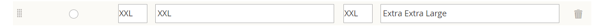

# 导入可配置产品

了解可配置产品数据的结构方式的最佳方法是导出可配置产品及其变体，并在电子表格中检查数据。

在以下示例中，您为每种颜色的新大小添加一组产品变体。 首先，导出可配置产品，并检查数据结构。 然后，更新数据并将其导入回目录中。 如果您不想完成导出数据的练习，则可以下载示例中使用的CSV文件。

{width="700" zoomable="yes"}

## 步骤1：验证属性设置和值

1. 在开始之前，请确保用于产品变体的属性具有所需的属性设置。

   - [**[!UICONTROL Scope]**](../getting-started/websites-stores-views.md#scope-settings) - `Global`
   - [**[!UICONTROL Catalog Input Type for Store Owner]**](data-attributes-product.md) — 用于产品变体的任何属性的输入类型必须是以下类型之一：

      - `Dropdown`
      - `Visual Swatch`
      - `Text Swatch`
      - `Multi-Select`

   - **[!UICONTROL Values Required]** - `Yes`

1. 如果要添加大小或颜色，或对现有属性进行任何其他更改，请确保使用新值更新属性。

1. 在&#x200B;_管理员_&#x200B;侧边栏上，转到&#x200B;**[!UICONTROL Stores]** > _[!UICONTROL Attributes]_>**[!UICONTROL Product]**。

1. 在列表中查找属性并在编辑模式下打开。

1. 将新值添加到属性中。

   在以下示例中，新大小被添加到文本样本。

   {width="500" zoomable="yes"}

1. 完成后，单击&#x200B;**[!UICONTROL Save Attribute]**。

1. 如果要添加属性，请按照说明[创建属性](../catalog/attribute-product-create.md)，然后再开始。

## 第2步：导出可配置产品

1. 在&#x200B;_管理员_&#x200B;侧边栏上，转到&#x200B;**[!UICONTROL Catalog]** > **[!UICONTROL Products]**。

1. 查找要导出的可配置产品：

   - 单击&#x200B;**[!UICONTROL Filters]**。
   - 将&#x200B;**[!UICONTROL Type]**&#x200B;设置为`Configurable Product`并单击&#x200B;**[!UICONTROL Apply Filters]**。
   - 选择要用于测试导出的可配置产品，并记下&#x200B;**[!UICONTROL SKU]**。

1. 在&#x200B;_管理员_&#x200B;侧边栏上，转到&#x200B;**[!UICONTROL System]** > _[!UICONTROL Data Transfer]_>**[!UICONTROL Export]**。

   {width="600" zoomable="yes"}

1. 在&#x200B;_[!UICONTROL Export Setting]s_&#x200B;下，执行以下操作：

   - 将&#x200B;**[!UICONTROL Entity Type]**&#x200B;设置为`Products`。

   - 将&#x200B;**[!UICONTROL Export File Format]**&#x200B;设置为`CSV`。

1. 在&#x200B;_[!UICONTROL Entity Attributes]_下，向下滚动或使用属性标签过滤器来查找&#x200B;**[!UICONTROL SKU]**属性并执行以下操作：

   - 输入已选择导出的可配置产品的SKU，然后单击&#x200B;**[!UICONTROL Continue]**。

     {width="600" zoomable="yes"}

   - 在Web浏览器的下载位置中查找文件，并将其作为电子表格打开。

     CSV文件针对每个简单产品变体都有一个单独的行，而可配置产品则有一个单独的行。 `product_type column`显示多个与一个可配置产品关联的简单产品变体。

     {width="600" zoomable="yes"}

   - 滚动到工作表的最右侧，可找到以下各列。

      - `configurable_variations` — 定义可配置产品记录与每个变体之间的一对多关系。
      - `configurable_variation_labels` — 定义标识每个变体的标签。

     在此示例中，可以在CG和CH列中找到数据。 根据变体的数量，`configurable_variations`列中的数据字符串可能会很长。 数据用作关联产品变体的索引，并具有以下结构：

     ```text
     sku={{SKU_VALUE}},attribute1={{VALUE}},attribute2={{VALUE}}| sku={{SKU_VALUE}},attribute1={{VALUE}},attribute2={{VALUE}}
     ```

     每个SKU用竖线符号(|)分隔，属性用逗号分隔。 每个属性的值由属性代码表示，而不是由属性标签表示。 以下是实际数据的显示方式：

     ```text
     sku=MH01-XS-Black,size=XS,color=Black|sku=MH01-XS-Gray,size=XS,color=Gray|sku=MH01-XS-Orange,size=XS,color=Orange</pre>
     ```

1. 当您了解可配置产品数据的结构时，可以编辑数据或直接将新变体添加到CSV文件。

   若要了解详细信息，请参阅[复杂数据](data-attributes-product.md#complex-product-data-attributes)。

## 步骤3：编辑数据

在以下示例中，XL大小集被复制并粘贴到工作表中，以创建每种颜色的新大小的产品变体集。

1. 复制要用作新产品模板的产品变体集。

   {width="600" zoomable="yes"}

1. 将复制的行记录插入工作表。

   您现在拥有两组相同的简单产品变体。

   {width="600" zoomable="yes"}

1. 根据需要更新新变体的以下列中的数据。

   - `sku`
   - `name`
   - `url_key`
   - `additional_attributes`

   在此示例中，所有`XL`引用都更改为`XXL`。

1. 更新可配置产品记录的`product_variations`列中的信息，以便新变体包含在可配置产品中。

   在包含可配置产品记录的行上，单击包含`product_variations`数据的单元格。 然后在公式栏中，复制最后一组参数，从管道符号开始。

   {width="600" zoomable="yes"}

1. 将参数粘贴到数据的末尾，并根据需要编辑新变量。

   在此示例中，`sku`和`size`参数已更新为新的XXL大小。

1. 将数据导入回目录之前，请删除所有未更改的行。

   在本例中，只有新大小的三个新变体以及具有更新的可配置产品的行导入回目录中。 其他行可以从CSV文件中删除。 但是，请确保不要删除带有列标签的标题行。

   {width="600" zoomable="yes"}

1. **[!UICONTROL Save]** CSV文件。

   数据已准备好导入目录中。

   >[!NOTE]
   >
   >导入文件的大小不能大于2 MB。

## 步骤4：导入更新的数据

1. 在&#x200B;_管理员_&#x200B;侧边栏上，转到&#x200B;**[!UICONTROL System]** > _[!UICONTROL Data Transfer]_>**[!UICONTROL Import]**。

1. 在&#x200B;_[!UICONTROL Import Settings]_下，将&#x200B;**[!UICONTROL Entity Type]**设置为`Products`。

1. 在&#x200B;_[!UICONTROL Import Behavior]_下，将&#x200B;**[!UICONTROL Import Behavior]**设置为`Add/Update`。

   {width="600" zoomable="yes"}

1. 在&#x200B;_[!UICONTROL File to Import]_下，单击&#x200B;**[!UICONTROL Choose File]**并导航到您准备导入的CSV文件并选择该文件。

   {width="600" zoomable="yes"}

1. 单击右上角的&#x200B;**[!UICONTROL Check Data]**。

1. 如果文件有效，请单击&#x200B;**[!UICONTROL Import]**。

   否则，请更正数据中发现的任何问题，然后重试。

   {width="600" zoomable="yes"}

1. 导入完成后，在页面顶部的消息中单击&#x200B;**[!UICONTROL Cache Management]**&#x200B;并刷新所有无效缓存。

   新产品变体现在可从管理员的目录和店面中获取。 在本例中，现在所有颜色的连帽衫尺寸均为XXL。
