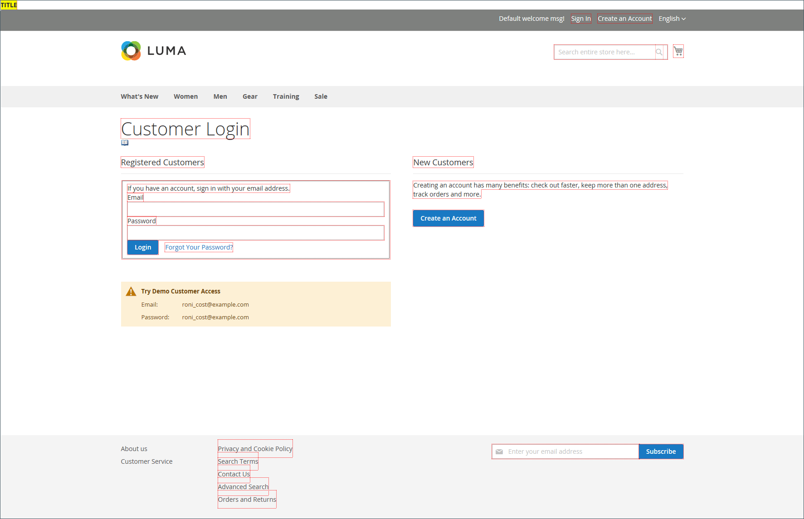
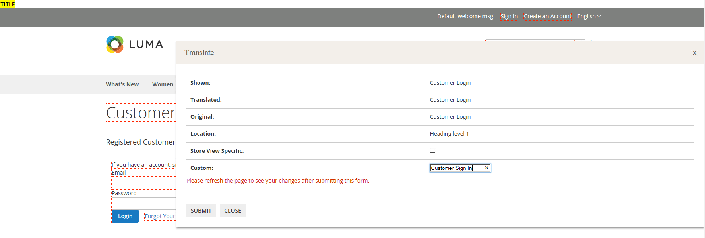

# 开发人员工具

使用高级开发人员工具确定前端开发期间的编译模式、创建IP地址的允许列表并显示模板路径提示。 还有一些工具，可轻松地在店面和管理员界面中对文本进行特别更改。

- [操作日志](action-log.md) (仅限Adobe Commerce)
- [前端开发工作流](#frontend-development-workflow)
- [使用静态文件签名](#static-file-signatures)
- [资源文件优化](#optimizing-resource-files)
- [开发人员客户端限制](#client-restrictions)
- [模板路径提示](#template-path-hints)
- [翻译内联](#translate-inline)

## 操作模式

您的Adobe Commerce或Magento Open Source实例可以部署为在&#x200B;_生产_&#x200B;或&#x200B;_开发人员模式_&#x200B;下运行。 仅当存储以&#x200B;_开发人员模式_&#x200B;运行时才能访问专门为开发人员设计的工具和配置设置。

只有具有适当权限的用户才能从服务器的命令行更改操作模式。 有关详细信息，请参阅&#x200B;_配置指南_&#x200B;中的[设置操作模式](https://experienceleague.adobe.com/docs/commerce-operations/configuration-guide/cli/set-mode.html?lang=zh-Hans)。

商家文档中的大多数主题都适用于在生产模式下运行的Commerce实例。 但是，以下配置设置和工具只能在开发人员模式下运行安装时使用。

## 前端开发工作流

前端开发工作流类型确定在开发期间在客户端还是服务器端进行较少的编译。 较少的是CSS的扩展，它有附加功能和约定，并能生成简化的代码。 建议在主题开发中使用客户端较少的编译。 服务器端编译是默认模式。 开发工作流选项不适用于处于生产模式的存储。
请参阅Commerce开发人员文档中的[客户端LESS编译与服务器端](https://developer.adobe.com/commerce/frontend-core/guide/css/quickstart/compilation-mode/){:target="_blank"}。

>[!NOTE]
>
>前端开发工作流配置仅在[开发人员模式](../systems/developer-tools.md#operation-modes)下可用。

{width="600" zoomable="yes"}

1. 在&#x200B;_管理员_&#x200B;侧边栏上，转到&#x200B;**[!UICONTROL Stores]** > _[!UICONTROL Settings]_>**[!UICONTROL Configuration]**。

1. 在左侧面板中，展开&#x200B;**[!UICONTROL Advanced]**&#x200B;并选择&#x200B;**[!UICONTROL Developer]**。

1. 展开&#x200B;**[!UICONTROL Front-end Development Workflow]**&#x200B;部分的。

1. 将&#x200B;**[!UICONTROL Workflow Type]**&#x200B;设置为以下项之一：

   - `Client side less compilation` — 使用本机`less.js`库在浏览器中进行编译。
   - `Server side less compilation` — 使用Less PHP库在服务器上进行编译。 这是默认的生产模式。

1. 完成后，单击&#x200B;**[!UICONTROL Save Config]**。

## 静态文件签名

通过向静态文件的URL添加数字签名，浏览器可以检测文件的较新版本何时可用。 可使用数字签名跟踪的静态文件包括JavaScript、CSS、图像和字体。 签名将直接附加到基本URL后面的路径中。 如果文件的签名与浏览器缓存中存储的签名不同，则使用较新版本的文件。

请参阅Commerce开发人员文档中的[静态内容签名](https://experienceleague.adobe.com/docs/commerce-operations/configuration-guide/cache/static-content-signing.html?lang=zh-Hans){:target="_blank"}。

>[!NOTE]
>
>静态文件设置配置仅在[开发人员模式](../systems/developer-tools.md#operation-modes)下工作时可用。

{width="600" zoomable="yes"}

有关配置设置的详细列表，请参阅&#x200B;_配置引用_&#x200B;中的&#x200B;[_静态文件设置_](../configuration-reference/advanced/developer.md)。

**_要启用已签名的静态文件：_**

1. 在&#x200B;_管理员_&#x200B;侧边栏上，转到&#x200B;**[!UICONTROL Stores]** > _[!UICONTROL Settings]_>**[!UICONTROL Configuration]**。

1. 在左侧面板中，展开&#x200B;**[!UICONTROL Advanced]**&#x200B;并选择&#x200B;**[!UICONTROL Developer]**。

1. 展开&#x200B;**[!UICONTROL Static Files Settings]**&#x200B;部分的。

1. 将&#x200B;**[!UICONTROL Sign Static Files]**&#x200B;设置为`Yes`。

1. 完成后，单击&#x200B;**[!UICONTROL Save Config]**。

## 资源文件优化

通过合并和捆绑文件以及最大限度地减少代码，可以减少加载资源文件所需的时间。

- 合并会将相同类型的单独文件合并为单个文件。
- 捆绑是一种对单独的文件进行分组的技术，用于减少加载页面所需的HTTP请求数。
- 缩小会删除空格、换行符和注释，但不会影响代码的功能。 由于无法编辑最小化的文件，因此应仅在准备好进入生产阶段时应用该流程。

默认情况下，Adobe Commerce和Magento Open Source不会合并、捆绑或最小化文件，项目开发人员应确定应使用的文件优化方法。

有关详细信息，请参阅[性能最佳实践](https://experienceleague.adobe.com/docs/commerce-operations/performance-best-practices/overview.html?lang=zh-Hans)。

>[!NOTE]
>
>只能在[开发人员模式](../systems/developer-tools.md#operation-modes)中优化CSS和JavaScript文件。

| 文件类型 | 支持的操作 |
| --------------- | -------------------- |
| CSS文件 | `MergeMinify` |
| JavaScript文件 | `MergeBundleMinify` |
| 模板文件 | `Minify` |

{style="table-layout:auto"}

**_要优化资源文件：_**

1. 在&#x200B;_管理员_&#x200B;侧边栏上，转到&#x200B;**[!UICONTROL Stores]** > _[!UICONTROL Settings]_>**[!UICONTROL Configuration]**。

1. 在左侧面板中，展开&#x200B;**[!UICONTROL Advanced]**&#x200B;并选择&#x200B;**[!UICONTROL Developer]**。

1. 要优化CSS文件，请展开 **[!UICONTROL CSS Settings]**&#x200B;部分并执行以下操作：

   - 将&#x200B;**[!UICONTROL Merge CSS Files]**&#x200B;设置为`Yes`。
   - 将&#x200B;**[!UICONTROL Minify CSS Files]**&#x200B;设置为`Yes`。

   {width="600" zoomable="yes"}

[_CSS设置_](../configuration-reference/advanced/developer.md)

1. 要优化JavaScript文件，请展开 **[!UICONTROL JavaScript Settings]**&#x200B;部分并执行以下操作：

   - 将&#x200B;**[!UICONTROL Merge JavaScript Files]**&#x200B;设置为`Yes`。
   - 将&#x200B;**[!UICONTROL Minify JavaScript Files]**&#x200B;设置为`Yes`。

   {width="600" zoomable="yes"}

1. 要缩小PHTML模板文件，请展开 **[!UICONTROL Template Settings]**&#x200B;部分并将&#x200B;**[!UICONTROL Minify Html]**&#x200B;设置为`Yes`。

   {width="600" zoomable="yes"}

1. 完成后，单击&#x200B;**[!UICONTROL Save Config]**。

## 客户端限制

列入允许列表在使用诸如[模板路径提示](#template-path-hints)之类的工具之前，请确保将您的IP地址添加到开发人员客户端限制，以避免中断商店中客户的购物体验。 如果您不知道自己的IP地址，则可以在线搜索它。

>[!NOTE]
>
>开发人员客户端限制只能在[开发人员模式](../systems/developer-tools.md#operation-modes)中设置。

有关技术信息，请参阅&#x200B;_Commerce on Cloud Infrastructure指南_&#x200B;中的[用于允许请求的自定义VCL](https://experienceleague.adobe.com/docs/commerce-cloud-service/user-guide/cdn/custom-vcl-snippets/fastly-vcl-allowlist.html?lang=zh-Hans)。

**_要将IP地址添加到允许列表：_**

1. 在&#x200B;_管理员_&#x200B;侧边栏上，转到&#x200B;**[!UICONTROL Stores]** > _[!UICONTROL Settings]_>**[!UICONTROL Configuration]**。

1. 在左侧面板中，展开&#x200B;**[!UICONTROL Advanced]**&#x200B;并选择&#x200B;**[!UICONTROL Developer]**。

1. 展开&#x200B;**[!UICONTROL Developer Client Restrictions]**&#x200B;部分的。

   {width="600" zoomable="yes"}

1. 对于&#x200B;**[!UICONTROL Allow IPs]**，输入您的IP地址。

   如果需要从多个IP地址访问，请使用逗号分隔每个IP地址。

1. 完成后，单击&#x200B;**[!UICONTROL Save Config]**。

1. 出现提示时，请刷新任何无效的缓存。

## 模板路径提示

模板路径提示是一种诊断工具，用于为页面上使用的每个模板添加带有路径的符号。 可以为店面或管理员启用模板路径提示。

>[!NOTE]
>
>只能在[开发人员模式](../systems/developer-tools.md#operation-modes)中编辑模板路径提示。

请参阅Commerce开发人员文档中的[查找模板、布局和样式](https://developer.adobe.com/commerce/frontend-core/guide/themes/debug/){:target="_blank"}。

{width="700" zoomable="yes"}

### 步骤1：将您的IP地址添加到允许列表

在使用模板路径提示之前，请将您的IP地址添加到[允许列表](#client-restrictions)以避免干扰在商店中购物的客户。 完成后，请确保清除Commerce缓存，以从存储中删除所有提示。

{width="600" zoomable="yes"}

### 步骤2：启用模板路径提示

1. 在&#x200B;_管理员_&#x200B;侧边栏上，转到&#x200B;**[!UICONTROL Stores]** > _[!UICONTROL Settings]_>**[!UICONTROL Configuration]**。

1. 在左侧面板中，展开&#x200B;**[!UICONTROL Advanced]**&#x200B;并选择&#x200B;**[!UICONTROL Developer]**。

1. 展开&#x200B;**[!UICONTROL Debug]**&#x200B;部分中的并执行以下操作：

   {width="600" zoomable="yes"}

   - 要为存储激活模板路径提示，请将&#x200B;**[!UICONTROL Enabled Template Path Hints for Storefront]**&#x200B;设置为`Yes`。

   - 要仅在URL包含`templatehints`参数时为商店启用模板路径提示，请将&#x200B;**使用URL参数**&#x200B;为商店启用提示`Yes`。 然后根据需要设置参数的值。 默认值为`magento`，但您可以使用自定义值。 例如，如果将值更改为`lorem`，则使用`mymagento.com?templatehints=lorem`显示模板提示。

   - 要为管理员激活模板路径提示，请将&#x200B;**[!UICONTROL Enabled Template Path Hints for Admin]**&#x200B;设置为`Yes`。

   - 要包含块的名称，请将&#x200B;**[!UICONTROL Add Block Class Type to Hints]**&#x200B;设置为`Yes`。

1. 完成后，单击&#x200B;**[!UICONTROL Save Config]**。

### 步骤3：清除缓存

1. 在&#x200B;_管理员_&#x200B;侧边栏上，转到&#x200B;**[!UICONTROL System]** > _[!UICONTROL Tools]_>**[!UICONTROL Cache Management]**。

1. 单击右上角的&#x200B;**[!UICONTROL Flush Magento Cache]**。

## 内嵌翻译

您可以在[开发人员模式](../systems/developer-tools.md#operation-modes)中使用翻译内联工具，修饰界面中的文本以反映您的声音和品牌。 激活“翻译内联”模式后，页面上可编辑的任何文本都以红色列出。 可以轻松编辑显示在店面和管理员中的字段标签、消息和其他文本。 例如，许多主题都使用术语，如&#x200B;_我的帐户_、_我的愿望清单_&#x200B;和&#x200B;_我的仪表板_，以帮助客户找到解决方法。 但是，您可能只想使用单词&#x200B;_帐户_、_愿望清单_&#x200B;和&#x200B;_仪表板_。

>[!NOTE]
>
>翻译内联工具仅在[开发人员模式](../systems/developer-tools.md#operation-modes)下工作时可用。

请参阅Commerce开发人员文档中的[翻译概述](https://developer.adobe.com/commerce/frontend-core/guide/translations/)。

{width="700" zoomable="yes"}

如果您的商店以多种语言提供，则可以对区域设置的翻译文本进行细微调整。 在服务器上，界面文本将保存在每个输出块的独立CSV文件中，并按区域设置进行组织。 作为替代方法，您还可以直接在服务器上编辑CSV文件，而不是使用&#x200B;_翻译内联_&#x200B;工具。 翻译文件存储在`app/code/Magento/<module_name>/i18n/<language_locale>.csv`中。

>[!NOTE]
>
>要使用翻译内联工具，您的浏览器必须允许弹出窗口。

### 步骤1：禁用输出缓存

1. 在&#x200B;_管理员_&#x200B;侧边栏上，转到&#x200B;**[!UICONTROL System]** > _[!UICONTROL Tools]_>**[!UICONTROL Cache Management]**。

1. 选中以下复选框：

   - `Blocks HTML output`
   - `Page Cache`
   - `Translations`

1. 将&#x200B;**[!UICONTROL Actions]**&#x200B;控件设置为`Disable`并单击&#x200B;**[!UICONTROL Submit]**。

### 步骤2：启用翻译内联工具

1. 在&#x200B;_管理员_&#x200B;侧边栏上，转到&#x200B;**[!UICONTROL Stores]** > _[!UICONTROL Settings]_>**[!UICONTROL Configuration]**。

1. 若要使用特定的商店视图，请将&#x200B;**[!UICONTROL Store View]**&#x200B;设置为要更新的。

1. 在左侧面板中，展开&#x200B;**[!UICONTROL Advanced]**&#x200B;并选择&#x200B;**[!UICONTROL Developer]**。

1. 展开&#x200B;**[!UICONTROL Translate Inline]**&#x200B;部分的。

   根据需要清除&#x200B;**[!UICONTROL Use Website]**&#x200B;复选框以修改这些设置。

   编辑特定商店视图时，_[!UICONTROL Enabled for Admin]_&#x200B;选项不可用。

   {width="600" zoomable="yes"}

1. 将&#x200B;**[!UICONTROL Enabled for Storefront]**&#x200B;设置为`Yes`。

1. 完成后，单击&#x200B;**[!UICONTROL Save Config]**。

1. 出现提示时，请刷新无效的缓存，但暂时保留已禁用的缓存。

### 步骤3：更新文本

1. 在浏览器中打开您的店面，然后转到要编辑的页面。

   如有必要，请使用语言选择器更改商店视图。 每个可翻译的文本字符串都以红色列出。 当您将鼠标悬停在任意文本框上时，会显示一个书籍图标（ ）。

1. 单击书籍图标以打开&#x200B;_翻译_&#x200B;窗口，然后执行以下操作：

   - 如果更改针对的是特定的商店视图，请选中&#x200B;**[!UICONTROL Store View Specific]**&#x200B;复选框。

   - 输入新的&#x200B;**[!UICONTROL Custom]**&#x200B;文本。

1. 完成后，单击&#x200B;**[!UICONTROL Submit]**。

   {width="700" zoomable="yes"}

1. 要在应用商店中查看您所做的更改，请刷新浏览器。

1. 对存储中要更改的任何元素重复此过程。

### 步骤4：恢复原始设置

1. 返回到商店的管理员。

1. 在&#x200B;_管理员_&#x200B;侧边栏上，转到&#x200B;**[!UICONTROL Stores]** > _[!UICONTROL Settings]_>**[!UICONTROL Configuration]**。

1. 将&#x200B;**[!UICONTROL Store View]**&#x200B;设置为已编辑的特定视图。

1. 在左侧面板中，展开&#x200B;**[!UICONTROL Advanced]**&#x200B;并选择&#x200B;**[!UICONTROL Developer]**。

1. 展开&#x200B;**[!UICONTROL Translate Inline]**&#x200B;部分的。

1. 将&#x200B;**[!UICONTROL Enabled for Frontend]**&#x200B;设置为`No`。

1. 完成后，单击&#x200B;**[!UICONTROL Save Config]**。

1. 在&#x200B;_管理员_&#x200B;侧边栏上，转到&#x200B;**[!UICONTROL System]** > _[!UICONTROL Tools]_>**[!UICONTROL Cache Management]**。

1. 选中以下先前已禁用的输出缓存的复选框：

   - `Blocks HTML output`
   - `Page Cache`
   - `Translations`

1. 将&#x200B;**[!UICONTROL Actions]**&#x200B;控件设置为`Enable`并单击&#x200B;**[!UICONTROL Submit]**。

1. 出现提示时，请刷新任何无效的缓存。

### 步骤5：验证存储中的更改

转到店面并检查每个更新的页面，确保更改正确。 在此示例中，`Customer Login`被更改为`Customer Sign In`。 如果对特定视图进行了更改，请使用语言选择器切换到正确的视图。

{width="700" zoomable="yes"}
