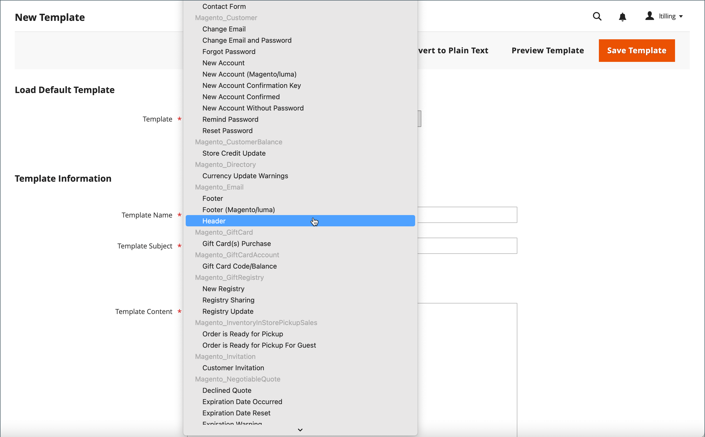
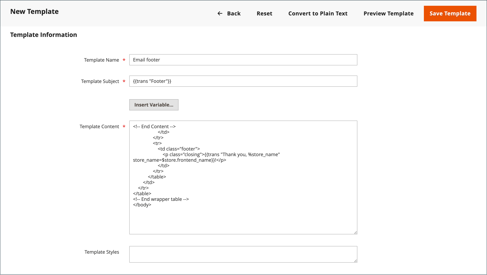
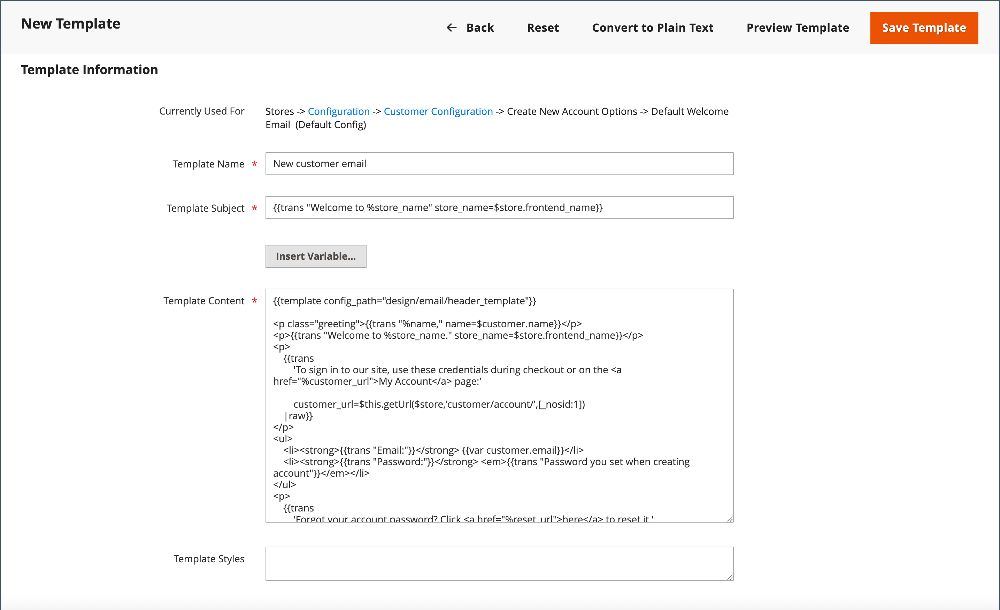

# 自定义电子邮件模板

Commerce包含系统发送的每封邮件正文部分的默认电子邮件模板。 正文内容的模板与页眉和页脚模板组合以创建完整消息。 内容使用HTML和CSS进行格式化，通过添加[变量](variables-predefined.md)可轻松编辑和自定义内容。 可以为每个网站、商店或商店视图自定义电子邮件模板。 如果使用自定义模板，请确保更新[系统配置](email-templates.md#configure-email-templates)以确保使用正确的模板。 要了解如何在自定义电子邮件模板中使用条件语句，请参阅[开发人员文档](https://developer.adobe.com/commerce/frontend-core/guide/templates/email/#theme-based-customizations-1)。

{width="500" zoomable="yes"}

默认模板包括您的徽标和商店信息，无需进一步自定义即可使用。 但是，作为最佳实践，您应该查看每个模板，并在将其发送给客户之前进行任何必要的更改。

- [标题模板](email-template-custom.md#header-template)
- [页脚模板](email-template-custom.md#footer-template)
- [消息模板](email-template-custom.md#message-templates)

{width="700" zoomable="yes"}

## 模板信息

| 字段 | 描述 |
| ----- | ----------- |
| [!UICONTROL Template Name] | 自定义模板的名称。 |
| [!UICONTROL Insert Variable] | 在模板中光标位置处插入变量。 |
| [!UICONTROL Template Subject] | 模板主题将显示在“主题”列中，可用于对列表中的模板进行排序和过滤。 |
| [!UICONTROL Template Content] | HTML中模板的内容。 |
| [!UICONTROL Template Styles] | 模板格式所需的任何CSS样式声明都可以在&#x200B;_[!UICONTROL Template Styles]_&#x200B;框中输入。 |

{style="table-layout:auto"}

## 标题模板

完成[配置](email-templates.md#configure-email-templates)后，电子邮件标头模板将包含链接到应用商店的徽标。 如果您具有HTML的基础知识，则可以轻松地使用[预定义变量](variables-predefined.md)将商店联系信息添加到标题中。

### 步骤1. 加载默认模板

1. 在&#x200B;_管理员_&#x200B;侧边栏上，转到&#x200B;**[!UICONTROL Marketing]** > _[!UICONTROL Communications]_>**[!UICONTROL Email Templates]**。

1. 单击&#x200B;**[!UICONTROL Add New Template]**。

1. 在&#x200B;**[!UICONTROL Load default template]**&#x200B;部分中，单击&#x200B;**[!UICONTROL Template]**&#x200B;选择器并选择`Magento_Email` > `Header`。

   {width="600" zoomable="yes"}

1. 单击&#x200B;**[!UICONTROL Load Template]**。

   模板中的HTML代码和变量会显示在表单中。

### 步骤2. 自定义模板

1. 为您的自定义标题输入&#x200B;**[!UICONTROL Template Name]**。

1. 输入&#x200B;**[!UICONTROL Template Subject]**&#x200B;以帮助组织模板。

   在网格中，模板列表可以按&#x200B;_[!UICONTROL Subject]_&#x200B;列进行排序和过滤。

   {width="600" zoomable="yes"}

1. 在&#x200B;**[!UICONTROL Template Content]**&#x200B;框中，根据需要修改HTML。

   >[!NOTE]
   >
   >在模板代码中工作时，请注意不要覆盖任何用双大括号括起来的内容。

1. 要插入[变量](variables-reference.md)，请将光标置于要放置该变量的代码中，然后单击&#x200B;**[!UICONTROL Insert Variable]**。

1. 选择要插入的变量。

   {width="600" zoomable="yes"}

   选择变量后，将在代码中插入变量的[标记标记](markup-tags.md)。

   虽然存储电子邮件地址变量是最常包含在标头中的变量，但您可以直接在模板中输入任何系统或[自定义变量](variables-custom.md)的代码。

1. 如果需要创建任何CSS声明，请在&#x200B;**[!UICONTROL Template Styles]**&#x200B;框中输入样式。

1. 准备好审阅您的工作后，单击&#x200B;**[!UICONTROL Preview Template]**。

   对模板进行任何所需的更改。

1. 完成后，单击&#x200B;**[!UICONTROL Save Template]**。

   自定义标题现在显示在可用电子邮件模板列表中。

### 步骤3. 更新配置

1. 在&#x200B;_管理员_&#x200B;侧边栏上，转到&#x200B;**[!UICONTROL Content]** > _[!UICONTROL Design]_>**[!UICONTROL Configuration]**。

1. 在网格中，找到要配置的商店视图，然后单击&#x200B;_[!UICONTROL Action]_&#x200B;列中的&#x200B;**[!UICONTROL Edit]**。

1. 向下滚动并展开&#x200B;**[!UICONTROL Transactional Emails]**&#x200B;部分的。

1. 选择用作电子邮件通知默认值的&#x200B;**[!UICONTROL Header Template]**。

1. 完成后，单击&#x200B;**[!UICONTROL Save Config]**。

{width="600" zoomable="yes"}

## 页脚模板

电子邮件模板页脚包含电子邮件的关闭行和签名行。 您可以根据自己的风格更改结尾，并添加其他信息，如公司名称和地址。

### 步骤1. 加载默认模板

1. 在&#x200B;_管理员_&#x200B;侧边栏上，转到&#x200B;**[!UICONTROL Marketing]** > _[!UICONTROL Communications]_>**[!UICONTROL Email Templates]**。

1. 单击&#x200B;**[!UICONTROL Add New Template]**。

1. 在&#x200B;**[!UICONTROL Load default template]**&#x200B;部分中，单击&#x200B;**[!UICONTROL Template]**&#x200B;选择器并选择`Magento_Email` > `Footer`。

1. 单击&#x200B;**[!UICONTROL Load Template]**。

   模板中的HTML代码和变量会显示在表单中。

### 步骤2. 自定义和预览模板

1. 为您的自定义页脚输入&#x200B;**[!UICONTROL Template Name]**。

1. 输入&#x200B;**[!UICONTROL Template Subject]**&#x200B;以帮助组织模板。

   在网格中，可以按&#x200B;_[!UICONTROL Subject]_&#x200B;列对模板进行排序和筛选。

   {width="600" zoomable="yes"}

1. 在&#x200B;**[!UICONTROL Template Content]**&#x200B;框中，根据需要修改HTML。

   >[!NOTE]
   >
   >在模板代码中工作时，请注意不要覆盖任何用双大括号括起来的内容。

1. 要插入[变量](variables-reference.md)，请将光标置于要放置该变量的代码中，然后单击&#x200B;**[!UICONTROL Insert Variable]**。

1. 选择要插入的变量。

   选择变量后，将在代码中插入变量的[标记标记](markup-tags.md)。

   虽然商店联系人变量是最常包含在页脚中的变量，但您可以直接在模板中输入任何系统或[自定义变量](variables-custom.md)的代码。

1. 如果需要创建任何CSS声明，请在&#x200B;**[!UICONTROL Template Styles]**&#x200B;框中输入样式。

### 步骤3. 更新配置

1. 在&#x200B;_管理员_&#x200B;侧边栏上，转到&#x200B;**[!UICONTROL Content]** > _[!UICONTROL Design]_>**[!UICONTROL Configuration]**。

1. 在网格中，找到要配置的商店视图，然后单击&#x200B;_[!UICONTROL Action]_&#x200B;列中的&#x200B;**[!UICONTROL Edit]**。

1. 向下滚动并展开&#x200B;**[!UICONTROL Transactional Emails]**&#x200B;部分的。

1. 选择用作电子邮件通知中默认页脚的&#x200B;**[!UICONTROL Footer Template]**。

1. 完成后，单击&#x200B;**[!UICONTROL Save Config]**。

{width="600" zoomable="yes"}

## 消息模板

自定义每个消息正文的过程与自定义页眉或页脚的过程相同。 唯一的区别是触发通知的每个活动或事件的消息模板。 您可以按原样使用模板，也可以自定义模板以匹配您的声音和品牌。 除了模板文本之外，还有大量允许的[预定义](variables-predefined.md)变量和[自定义](variables-custom.md)变量可供您创建并合并到模板中。

### 步骤1. 加载默认模板

1. 在&#x200B;_管理员_&#x200B;侧边栏上，转到&#x200B;**[!UICONTROL Marketing]** > _[!UICONTROL Communications]_>**[!UICONTROL Email Templates]**。

1. 单击&#x200B;**[!UICONTROL Add New Template]**。

   {width="600" zoomable="yes"}

1. 执行以下操作：

   - 在&#x200B;**[!UICONTROL Load default template]**&#x200B;下，选择要自定义的&#x200B;**[!UICONTROL Template]**。

   - 单击&#x200B;**[!UICONTROL Load Template]**。

### 步骤2. 自定义模板

1. 为&#x200B;**[!UICONTROL Template Name]**&#x200B;输入自定义模板的名称。

1. 如果需要，请更改&#x200B;**[!UICONTROL Template Subject]**。

   这是消息的第一行，默认情况下是称呼。 您可以保持原样，也可以输入更具描述性的内容。

1. 记下模板的&#x200B;**[!UICONTROL Currently Used For]**&#x200B;路径，该路径用于更新配置。

   {width="600" zoomable="yes"}

1. 在&#x200B;**[!UICONTROL Template Content]**&#x200B;框中，根据需要修改HTML。

   内容由HTML标签、CSS指令、变量和文本的组合组成。

   >[!NOTE]
   >
   >在模板代码中工作时，注意不要意外键入用双大括号括起来的代码。

1. 要插入变量，请将光标放置在要显示该变量的代码中。

   变量的选择因模板而异，包括允许的[预定义](variables-predefined.md)和[自定义](variables-custom.md)变量（如果可用）。

1. 单击&#x200B;**[!UICONTROL Insert Variable]**&#x200B;并选择要插入的变量。

   用于插入变量的命令用大括号括起来，并添加到光标位置的代码中。 例如：

   `customVar code=my_custom_variable`

1. 若要进行CSS声明，请在&#x200B;**[!UICONTROL Template Styles]**&#x200B;中输入样式。

   {width="600" zoomable="yes"}

   >[!NOTE]
   >
   >仅当&#x200B;_[!UICONTROL Template Styles]_&#x200B;中存在`{{template config_path="design/email/header_template"}}`时，自定义样式才会应用于电子邮件。 要在没有默认页眉模板的情况下使用自定义CSS，您必须在`<style>`HTML标记中在此处提供它们。

### 步骤3. 更新配置

_[!UICONTROL Currently Used For]_&#x200B;痕迹导航跟踪显示模板的使用位置。 在此示例中，模板配置位于&#x200B;_[!UICONTROL Customer Configuration]_&#x200B;页面、_[!UICONTROL Create New Account Options]_&#x200B;部分和&#x200B;_[!UICONTROL Default Welcome Email]_&#x200B;字段中。

- 页面 — [!UICONTROL Customer Configuration]
- 分区 — [!UICONTROL Create New Account Options]
- 字段 — [!UICONTROL Default Welcome Email]

1. 在&#x200B;**[!UICONTROL Currently Used For]**&#x200B;痕迹导航路径中，单击链接以打开模板配置页面。

   {width="600" zoomable="yes"}

1. 展开部分，找到您自定义的电子邮件模板的字段。

1. 清除&#x200B;**[!UICONTROL Use system value]**&#x200B;复选框，然后单击自定义模板的名称。

   {width="600" zoomable="yes"}

1. 完成后，单击&#x200B;**[!UICONTROL Save Config]**。

1. 在工作区顶部的消息中，单击&#x200B;**[!UICONTROL Cache Management]**&#x200B;并清除任何无效的缓存。

### 步骤4. 预览并保存模板

1. 准备好审阅您的工作后，单击&#x200B;**[!UICONTROL Preview Template]**。

1. 根据需要更新模板。

1. 完成后，单击&#x200B;**[!UICONTROL Save Template]**。

   您的自定义模板现在可在电子邮件模板列表中使用。
