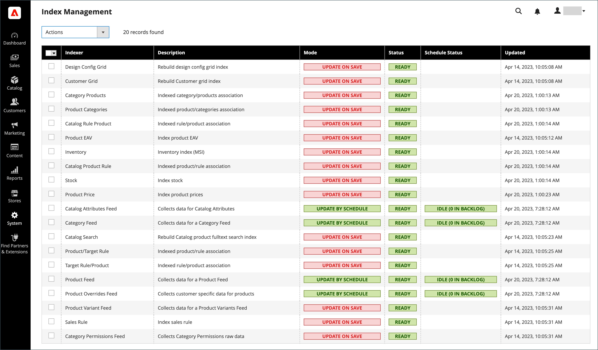

# 索引管理

每当一个或多个项目发生更改时，Adobe Commerce和Magento Open Source会自动重新索引。 触发重新索引的操作包括价格更改、创建目录或购物车价格规则、添加新类别等。 为了优化性能，Commerce使用索引器将数据累积到特殊表中。 随着数据的变化，必须更新索引表，或重新编制索引。 Commerce会作为后台进程重新索引，并且您的存储将在这些进程中保持可访问状态。

重新索引数据可加快处理速度，并减少客户必须等待的时间。 例如，如果您将某个项目的价格从$4.99更改为$3.99，Commerce会对数据进行重新索引以显示商店中的价格变化。 如果没有索引，Commerce将不得不动态计算每个产品的价格；处理购物车价格规则、捆绑定价、折扣、分层定价等。 加载产品价格可能需要比客户愿意等待的时间更长的时间。

索引器可以设置为在保存时或按计划更新。 所有索引都可以使用任一选项，但Customer Grid除外，它仅在保存时支持。 在保存时索引时，Commerce会在保存操作时启动重新索引。 “索引管理”页完成更新并刷新缓存，在一两分钟之内出现重新索引消息。 按照计划重新索引时，重新索引将按照计划作为cron作业运行。 如果出现以下情况，则会显示系统消息 [cron作业](cron.md) 不可用于更新任何失效的索引器。 在重新索引过程中，您的存储仍可访问。

>[!NOTE]
> 使用Live Search、Catalog Service或Product Recommendations的Adobe Commerce商家可以选择使用 [基于SaaS的价格索引器](https://experienceleague.adobe.com/docs/commerce-merchant-services/price-indexer/index.html).

当需要重新索引时，将在页面顶部显示通知。 根据重新索引模式和您执行的潜在操作，将清除索引和消息。 有关索引的更多详细信息，请参阅 [应用程序如何实施索引](https://developer.adobe.com/commerce/php/development/components/indexing/#how-the-application-implements-indexing) 在 _PHP开发人员指南_.

{width="700" zoomable="yes"}

- 对于平面产品目录，索引管理的呈现方式略有不同。
- 为避免在多个Admin用户更新触发自动重新索引的对象时出现问题，建议将所有索引器设置为按计划运行 [cron作业](cron.md). 否则，每次保存对象时，任何具有相互依赖关系的对象都可能导致死锁。 死锁的症状包括高CPU使用率和MySQL错误。 作为最佳实践，建议您使用计划索引。
-  (仅限Adobe Commerce)默认情况下，系统记录管理员操作，如重新编制索引，并可在 [操作日志报告](action-log-report.md). 操作日志记录可以在以下位置配置： [管理员操作日志记录](action-log.md) （在商店的高级管理员设置中）。

## 重新索引的最佳实践

在Commerce中，重新索引和缓存有不同的用途。 索引可以跟踪数据库信息，以提高搜索性能、加快存储前端的数据检索速度等等。 [缓存](cache-management.md) 保存加载的数据、图像、格式等，以提高加载和访问店面的性能。

- 通常，在Commerce中更新数据时想要重新索引。
- 如果您有一个或多个商店，则可能需要将索引器（如类别和产品）设置为计划的cron作业，因为可能会重新索引循环。 您可能希望在非高峰时间按计划设置重新索引。
- 重新索引时，您不需要同时执行刷新缓存。
- 对于新的Commerce安装，您必须刷新缓存并重新索引。
- 刷新缓存和重新索引不会刷新计算机的Web浏览器缓存。 完成店面的更新后，清除浏览器缓存。

## 更改索引模式

>[!IMPORTANT]
>
>对于使用的商店 [Adobe Commerce B2B](https://experienceleague.adobe.com/docs/commerce-admin/b2b/introduction.html) 并将Elasticsearch设置为全文(`catalogsearch_fulltext`)索引器：在批量权限发生更改或“权限”索引器处于“已计划”模式时，必须重新运行全文索引。

1. 在 _管理员_ 侧栏，转到 **[!UICONTROL System]** > _[!UICONTROL Tools]_>**[!UICONTROL Index Management]**.

1. 选中要更改的每个索引器的复选框。

1. 设置 **[!UICONTROL Actions]** 更改为以下任一项：

   - `Update on Save`
   - `Update by Schedule`
   - `Invalidate index`

   >[!IMPORTANT]
   >
   >只能使用以下方式重新索引客户网格 `Update on Save`. 此索引可以 **_非_** 支持 `Update by Schedule`.

1. 单击 **[!UICONTROL Submit]** 将更改应用于每个选定的索引器。

   **“索引管理”列**

   | 列 | 描述 |
   | ------ |---------------------------------------------------------------------------------------------------------------------------------------------------------------------------------------------------------------------------------------------------------------------------------------------------------------------------------------------------------------------------------------------------------------------------------------------------------------------------------------------------------------------------------------------------------------------------------------------------------------------------------------------------------|
   | [!UICONTROL Indexer] | 索引器的名称。 |
   | [!UICONTROL Description] | 索引器的描述。 |
   | [!UICONTROL Mode] | 指示每个索引器的当前更新模式。 选项：  **[!UICONTROL Update on Save]**— 将索引设置为在保存实体更改时更新。 该等实体包括产品、类别及客户。 保存操作完成后，一系列步骤开始捕获更改并更新索引。 “索引管理”页会在一两分钟内更新并刷新重新索引消息。 **[!UICONTROL Update on Schedule]**  — 索引设置为根据 [cron作业](cron.md). cron作业包括重新索引的时间表间隔，在运行时将更新写入索引。 |
   | [!UICONTROL Schedule Status] | 显示计划状态更新。 |
   | [!UICONTROL Status] | 显示以下选项之一：  **[!UICONTROL Ready]**— 索引是最新的。 **[!UICONTROL Suspended]**  — 重新索引已暂停。  **[!UICONTROL Processing]**— 当前正在重新编制索引。 **[!UICONTROL Reindex Required]**  — 已做出需要重新索引的更改，但索引器无法自动更新。 检查以查看 [cron](cron.md) 可用且配置正确。 |
   | [!UICONTROL Updated] | 指示上次更新索引的日期和时间。 |

   {style="table-layout:auto"}

## 使用命令行重新索引

Commerce使用命令行提供了其他重新索引选项。 有关完整的详细信息和命令选项，请参见 [重新索引](https://experienceleague.adobe.com/docs/commerce-operations/configuration-guide/cli/manage-indexers.html#reindex){：target=&quot;blank&quot;}在 _配置指南_.

## 索引触发事件

## 重新索引触发器

| 索引类型 | 重新索引事件 |
| ---------- | ---------------- |
| [!UICONTROL Product Prices] | 添加客户组 更改配置设置 |
| [!UICONTROL Flat catalog product data] | 添加存储 添加商店组 添加、编辑或删除属性（用于搜索和筛选） |
| [!UICONTROL Flat catalog category data] | 添加存储 添加商店组 添加、编辑或删除属性（用于搜索和筛选） |
| [!UICONTROL Catalog category/product index] | 添加、编辑或删除产品（单次、成批和导入） 更改产品与类别的关系 添加、编辑或删除类别 添加或删除商店 删除商店组 删除网站 |
| [!UICONTROL Catalog search index] | 添加、编辑或删除产品（单次、成批和导入） 添加或删除商店 删除商店组 删除网站 |
| [!UICONTROL Stock status index] | 更改清单配置设置。 |
| [!UICONTROL Category permissions index] | 添加存储 添加商店组 添加、删除或更新属性（用于搜索和筛选） |

{style="table-layout:auto"}

>[!IMPORTANT]
>
>不再建议将使用平面目录作为最佳实践。 据悉，继续使用此功能会导致性能下降和其他索引问题。 请参阅 [使用平面目录产品](../catalog/catalog-flat.md) 以了解更多信息。

## 索引操作和控件

| 操作 | 结果 | 控件 |
| ------ | ------ | -------- |
| 创建商店、新客户组或中列出的任何操作 `Actions that Cause a Full Reindex` | 完全重新索引 | 完全重新索引按照您的Adobe Commerce或Magento Open Sourcecron作业确定的时间表执行。 |
| 批量加载项目(Commerce导入/导出、直接SQL查询以及任何其他直接添加、更改或删除数据的方法) | 部分重新索引（仅对更改的项目重新索引） | 频率由您的Commerce cron作业决定。 |
| 更改范围（例如，从全局更改为网站） | 部分重新索引（仅对更改的项目重新索引） | 频率由您的Commerce cron作业决定。 |

{style="table-layout:auto"}

## 触发完全重新索引的事件

| 索引器 | 事件 |
| ------- | ----- |
| [!UICONTROL Catalog Category Flat Indexer] | 创建网络商店 创建Web商店视图 创建或删除属于以下任意属性的属性：  — 在高级搜索中可搜索或可见  — 可筛选  — 可在搜索中筛选  — 用于排序 将现有属性更改为前面的任一属性。 启用平面类别店面选项 |
| [!UICONTROL Catalog Product Flat Indexer] | 创建网络商店 创建Web商店视图 创建或删除属于以下任意属性的属性：  — 在高级搜索中可搜索或可见  — 可筛选  — 可在搜索中筛选  — 用于排序  将现有属性更改为前面的任一属性。 启用平面类别店面选项 |
| [!UICONTROL Stock status indexer] | 当满足以下条件时 _目录清单选项_ 更改系统配置： `Stock Options`  — 显示缺货产品 `Product Stock Options`  — 管理库存 |
| [!UICONTROL Price Indexer] | 添加客户组。 当系统配置中的以下任何目录清单选项发生更改时： `Stock Options`  — 显示缺货产品 `Product Stock Options`  — 管理库存 `Price`  — 目录价格范围 |
| [!UICONTROL Category or Product Indexer] | 创建或删除商店视图 删除商店 删除网站 |

{style="table-layout:auto"}
