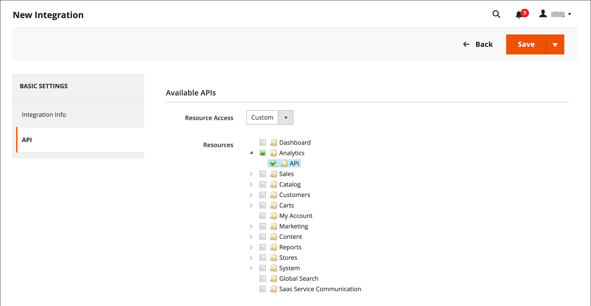

# 集成

在Commerce管理员中定义集成，可为第三方集成建立OAuth凭据和重定向URL的位置，并标识集成所需的可用API资源。 有关集成注册过程的更多详细信息，请参阅Commerce开发人员文档中的[基于OAuth的身份验证](https://developer.adobe.com/commerce/webapi/get-started/authentication/gs-authentication-oauth/)。

{width="700" zoomable="yes"}

## 载入工作流

1. **授权集成** — 转到&#x200B;**[!UICONTROL System]** > _[!UICONTROL Extensions]_>**[!UICONTROL Integrations]**&#x200B;页面，查找相关的集成并授权。
1. **验证并建立登录** — 出现提示时，接受请求的访问。 如果重定向到第三方，请登录到系统或创建帐户。 成功登录后，您将返回到集成页面。
1. **接收授权集成的确认** — 系统发送通知，告知集成已成功授权。 设置集成并接收凭据后，不再需要调用访问或请求令牌。

## 添加集成

1. 在&#x200B;_管理员_&#x200B;侧边栏上，转到&#x200B;**[!UICONTROL System]** > _[!UICONTROL Extensions]_>**[!UICONTROL Integrations]**。

   {width="600" zoomable="yes"}

1. 输入以下集成信息：

   - 输入集成的&#x200B;**[!UICONTROL Name]**&#x200B;和联系人&#x200B;**[!UICONTROL Email]**&#x200B;地址。

   - 输入&#x200B;**[!UICONTROL Callback URL]**，在使用OAuth进行令牌交换时，可在其中发送OAuth凭据。 强烈建议使用`https://`。

   - 输入&#x200B;**[!UICONTROL Identity Link URL]**&#x200B;以使用这些Adobe Commerce或Magento Open Source集成凭据将用户重定向到第三方帐户。

   >[!NOTE]
   >
   > `Integration not secure`警告标签显示在[!UICONTROL Integrations]网格上的每个集成名称附近作为提醒，直到HTTPS URL保存到[!UICONTROL Callback URL]和[!UICONTROL Identity Link URL]字段中为止。

   - 出现提示时，输入密码以确认您的身份。

1. 在左侧面板中，选择&#x200B;**[!UICONTROL API]**&#x200B;并执行以下操作：

   - 将&#x200B;**[!UICONTROL Resource Access]**&#x200B;设置为以下项之一：

      - `All`
      - `Custom`

   - 对于自定义访问，请选中所需每个资源的复选框。

     {width="600" zoomable="yes"}

1. 完成后，单击&#x200B;**[!UICONTROL Save]**。

## 激活集成

默认情况下，保存的集成会以`Inactive`状态显示在网格上。 要激活它，请完成以下步骤：

1. 在&#x200B;_管理员_&#x200B;侧边栏上，转到&#x200B;**[!UICONTROL System]** > _[!UICONTROL Extensions]_>**[!UICONTROL Integrations]**。

1. 找到新创建的集成，然后单击&#x200B;**[!UICONTROL Activate]**&#x200B;链接。

1. 单击右上角的&#x200B;**[!UICONTROL Allow]**。

   此操作显示扩展的集成令牌。 将此信息复制到安全的加密位置，以便与集成一起使用。

   扩展的{width="600" zoomable="yes"}

1. 单击右上角的&#x200B;**[!UICONTROL Done]**。

## 重新授权集成

要生成新的集成访问令牌和访问令牌密码，请从管理员重新授权集成：

1. 在&#x200B;_管理员_&#x200B;侧边栏上，转到&#x200B;**[!UICONTROL System]** > _[!UICONTROL Extensions]_>**[!UICONTROL Integrations]**。

1. 查找与&#x200B;**[!UICONTROL Active]**&#x200B;状态的集成。

1. 在&#x200B;_[!UICONTROL Activate]_&#x200B;列中，单击&#x200B;**[!UICONTROL Reauthorize]**。

1. 单击&#x200B;**[!UICONTROL Reauthorize]**&#x200B;批准对API资源的访问。

1. 保存扩展的新集成令牌，然后单击&#x200B;**[!UICONTROL Done]**。

## 更改API来宾访问安全设置

默认情况下，系统不允许匿名访客访问CMS、目录和其他存储资源。 如果必须更改设置，请执行以下操作：

1. 在&#x200B;_管理员_&#x200B;侧边栏上，转到&#x200B;**[!UICONTROL Stores]** > _[!UICONTROL Settings]_>**[!UICONTROL Configuration]**。

1. 在左侧面板中，展开&#x200B;**[!UICONTROL Services]**&#x200B;并选择&#x200B;**[!UICONTROL Magento Web API]**。

1. 展开&#x200B;**[!UICONTROL Web API Security Setting]**&#x200B;部分的。

   {width="600" zoomable="yes"}

1. 将&#x200B;**[!UICONTROL Allow Anonymous Guest Access]**&#x200B;设置为`Yes`。

1. 完成后，单击&#x200B;**[!UICONTROL Save Config]**。

有关详细信息，请参阅Commerce开发人员文档中的[限制对匿名Web API的访问](https://developer.adobe.com/commerce/webapi/rest/use-rest/anonymous-api-security/)。

## 删除集成

1. 在&#x200B;_管理员_&#x200B;侧边栏上，转到&#x200B;**[!UICONTROL System]** > _[!UICONTROL Extensions]_>**[!UICONTROL Integrations]**。

1. 找到现有的集成，然后单击&#x200B;**[!UICONTROL Delete]**&#x200B;列中的图标（）。

1. 要确认您的操作，请单击&#x200B;**[!UICONTROL OK]**。
