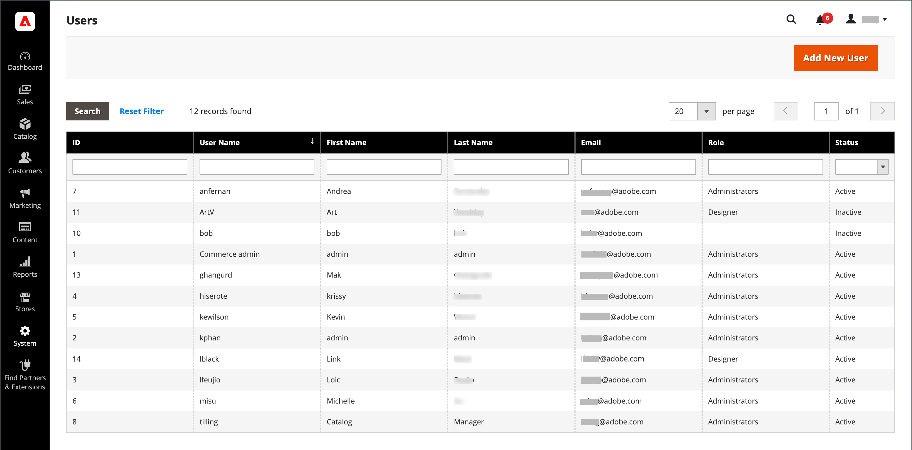

# 管理员权限

Adobe Commerce和Magento Open Source使用角色和权限创建管理员的不同级别访问权限。 首次设置存储时，您将收到一组具有完全权限的管理员角色的登录凭据。 但是，您可以根据“需要知道”对在您的网站上工作的其他人的权限级别进行限制。 例如，设计团队的成员只能访问内容设计工具，而不能访问包含客户和订单信息的区域。

此外，您可以进一步将管理员访问权限限制为仅访问特定站点，或访问一组站点及其相关数据。 如果在同一Commerce安装中有多个品牌或业务部门拥有不同的商店，则可以为每个业务部门提供管理员访问权限，但是可以隐藏这些品牌或业务部门的数据并保护其数据不被其他管理员用户访问。

当管理员用户的访问权限仅限于特定网站或商店时，这些未被授权的网站或商店不可见或显示为灰色。 仅向用户显示许可网站和商店的销售和其他数据。

-  (仅限Adobe Commerce)默认情况下，系统将自动记录（记录）用户在将更改应用于商店时执行的所有操作。 管理员操作可在以下位置查看： [操作日志报告](action-log-report.md). 配置登录 [管理员操作日志记录](action-log.md) （在商店的高级管理员设置中）。

{width="700" zoomable="yes"}
