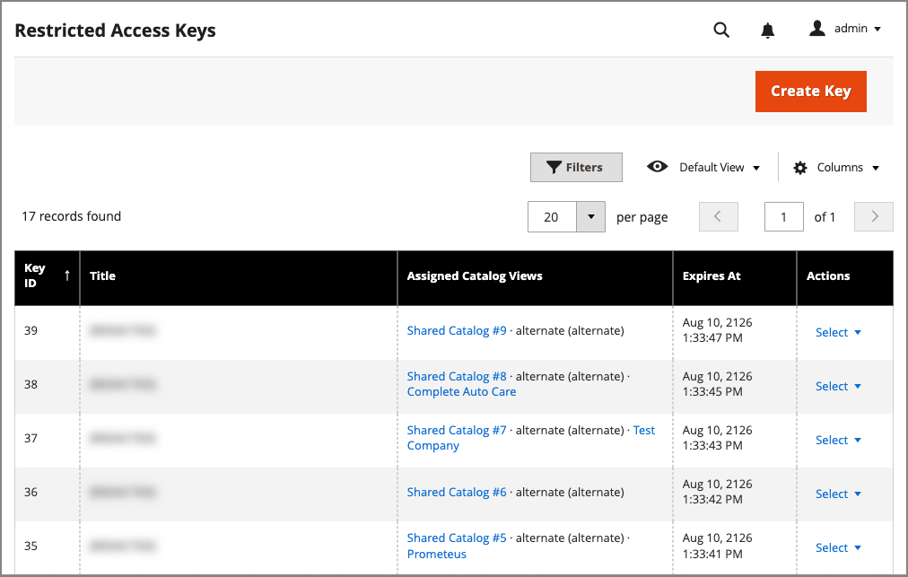

# 管理受限制的访问密钥

使用“受限访问密钥”页管理[!DNL Adobe Commerce Optimizer Connector for B2B]创建的私有目录视图的访问密钥。 连接器将B2B共享目录配置从Adobe Commerce同步到Adobe Commerce Optimizer。

>[!NOTE]
>
>对于在非B2B方案（如合作伙伴门户）中用于管理专用目录的手动创建的密钥，请从[[!DNL Adobe Commerce Optimizer Studio]](https://experienceleague.adobe.com/zh-hans/docs/commerce/optimizer/setup/restricted-access-keys){target="_blank"}管理密钥。

## 受众和可用性 {#audience}

仅[!BADGE PaaS]{type=Informative url="https://experienceleague.adobe.com/zh-hans/docs/commerce/user-guides/product-solutions" tooltip="仅适用于云基础架构和内部部署项目上的Adobe Commerce 。"}

[!UICONTROL Restricted Access Keys]页面适用于Adobe Commerce on Cloud Infrastructure和使用B2B共享目录与[!DNL Adobe Commerce Optimizer Connector for B2B]的本地商家。 连接器会自动安装和启用页面。

首次为共享目录创建目录视图时，连接器会自动生成并分配一个键。 使用此页可查看该键，并创建、分配或删除其他键。

## 访问“受限访问密钥”页 {#access-restricted-access-keys-page}

从管理区域，导航到&#x200B;**[!UICONTROL System]** > **[!UICONTROL Data Transfer]** > **[!UICONTROL Restricted Access Keys]**。

{width="600" zoomable="yes"}

此页面列出每个键，无论是否将其分配给目录视图。 要将密钥分配给特定目录视图，请对该目录视图使用[!UICONTROL Edit Restricted Access Keys]操作。 查看[将密钥分配给目录视图](#assign-keys-to-a-catalog-view)。

## 受限访问密钥摘要 {#restricted-access-keys-summary}

网格每行包含一个键。

| 字段 | 描述 |
| --- | --- |
| **密钥ID** | 唯一密钥标识符。 |
| **标题** | 您提供的用于标识键的标签。 |
| **已分配的目录视图** | 此键当前分配的目录视图。 |
| **过期时间：** | 密钥到期日期。 |
| **操作** | 行级操作。 请参阅[管理密钥](#manage-keys)。 |

## 管理密钥 {#manage-keys}

- **[!UICONTROL Create Key]** — 生成新的未分配密钥对。 Commerce会生成密钥对并存储私钥。 在将公钥分配给目录视图之前，该公钥未向[!DNL Adobe Commerce Optimizer]注册。
- **[!UICONTROL View Public Key]** — 打开密钥的公共密钥的只读视图，以便您可以根据需要复制它以重新注册或重新同步密钥。 从不显示私钥。
- **[!UICONTROL Delete]** — 删除密钥并撤消其在[!DNL Adobe Commerce Optimizer]中的远程注册。 已使用此密钥颁发的店面令牌在过期之前一直有效。 无法撤消此操作。

>[!NOTE]
>
>只能删除已过期的密钥。 您不能分配或取消分配过期的密钥。

## 创建密钥

在[!UICONTROL Restricted Access Keys]页面上，通过选择&#x200B;**[!UICONTROL Create Key]**&#x200B;创建一个键。

Commerce会生成一个新的密钥对并存储私钥。 “受限访问密钥”表将更新为显示唯一密钥ID的新密钥条目。 将密钥分配给目录视图时使用此[!UICONTROL Key ID]。

在将公钥分配给目录视图之前，该公钥未向[!DNL Adobe Commerce Optimizer]注册。 注册后，将更新受限访问键表条目，以显示目录分配和到期日期。

## 分配或删除受限访问密钥 {#assign-keys-to-a-catalog-view}

{{$include /help/_includes/edit-restricted-access-keys.md}}

## 键选择和轮换 {#key-selection-and-rotation}

将多个密钥分配给目录视图时，[!DNL Adobe Commerce]会自动使用分配的、未过期的密钥和最新的到期日期来签署令牌。

>[!IMPORTANT]
>
>自动密钥轮换尚不可用。 键的默认有效期较长。 要手动旋转键，请创建新键，并将其与现有键一起分配给目录视图。 确认新密钥正在使用后，删除旧密钥。

要更改应用于新创建密钥的默认过期期限，请转到&#x200B;**[!UICONTROL Stores]** > **[!UICONTROL Configuration]** > **[!UICONTROL Services]** > **[!UICONTROL ACO Restricted Access Keys]** > **[!UICONTROL Provisioning]** > **[!UICONTROL Default key lifetime (days)]**。 请参阅[服务> ACO受限访问密钥](../configuration-reference/services/aco-restricted-access-keys.md)。

## 已知限制 {#known-limitations}

- 主[!UICONTROL Restricted Access Keys]网格上没有活动或状态指示器。

  您可以在[!UICONTROL Edit Restricted Access Keys]页面上看到链接状态。 使用下拉菜单查看可用密钥及其状态。 如果将键分配给目录视图，则会链接该键。 如果未分配，则它没有状态。 您可以将这些键分配给正在编辑的目录视图。

  在[!UICONTROL Catalog View Sync Status]页面中，您可以从目录视图详细信息页面（**[!UICONTROL View details]**&#x200B;操作）看到链接到目录视图的键。 详细信息页面还会显示关键历史记录，包括从目录视图进行分配或取消分配的时间。

- 自动密钥轮换尚不可用。

>[!MORELIKETHIS]
>
> - [管理目录视图配置](/help/b2b/catalog-views-manage.md) — 从共享目录或公司帐户分配这些密钥
> - [目录视图同步状态监视](catalog-view-sync-status.md) — 监视并协调这些密钥保护的目录视图
> - [服务> ACO受限访问密钥](../configuration-reference/services/aco-restricted-access-keys.md) — 配置默认密钥过期期限
> - [服务> ACO目录视图](../configuration-reference/services/aco-catalog-view.md) — 配置店面访问令牌生命周期并启用或禁用发布
> - [在&#x200B;*Adobe Commerce Optimizer Connector指南*&#x200B;中管理受限访问密钥](https://experienceleague.adobe.com/en/docs/commerce/aco-optimizer-connector/manage-sync/catalog-view-sync/restricted-access-keys){target="_blank"} — 了解这些密钥如何适应B2B共享目录同步
> - *Adobe Commerce Optimizer指南*&#x200B;中的[受限访问密钥](https://experienceleague.adobe.com/zh-hans/docs/commerce/optimizer/setup/restricted-access-keys){target="_blank"} — 非B2B用例的手动基于ACO Studio的密钥流
