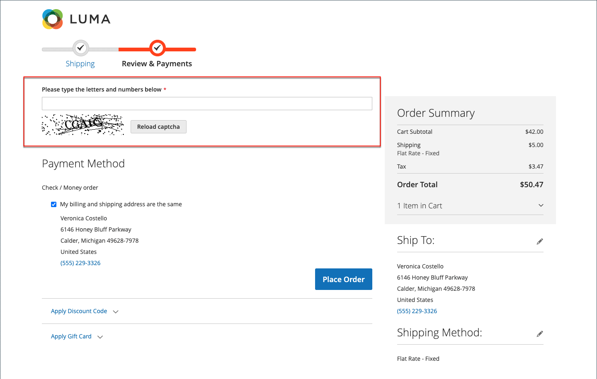

# 验证码

验证码是一种可视设备，可确保人(而不是计算机（或“机器人”）)与站点进行交互。 CAPTCHA是&#x200B;_Complete Automated Public Turing测试的缩写，用于区分计算机和人_。 它可用于管理员访问和注册客户启动的各种店面操作。 Adobe Commerce和Magento Open Source支持本主题和[Google reCAPTCHA](security-google-recaptcha.md)中所述的标准CAPTCHA。

您可以根据需要多次重新加载验证码，方法是单击图像右上角的重新加载图标。 CAPTCHA是完全可配置的，并且每次都可以设置，或者仅在定义的失败登录尝试次数之后设置。

{width="700" zoomable="yes"}

## 为管理员配置验证码

为了提高安全性，您可以在“管理员登录和忘记密码”页面中添加验证码。 管理员用户可以通过单击图像右上角的&#x200B;_重新加载_ 图标来重新加载显示的验证码。 重新加载的次数不受限制。

{width="300"}

1. 在&#x200B;_管理员_&#x200B;侧边栏上，转到&#x200B;**[!UICONTROL Stores]** > _[!UICONTROL Settings]_>**[!UICONTROL Configuration]**。

1. 在左侧面板中，展开&#x200B;**[!UICONTROL Advanced]**&#x200B;并选择&#x200B;**[!UICONTROL Admin]**。

1. 在右上角，将&#x200B;**[!UICONTROL Store View]**&#x200B;设置为`Default`。

   如果Commerce安装的[作用域](../getting-started/websites-stores-views.md#scope-settings)包含多个网站，请选择您希望应用验证码配置的网站。

1. 展开&#x200B;**[!UICONTROL CAPTCHA]**&#x200B;部分的。

1. 将&#x200B;**[!UICONTROL Enable CAPTCHA in Admin]**&#x200B;设置为`Yes`。 然后完成其余选项，如下所示：

   {width="600" zoomable="yes"}

   - 输入要用于验证码符号的&#x200B;**[!UICONTROL Font]**&#x200B;的名称（默认值： `LinLibertine`）。

     要添加您自己的字体，该字体文件必须与Commerce安装位于同一目录中，并且必须在`app/code/Magento/Captcha/etc`处的Captcha模块的`config.xml`文件中声明。

   - 选择以下&#x200B;**[!UICONTROL Forms]**&#x200B;中要使用CAPTCHA的任何一个。 要选择多个表单，请按住Ctrl键(PC)或Command键(Mac)。

      - `Admin Login`
      - `Admin Forgot Password`

   - 将&#x200B;**[!UICONTROL Displaying Modes]**&#x200B;设置为以下项之一：

      - `Always` — 始终需要CAPTCHA才能登录到管理员。
      - `After number of attempts to login` — 此选项仅适用于“管理员登录”表单。 选中后，将显示&#x200B;_[!UICONTROL Number of Unsuccessful Attempts to Login]_&#x200B;字段。 输入要允许的登录尝试次数。 值为0 （零）类似于将“显示模式”设置为`Always`。

     为了跟踪失败的登录尝试次数，每次尝试使用一个电子邮件地址和一个IP地址登录都会被计数。 允许从同一IP地址登录的最大次数是1,000。 此限制仅在启用CAPTCHA时适用。

   - 对于&#x200B;**[!UICONTROL Number of Unsuccessful Attempts to Login]**，输入在验证码出现之前管理员可以尝试登录的次数。 如果设置为零(`0`)，则始终需要验证码。

   - 对于&#x200B;**[!UICONTROL CAPTCHA Timeout (minutes)]**，请输入验证码过期前的分钟数。 验证码过期后，管理员必须重新加载页面。

   - 输入要出现在验证码中的&#x200B;**[!UICONTROL Number of Symbols]**。 最多可使用八个(`8`)符号。 对于随每个CAPTCHA更改的可变符号数，请输入一个范围（如`5-8`）。

   - 对于&#x200B;**[!UICONTROL Symbols Used in CAPTCHA]**，请输入要在验证码中随机显示的字母（a-z和A-Z）和数字(0-9)。 很难与其他符号（如`i`、`l`或`1`）区分的符号不包含在默认验证码符号集中。

   - 如果您希望要求管理员完全按照验证码中所示输入大写或小写字符，请将&#x200B;**[!UICONTROL Case Sensitive]**&#x200B;设置为`Yes`。

1. 完成后，单击&#x200B;**[!UICONTROL Save Config]**。

## 为店面配置验证码

客户每次登录其帐户时，或多次尝试登录失败后，都可能需要输入验证码。 此外，在整个店面中使用的许多表单都可以配置为需要由验证码进行验证。

签出期间{width="700" zoomable="yes"}

1. 在&#x200B;_管理员_&#x200B;侧边栏上，转到&#x200B;**[!UICONTROL Stores]** > _[!UICONTROL Settings]_>**[!UICONTROL Configuration]**。

1. 在左侧面板中，展开&#x200B;**[!UICONTROL Customers]**&#x200B;并选择&#x200B;**[!UICONTROL Customer Configuration]**。

1. 展开&#x200B;**[!UICONTROL CAPTCHA]**&#x200B;部分的。

{width="600" zoomable="yes"}

1. 将&#x200B;**[!UICONTROL Enable CAPTCHA on Storefront]**&#x200B;设置为`Yes`。 然后完成其余选项，如下所示：

   - 输入要用于验证码符号的&#x200B;**[!UICONTROL Font]**&#x200B;的名称（默认值： `LinLibertine`）。

     要添加您自己的字体，字体文件必须与Commerce安装位于同一目录中，并且必须在CAPTCHA模块的`config.xml`文件中声明。

   - 选择以下&#x200B;**[!UICONTROL Forms]**&#x200B;中要使用CAPTCHA的任何一个。 要选择多个表单，请按住Ctrl键(PC)或Command键(Mac)。

      - `Applying coupon code`
      - `Checkout/Placing Order`
      - `Create user`
      - `Login`
      - `Forgot password`
      - `Contact Us`
      - `Change password`
      - `Share Wishlist Form`
      - `Payflow Pro` （请参阅[安全修补程序](https://experienceleague.adobe.com/docs/commerce-knowledge-base/kb/troubleshooting/payments/paypal-payflow-pro-active-carding-activity.html) _知识库_&#x200B;文章）
      - `Send to Friend Form` (仅Magento Open Source)
      - `Add Gift Card Code` (仅限Adobe Commerce)
      - `Create company` (仅适用于Adobe Commerce B2B)

   - 将&#x200B;**[!UICONTROL Displaying Mode]**&#x200B;设置为以下项之一：

      - `Always` — 始终需要CAPTCHA才能访问选定的表单。
      - `After number of attempts to login` — 输入验证码出现之前的登录尝试次数。 值0（零）类似于“始终”。 选中后，将显示失败的登录尝试次数。 此选项不适用于“忘记密码”表单，该表单如果启用，将始终显示CAPTCHA。

   - 对于&#x200B;**[!UICONTROL Number of Unsuccessful Attempts to Login]**，输入客户在验证码出现之前不能成功登录的次数。 如果设置为零(`0`)，则始终使用CAPTCHA。

   - 对于&#x200B;**[!UICONTROL CAPTCHA Timeout (minutes)]**，请输入验证码过期前的分钟数。 验证码过期后，客户必须重新加载页面才能生成新的验证码。

   - 输入要出现在验证码中的&#x200B;**[!UICONTROL Number of Symbols]**。 最多可使用八个(`8`)符号。 对于随每个CAPTCHA更改的可变符号数，请输入一个范围（如`5-8`）。

   - 对于&#x200B;**[!UICONTROL Symbols Used in CAPTCHA]**，请输入要在验证码中随机显示的字母（a-z和A-Z）和数字(0-9)。 默认字符集不包括类似符号，如`I`或`1`。 为了获得最佳效果，请使用用户可轻松识别的符号。

   - 如果您希望要求客户完全按照验证码中的显示方式输入大写或小写的字符，请将&#x200B;**[!UICONTROL Case Sensitive]**&#x200B;设置为`Yes`。

1. 完成后，单击&#x200B;**[!UICONTROL Save Config]**。
