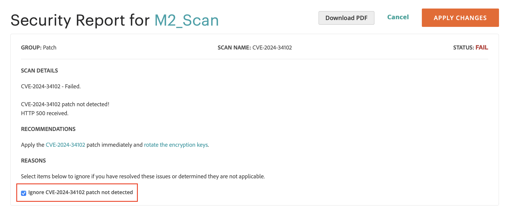

# 安全扫描

监控您的Adobe Commerce和Magento Open Source站点是否存在安全风险和恶意软件，并接收安全更新和通知。

- 让insight了解您商店的实时安全状态。
- 接收基于最佳实践的建议，以帮助解决问题。
- 安排每周、每天或按需运行安全扫描。
- 运行21,000多项安全测试，帮助识别潜在的恶意软件。
- 访问跟踪和监控站点进度的历史安全报告。
- 访问显示成功和失败检查以及任何建议操作的扫描报告。

安全扫描工具可从[Commerce/Magento帐户](../getting-started/commerce-account-create.md)的仪表板中免费使用。 有关技术信息，请参阅《云基础架构上的Commerce指南》[中的](https://experienceleague.adobe.com/en/docs/commerce-on-cloud/user-guide/launch/overview#set-up-the-security-scan-tool)设置安全扫描工具&#x200B;__。

{width="600" zoomable="yes"}

## 工作流

要为您的Adobe Commerce或Magento Open Source站点设置和配置安全扫描工具，请完成两个步骤：

1. [设置您的站点以进行安全扫描](#step-1-set-up-your-site-for-security-scanning)
2. [配置自动安全扫描](#step-2-configure-automatic-security-scans)

### 步骤1：设置站点以进行安全扫描

1. 从Commerce主页登录到您的[Commerce/Magento帐户](../getting-started/commerce-account-create.md)。

2. 查看并接受使用安全扫描工具的条款。

   1. 在左侧面板中，选择&#x200B;**[!UICONTROL Security Scan]**。
   1. 单击&#x200B;**[!UICONTROL Go to Security Scan]**。
   1. 阅读&#x200B;**[!UICONTROL Terms and Conditions]**。
   1. 单击&#x200B;**[!UICONTROL Agree]**&#x200B;继续。

3. 在&#x200B;_[!UICONTROL Monitored Websites]_页面上，单击&#x200B;**[!UICONTROL +Add Site]**。

   如果您有多个具有不同域的站点，请为每个域配置单独的扫描。

   {width="600" zoomable="yes"}

4. 通过生成确认代码并将其添加到安全扫描工具，验证您对网站域的所有权。

   添加确认代码的过程因您使用的店面类型而异。 按照店面类型的步骤操作。

>[!BEGINTABS]

>[!TAB Commerce店面]

1. 输入&#x200B;**[!UICONTROL Site URL]**&#x200B;和&#x200B;**[!UICONTROL Site Name]**。
1. 单击&#x200B;**[!UICONTROL Generate Confirmation Code]**。
1. 单击&#x200B;**复制**&#x200B;以将确认代码复制到剪贴板。

   {width="400" zoomable="yes"}

1. 以具有完全管理员权限的用户身份登录到存储的管理员，并执行以下操作：

   1. 在&#x200B;_管理员_&#x200B;侧边栏中，转到&#x200B;**[!UICONTROL Content]** > _[!UICONTROL Design]_>**[!UICONTROL Configuration]**。
   1. 在列表中找到您的网站，然后单击&#x200B;**[!UICONTROL Edit]**。
   1. 展开扩展选择器&#x200B;**[!UICONTROL HTML Head]**。
   1. 向下滚动到&#x200B;**[!UICONTROL Scripts and Style Sheets]**&#x200B;并单击任何现有代码末尾的文本框。 将确认代码粘贴到文本框中。

      {width="600" zoomable="yes"}

   1. 完成后，单击&#x200B;**[!UICONTROL Save Configuration]**。

1. 返回到Commerce帐户中的&#x200B;_[!UICONTROL Security Scan]_页面，然后单击&#x200B;**[!UICONTROL Verify Confirmation Code]**以建立域的所有权。

>[!TAB PWA店面]

1. 输入&#x200B;**[!UICONTROL Site URL]**&#x200B;和&#x200B;**[!UICONTROL Site Name]**。

1. 对于&#x200B;**[!UICONTROL Confirmation Code]**，请选择`META Tag`选项，然后单击&#x200B;**[!UICONTROL Generate Code]**。

1. 单击&#x200B;**[!UICONTROL Copy]**&#x200B;以将生成的确认代码META标记复制到剪贴板。

   {width="400" zoomable="yes"}

1. 转到PWA Studio storefront项目目录并执行以下操作：

   1. 在PWA Studio项目目录下，转到`packages > venia-concept > template.html`。
   1. 将复制的确认代码(生成的META标记)添加到HTML标题并保存更改。

      {width="600" zoomable="yes"}

   1. 返回到PWA Studio CLI，然后使用yarn安装项目依赖项并运行项目构建命令。

      ```sh
      yarn install &&
      yarn build
      ```

   1. *在您的云项目*&#x200B;中，创建一个`pwa`文件夹，并复制店面项目的`dist`文件夹中的内容。

      ```sh
      mkdir pwa && cp -r <path to your storefront project>/dist/* pwa
      ```

   1. 使用Git CLI工具来暂存、提交这些更改，并将其推送到您的云项目。

      ```sh
      git add . &&
      git commit -m "Added storefront file bundles" &&
      git push origin
      ```

      构建过程完成后，更改将部署到您的PWA店面。

1. 返回到Commerce帐户中的&#x200B;_[!UICONTROL Security Scan]_页面，然后单击&#x200B;**[!UICONTROL Verify Confirmation Code]**以建立域的所有权。

>[!TAB AEM店面]

1. 输入&#x200B;**[!UICONTROL Site URL]**&#x200B;和&#x200B;**[!UICONTROL Site Name]**。

1. 对于&#x200B;**[!UICONTROL Confirmation Code]**，选择`HTML Content`或`META Tag`选项，然后单击&#x200B;**[!UICONTROL Generate Code]**。

1. 单击&#x200B;**[!UICONTROL Copy]**&#x200B;以将生成的确认代码复制到剪贴板。

   {width="400" zoomable="yes"}

1. 转到AEM storefront项目目录并执行以下操作：

   1. 在AEM storefront项目目录下，转到`head.html`。
   1. 将复制的确认代码(生成的HTML Content或META Tag)添加到`head.html`文件并保存更改。

   {width="600" zoomable="yes"}

1. 使用Git CLI工具暂存、提交这些更改并将其推送到项目存储库。

   ```sh
   git add . &&
   git commit -m "Added security scan confirmation code" &&
   git push origin
   ```

   构建过程完成后，更改将部署到您的AEM商店前面。

1. 返回到Commerce帐户中的&#x200B;_[!UICONTROL Security Scan]_页面，然后单击&#x200B;**[!UICONTROL Verify Confirmation Code]**以建立域的所有权。

>[!ENDTABS]

### 步骤2：配置自动安全扫描

1. 成功验证站点所有权后，为以下类型之一配置&#x200B;**[!UICONTROL Set Automatic Security Scan]**&#x200B;选项：

   **每周扫描（推荐）**：

   选择每周进行扫描的&#x200B;**[!UICONTROL Week Day]**、**[!UICONTROL Time]**&#x200B;和&#x200B;**[!UICONTROL Time Zone]**。

   默认情况下，扫描计划从每周的星期六午夜(UTC)开始，并持续到星期日。

   {width="500" zoomable="yes"}

   **每日扫描**：

   选择每天进行扫描的&#x200B;**[!UICONTROL Time]**&#x200B;和&#x200B;**[!UICONTROL Time Zone]**。

   默认情况下，扫描计划于每天午夜(UTC)开始。

   {width="500" zoomable="yes"}

1. 输入要接收已完成扫描和安全更新通知的&#x200B;**[!UICONTROL Email Address]**。

   {width="400" zoomable="yes"}

1. 完成后，单击&#x200B;**[!UICONTROL Submit]**。

   验证域的所有权后，该站点将显示在Commerce帐户的“受监控网站”列表中。

1. 如果您有多个网站使用不同的域，请重复此过程为每个网站设置安全扫描。

## 管理扫描失败

安全扫描工具允许您直接从报告视图管理扫描失败。 您可以将特定的扫描失败标记为误报，并将其从风险分数中排除。

### 管理扫描失败的好处

管理扫描故障可通过以下方式帮助您维护存储区更准确的安全概述：

- 减少安全报表中的误报。
- 关注需要注意的相关安全问题。
- 保持更清楚地了解您商店的真实安全状态。
- 无需联系支持人员来查找已知误报。
- 通过自行管理您已经调查的扫描故障来节省时间。

您可能希望将扫描失败标记为误报的常见情况包括：

- 应用了扫描工具未检测到的安全修补程序后。
- 当检测到的问题不适用于您的特定商店配置时。
- 当您实施了替代安全措施来解决问题时。
- 当扫描失败基于您特意为业务需求设置的配置时。

### 忽略扫描失败

要管理已识别为误报的扫描失败，请执行以下步骤：

1. 从&#x200B;_[!UICONTROL Monitored Websites]_页面，单击要管理的站点的&#x200B;**[!UICONTROL View Report]**。

1. 在报表视图中，找到要标记为误报的失败扫描。

1. 单击&#x200B;**[!UICONTROL Ignore]**&#x200B;查看特定的扫描失败。

   {width="600" zoomable="yes"}

1. 单击&#x200B;**[!UICONTROL Apply Changes]**&#x200B;保存您的选择。

忽略的扫描失败将移至&#x200B;_[!UICONTROL Ignored Results]_部分，并从风险分数中排除。

### 停止忽略扫描失败

如果需要将以前忽略的扫描故障恢复到活动监视状态，请执行以下步骤：

1. 在报表视图中，滚动到&#x200B;_[!UICONTROL Ignored Results]_部分。

1. 对于要恢复的扫描失败，单击&#x200B;**[!UICONTROL Stop Ignoring]**。

   {width="600" zoomable="yes"}

1. 单击&#x200B;**[!UICONTROL Apply Changes]**&#x200B;保存您的选择。

扫描失败将移回到&#x200B;_[!UICONTROL Failed Scans]_部分，并包含在您的风险分数中。

### 查看忽略的扫描失败

忽略的结果显示在报告的单独部分中，并且风险分数会自动更新以仅反映活动扫描失败。 在应用更改之前，通过选择多个项目，可以一次管理多个扫描失败。

{width="600" zoomable="yes"}
