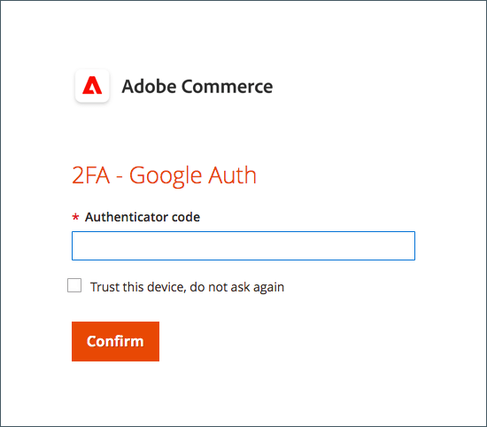
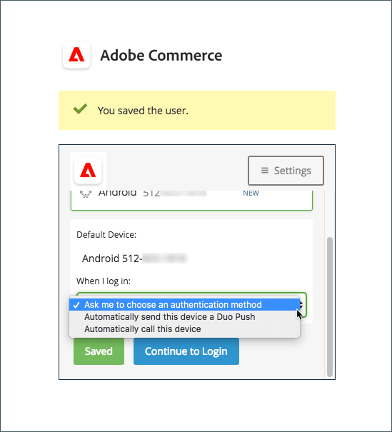

# 用户帐户的双重身份验证设置

这些说明说明了如何在首次登录Adobe Commerce或Magento Open Source期间设置双重身份验证，以及如何使用以下应用程序和设备验证您的身份。

有关完整说明，请参阅 [管理员登录](../getting-started/admin-signin.md).

>[!NOTE]
>
>已启用存储 [!DNL Adobe Identity Management Services] (IMS)身份验证已禁用本机Adobe Commerce和Magento Open Source2FA。 使用Adobe凭据登录其Commerce实例的管理员用户不需要对许多管理员任务重新进行身份验证。 当管理员用户登录到其当前会话时，身份验证由Adobe IMS处理。 请参阅 [[!DNL Adobe Identity Management Service] (IMS)集成概述](../getting-started/adobe-ims-integration-overview.md).

## [!DNL Google Authenticator]

### 第1步：设置 [!DNL Google Authenticator]

1. 输入您的帐户凭据并登录到 _管理员_. 将出现一个带有二维码的新验证器屏幕。

1. 打开 **[!UICONTROL Google Authenticator]** 移动设备上的应用程序。

1. 单击加号( **+** )，以添加一个条目，并在红色框中排列二维码，以便使用智能手机上的摄像头进行扫描。

1. 当手机识别二维码并添加条目时，请在 _管理员_ **[!UICONTROL Authenticator code]** 字段。

1. 完成后，单击 **[!UICONTROL Confirm]**.

   {width="300"}

### 第2步：使用登录 [!DNL Google Authenticator]

1. 输入帐户凭据并登录到Commerce _管理员_.

   {width="300"}

1. 打开 [!DNL Google Authenticator] 在移动设备上。

1. 出现提示时，输入六位数的验证代码。

1. 要保存身份验证以供将来登录，请选择 **[!UICONTROL Trust this device, do not ask again]** 复选框。

1. 完成后，单击 **[!UICONTROL Confirm]**.

## [!DNL Duo Security]

[!DNL Duo] 提供免费试用，并根据与帐户关联的用户数量收费。 关注其 [有关设置帐户和下载应用程序的说明](https://duo.com/product/multi-factor-authentication-mfa/duo-mobile-app).

### 第1步：设置 [!DNL Duo Security]

1. 输入您的帐户凭据并登录到 _管理员_.

1. 当 [!DNL Duo] 出现“Setup（设置）”页面，单击 **[!UICONTROL Start setup]** 并执行以下操作：

   {width="300"}

1. 选择您的设备。

1. 出现提示时，输入您的电话号码并单击 **[!UICONTROL Continue]**.

   此示例会请求您的电话号码，因为我们使用的是移动设备。

1. 提示安装时 [!DNL Duo Mobile] 对于您的电话类型，请单击 **[!UICONTROL I have Duo Mobile]**.

1. 打开 [!DNL Duo Mobile] 并扫描此二维码以将验证器与Adobe Commerce同步。 激活完成后，会出现复选标记。

1. 要配置设备的设置，请选择登录时要执行的操作。

   - `Ask me to choose an authenticator method`  — 允许用户在登录和验证时进行选择 _管理员_.
   - `Automatically send this device a Duo Push`  — 向设备发送消息以接受或拒绝访问。
   - `Automatically call this device`  — 调用并提供要输入以进行访问的密码。

   {width="300"}

### 第2步：使用登录 [!DNL Duo Security]

以下示例显示了 `Ask me to choose an authenticator method`：

1. 出现提示时，输入 _管理员_ 用于登录的凭据。

   {width="300"}

1. 选择要用于验证的方法：

   - `Send Me a Push`  — 单击以接收推送通知 [!DNL Duo Mobile]. 接受以进行身份验证。
   - `Call Me`  — 单击此选项，接收带有代码的呼叫，然后输入密码。
   - `Enter a Passcode`  — 单击此选项接收并输入密码。

1. 完成推送或代码以完全登录到 _管理员_.

## [!DNL Authy]

[!DNL Authy] 向用户免费提供他们的应用程序和服务。 按照他们的说明为您的设备或浏览器下载和设置应用程序。 要了解更多信息，请参阅 [[!DNL Authy] 文档](https://authy.com/features/setup/).

### 步骤1：设置身份验证

1. 输入您的帐户凭据并登录到 _管理员_.

   ![[!DNL Authy] 注册](./assets/storefront-2fa-authy-auth.png){width="300"}

1. 当系统提示您向Authy注册时，请执行以下操作：

   - 选择您的国家/地区。

   - 输入您的电话号码。

   - 选择 **[!UICONTROL Verification method]**： `SMS` 或 `Call Me`

   单击 **[!UICONTROL Continue]**. 通过短信或呼叫将消息发送到您的电话。

1. 输入您收到的验证码并单击 **[!UICONTROL Verify]**.

1. 完成后，单击 **[!UICONTROL Confirm]**.

   ![[!DNL Authy] 验证码](./assets/storefront-2fa-authy-verify.png){width="300"}

### 第2步：使用登录 [!DNL Authy]

1. 输入您的帐户凭据并登录到 _管理员_.

   ![[!DNL Authy]  — 登录](./assets/storefront-2fa-authy-access.png){width="300"}

1. 选择以下方法之一进行身份验证：

   - `Use one touch`  — 发送警报至 [!DNL Authy] 应用程序。 在应用程序中，接受访问权限。
   - `Use authy token`  — 提示您输入您的中的代码 [!DNL Authy] 应用程序。

1. 如果您在登录时遇到问题，请选择要用来接收代码的方法。 然后，输入您收到的用于访问 _管理员_.

   该应用程序包括这些额外的紧急方法。

   - `Send me a code via SMS`  — 向配置的移动设备发送文本短信消息。
   - `Send me a code via phone call`  — 用户接到带有代码的电话呼叫。

   您的帐户已验证并打开。

## U2F ([!DNL Yubikey] 和其他设备)

按照解决方案提供商的说明配置U2F设备。 有关详细信息，请参阅供应商文档，如 [[!DNL YubiKey]](https://support.yubico.com/hc/en-us/articles/360013790339-Getting-Started-with-Your-YubiKey) 按 [!UICONTROL Yubico].

1. 输入您的帐户凭据并登录到 _管理员_.

   {width="300"}

1. 按住键上的按钮。

   身份验证会立即触发并打开 _管理员_.

1. 插入 **[!UICONTROL U2F key]** 插入计算机上的USB端口。
