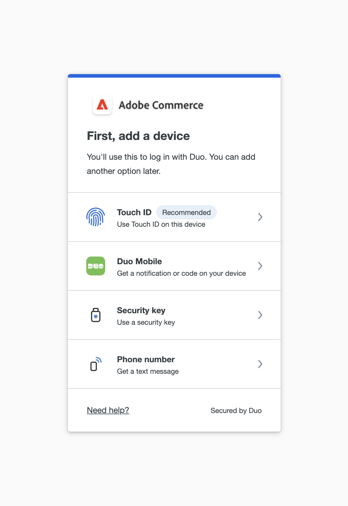

# 用户帐户的双重身份验证设置

这些说明说明了如何在首次登录Adobe Commerce或Magento Open Source期间设置双重身份验证，以及如何使用以下应用程序和设备验证您的身份。

有关完整说明，请参阅[管理员登录](../getting-started/admin-signin.md)。

>[!NOTE]
>
>已启用[!DNL Adobe Identity Management Services] (IMS)身份验证的存储已禁用本机Adobe Commerce和Magento Open Source 2FA。 使用其Adobe凭据登录到其Commerce实例的管理员用户不需要对许多管理员任务重新进行身份验证。 当管理员用户登录到其当前会话时，身份验证由Adobe IMS处理。 请参阅[[!DNL Adobe Identity Management Service] (IMS)集成概述](../getting-started/adobe-ims-integration-overview.md)。

## [!DNL Google Authenticator]

### 步骤1：设置[!DNL Google Authenticator]

1. 输入帐户凭据并登录到&#x200B;_管理员_。 将出现一个带有二维码的新验证器屏幕。

1. 在移动设备上打开&#x200B;**[!UICONTROL Google Authenticator]**&#x200B;应用。

1. 单击加号( **+** )添加一个条目，并在红色框中排上要与智能手机上的摄像头一起扫描的二维码。

1. 当您的手机识别二维码并添加条目时，请在&#x200B;_管理员_ **[!UICONTROL Authenticator code]**&#x200B;字段中输入该6位数代码。

1. 完成后，单击&#x200B;**[!UICONTROL Confirm]**。

   {width="300"}

### 步骤2：使用[!DNL Google Authenticator]登录

1. 输入帐户凭据并登录到Commerce _管理员_。

   {width="300"}

1. 在移动设备上打开[!DNL Google Authenticator]。

1. 出现提示时，输入六位数的验证代码。

1. 要保存身份验证以供将来登录，请选中&#x200B;**[!UICONTROL Trust this device, do not ask again]**&#x200B;复选框。

1. 完成后，单击&#x200B;**[!UICONTROL Confirm]**。

## [!DNL Duo Security]

[!DNL Duo]提供免费试用，并根据与帐户关联的用户数量收费。 按照他们的[说明设置您的帐户并下载应用程序](https://duo.com/product/multi-factor-authentication-mfa/duo-mobile-app)。

### 步骤1：设置[!DNL Duo Security]

1. 输入帐户凭据并登录到&#x200B;_管理员_。

1. 显示[!DNL Duo]设置页面时，单击&#x200B;**[!UICONTROL Get Started]**&#x200B;并执行以下操作：

   {width="300"}

1. 选择您的选项。 您可以选择触控ID、双核Mobile、安全密钥或电话号码。 此示例显示了Duo手机或电话号码选项。

1. 出现提示时，输入您的电话号码并单击&#x200B;**[!UICONTROL Continue]**。

   通过发送并验证电话号码上的密码来确认所有权。

1. 当提示您为电话类型安装[!DNL Duo Mobile]时，单击&#x200B;**[!UICONTROL I have Duo Mobile]**。

1. 打开[!DNL Duo Mobile]并扫描此二维码以将验证器与Adobe Commerce同步。 激活完成后，会出现复选标记。

1. 您可以添加更多设备（如有必要）或跳过。 您的设置现已完成，您可以使用Duo登录。

   {width="300"}

### 步骤2：使用[!DNL Duo Security]登录

以下示例显示了`Ask me to choose an authenticator method`的选项：

1. 出现提示时，输入您的&#x200B;_管理员_&#x200B;凭据进行登录。

   {width="300"}

1. 选择“使用Duo登录”以在Duo移动设备应用程序上获取推送通知，或者使用Touch ID登录，或者继续使用您在设置期间配置的其他选项。

1. 批准来自双核app/触控ID/短信的请求，您将成功登录。

   {width="300"}

## [!DNL Authy]

[!DNL Authy]向用户免费提供其应用程序和服务。 按照他们的说明为您的设备或浏览器下载和设置应用程序。 若要了解详细信息，请参阅[[!DNL Authy] 文档](https://authy.com/features/setup/)。

### 步骤1：设置身份验证

1. 输入帐户凭据并登录到&#x200B;_管理员_。

   ![[!DNL Authy]注册](./assets/storefront-2fa-authy-auth.png){width="300"}

1. 当系统提示您向Authy注册时，请执行以下操作：

   - 选择您的国家/地区。

   - 输入您的电话号码。

   - 选择&#x200B;**[!UICONTROL Verification method]**： `SMS`或`Call Me`

   单击&#x200B;**[!UICONTROL Continue]**。 通过短信或呼叫将消息发送到您的电话。

1. 输入您收到的验证码并单击&#x200B;**[!UICONTROL Verify]**。

1. 完成后，单击&#x200B;**[!UICONTROL Confirm]**。

   ![[!DNL Authy]验证码](./assets/storefront-2fa-authy-verify.png){width="300"}

### 步骤2：使用[!DNL Authy]登录

1. 输入帐户凭据并登录到&#x200B;_管理员_。

   ![[!DNL Authy] — 登录](./assets/storefront-2fa-authy-access.png){width="300"}

1. 选择以下方法之一进行身份验证：

   - `Use one touch` — 向您的[!DNL Authy]应用程序发送警报。 在应用程序中，接受访问权限。
   - `Use authy token` — 提示输入您的[!DNL Authy]应用中的代码。

1. 如果您在登录时遇到问题，请选择要用来接收代码的方法。 然后，输入您收到的用于访问&#x200B;_管理员_&#x200B;的代码。

   该应用程序包括这些额外的紧急方法。

   - `Send me a code via SMS` — 向配置的移动设备发送文本短信消息。
   - `Send me a code via phone call` — 用户收到带有代码的电话呼叫。

   您的帐户已验证并打开。

## U2F （[!DNL Yubikey]和其他设备）

按照解决方案提供商的说明配置U2F设备。 有关详细信息，请参阅供应商文档，如[!UICONTROL Yubico]的[[!DNL YubiKey]](https://support.yubico.com/hc/en-us/articles/360013790339-Getting-Started-with-Your-YubiKey)。

1. 输入帐户凭据并登录到&#x200B;_管理员_。

   {width="300"}

1. 按住键上的按钮。

   身份验证会立即触发并打开&#x200B;_管理员_。

1. 将&#x200B;**[!UICONTROL U2F key]**&#x200B;插入计算机的USB端口。
