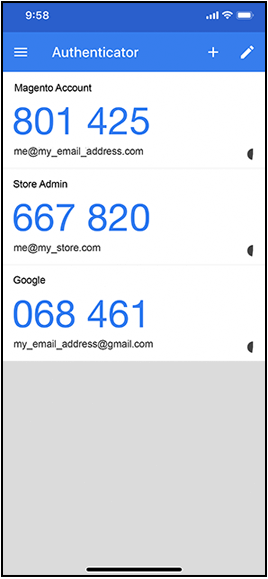

# 双重身份验证(2FA)

用于您的Adobe Commerce或Magento Open Source安装的Commerce _管理员_&#x200B;提供对您的商店、订单和客户数据的访问权限。 为了防止对您的数据进行未经授权的访问，所有尝试登录到&#x200B;_管理员_&#x200B;的用户都必须完成身份验证过程以验证其身份。

>[!NOTE]
>
>此双重身份验证(2FA)的实现仅适用于&#x200B;_管理员_，不适用于客户帐户。 保护您的Commerce帐户的双因素身份验证具有单独的设置。 若要了解更多信息，请转到[保护您的Commerce帐户](../getting-started/commerce-account-secure.md)。

二元身份验证被广泛使用，通常在同一应用程序上为不同的网站生成访问代码。 此附加身份验证可确保只有您才能登录到您的用户帐户。 如果您丢失了密码或机器人猜到了密码，则双重身份验证会增加一层保护。 例如，您可以使用Google Authenticator生成商店管理员、Commerce帐户和Google帐户的代码。

{width="300"}

Adobe Commerce支持来自多个提供商的2FA方法。 有些客户要求安装生成一次性密码(OTP)的应用程序，用户可在登录时输入该密码以验证其身份。 通用第二因子(U2F)设备类似于密钥链，并生成用于验证身份的唯一密钥。 其它设备在插入USB端口时验证身份。 作为商店管理员，您可以要求一个或多个可用的2FA方法来验证用户身份。 您的2FA配置适用于与Adobe Commerce安装关联的所有网站和商店。

当用户首次登录&#x200B;_管理员_&#x200B;时，必须设置您所需的每个[2FA](../configuration-reference/security/2fa.md)方法，并使用关联的应用或设备验证其身份。 进行此初始设置后，用户每次登录时都必须使用配置的方法之一进行身份验证。 每个用户的2FA信息都记录在其&#x200B;_管理员_&#x200B;帐户中，如有必要，可以进行[重置](security-two-factor-authentication-manage.md)。 若要了解有关登录过程的详细信息，请转到&#x200B;[_管理员_&#x200B;登录](../getting-started/admin-signin.md)。

>[!NOTE]
>
>启用了Adobe Identity Management Services (IMS)身份验证的存储已禁用本机Adobe Commerce和Magento Open Source 2FA。 使用其Adobe凭据登录到其Commerce实例的管理员用户不需要对许多管理员任务重新进行身份验证。 当管理员用户登录到其当前会话时，身份验证由Adobe IMS处理。 请参阅[Adobe Identity Management Service (IMS)集成概述](https://experienceleague.adobe.com/docs/commerce-admin/start/admin/ims/adobe-ims-integration-overview.html)。

您可以观看此[视频演示](https://video.tv.adobe.com/v/339104?quality=12&learn=on)，以了解管理员中双重身份验证的概述。

## 配置所需的2FA提供商

1. 在&#x200B;_管理员_&#x200B;侧边栏上，转到&#x200B;**[!UICONTROL Stores]** > _[!UICONTROL Settings]_>**[!UICONTROL Configuration]**。

1. 在左侧面板中，展开&#x200B;**[!UICONTROL Security]**&#x200B;并选择&#x200B;**[!UICONTROL 2FA]**。

1. 在&#x200B;_[!UICONTROL General]_&#x200B;部分中，选择要使用的提供程序。

   | 提供商 | 函数 |
   |--- |--- |
   | [!UICONTROL Google Authenticator] | 在应用程序中生成用于用户验证的一次性密码。 |
   | [!UICONTROL Duo Security] | 提供短信和推送通知。 |
   | [!UICONTROL Authy] | 生成依赖于时间的六位数代码，并提供短信或语音呼叫2FA保护或令牌。 |
   | [!UICONTROL U2F Devices (Yubikey and others)] | 使用物理设备进行身份验证，如[[!DNL YubiKey]](https://www.yubico.com/)。 |

   要选择多种方法，请按住Ctrl键(PC)或Command键(Mac)并单击每个项目。

1. 为每个必需的2FA方法完成[设置](../configuration-reference/security/2fa.md)。

   {width="600" zoomable="yes"}

1. 完成后，单击&#x200B;**[!UICONTROL Save Config]**。

   用户首次登录&#x200B;_管理员_&#x200B;时，必须设置每个必需的2FA方法。 进行此初始设置后，每次登录时都必须使用配置的方法之一进行身份验证。

## 2FA提供程序设置

完成所需的每个2FA方法的设置。

### Google

若要更改一次性密码(OTP)在登录期间可用的时间，请清除&#x200B;**[!UICONTROL Use system value]**&#x200B;复选框。 然后，输入希望&#x200B;**[!UICONTROL OTP Window]**&#x200B;有效的秒数。

{width="600" zoomable="yes"}

>[!NOTE]
>
>在Adobe Commerce 2.4.7及更高版本中，OTP窗口配置设置控制系统接受管理员的一次性密码(OTP)过期后的时间（以秒为单位）。 此值必须小于30秒。 系统默认设置为`29`.   在版本2.4.6中， OTP窗口设置确定保持有效的过去和将来的OTP代码数。 值为`1`表示当前OTP代码加上一个过去代码和一个将来代码在任何给定时间点都保持有效。

### [!DNL Duo Security]

从您的Duo Security帐户输入以下凭据：

- 客户端ID
- 客户端密码
- 集成密钥
- 密钥
- API主机名

{width="600" zoomable="yes"}

### [!DNL Authy]

1. 输入[!DNL Authy]帐户中的API密钥。

1. 要更改验证期间显示的默认消息，请清除&#x200B;**[!UICONTROL Use system value]**&#x200B;复选框。 然后，输入要显示的&#x200B;**[!UICONTROL OneTouch Message]**。

   {width="600" zoomable="yes"}

### U2F设备（[!DNL Yubikey]及其他）

默认情况下，在身份验证过程中使用存储域。 要将自定义域用于身份验证挑战，请清除&#x200B;**[!UICONTROL Use system value]**&#x200B;复选框。 然后，输入&#x200B;**[!UICONTROL WebAPi Challenge Domain]**。

{width="600" zoomable="yes"}
