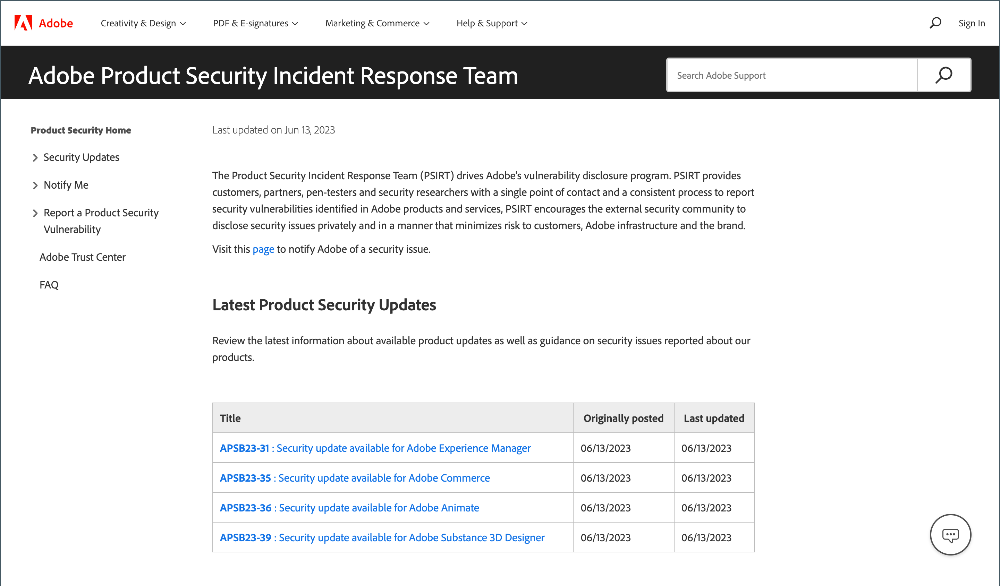

# 安全性

可通过多种方法来保护存储区并维护数据安全：

- 设置[双重身份验证](security-two-factor-authentication.md)
- 实施[CAPTCHA](security-captcha.md)或[reCAPTCHA](security-google-recaptcha.md)
- 为Adobe Commerce或Magento Open Source安装中的每个域设置[安全扫描](security-scan.md)。

>[!NOTE]
>
>已启用[!DNL Adobe Identity Management Services] (IMS)身份验证的存储已禁用本机Adobe Commerce和Magento Open Source 2FA。 使用其Adobe凭据登录到其Commerce实例的管理员用户不需要对许多管理员任务重新进行身份验证。 当管理员用户登录到其当前会话时，身份验证由Adobe IMS处理。 请参阅[[!DNL Adobe Identity Management Service] (IMS)集成概述](../getting-started/adobe-ims-integration-overview.md)。

访问[安全中心](https://helpx.adobe.com/cn/security.html){:target="_blank"}以获取有关潜在漏洞的最新消息、注册Adobe安全通知以及访问Adobe信任中心。

{width="700" zoomable="yes"}

有关安全最佳实践的信息，请参阅&#x200B;_实施行动手册_&#x200B;中的[保护Commerce站点和基础架构](https://experienceleague.adobe.com/docs/commerce-operations/implementation-playbook/best-practices/launch/security-best-practices.html?lang=zh-Hans)。

## 安全行动计划

如果您怀疑您的Adobe Commerce或Magento Open Source站点受到危害，请立即遵循此行动计划。

1. **诊断**：运行扫描以建立Commerce存储的安全状态。 Commerce [安全扫描](security-scan.md)是Adobe提供的免费服务，允许您监视Commerce站点是否存在已知的安全风险和恶意软件，并接收安全通知。

1. **清理**：请聘请[合格的顾问](https://solutionpartners.adobe.com/s/directory/?partner_type=1)或在线服务来清理您的网站上的所有恶意代码。 一些Commerce社区成员推荐[[!DNL Sucuri Website Malware Removal]](https://sucuri.net/website-antivirus/malware-removal)。 检查`/media`文件夹中的剩余可执行代码。 删除所有未知的管理员用户并重置所有管理员密码。

1. **保护**：使用最新版本保持Commerce安装处于最新状态。 如果您使用的是旧版本，请在所有安全修补程序可用时应用它们。 查看并遵循[Commerce安全最佳实践](https://www.adobe.com/content/dam/cc/en/trust-center/ungated/whitepapers/experience-cloud/adobe-commerce-best-practices-guide.pdf)。 订阅[Commerce安全警报](https://www.adobe.com/subscription/adbeSecurityNotifications.html)。

1. **报告**：如果您认为已在Commerce中发现特定漏洞，请[打开Adobe的问题](https://hackerone.com/adobe?type=team)，并包含技术详细信息。

1. **升级**：为了24/7全天候支持带来的额外安心，请立即计划在我们的云架构上升级到[Adobe Commerce](https://business.adobe.com/cn/products/magento/cloud-delivery.html)。
