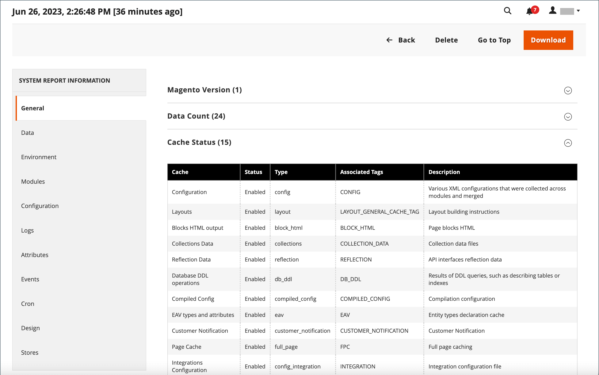

# 支持工具

{{ee-feature}}

支持工具旨在识别系统中的已知问题。 它们可用作开发和优化过程中的资源，以及帮助我们的支持团队识别和解决问题的诊断工具。

## 系统报表

利用系统报告工具，您可以定期获取系统的完整或部分快照，并保存它们以供将来参考。 您可以比较代码开发周期之前和之后的性能设置，或对服务器设置的更改。 系统报告工具可以大大减少准备和提交支持部门开始调查所需的信息所花费的时间。

在“系统报表”网格中，您可以查看和下载现有报表、删除报表以及创建报表。

### 访问系统报告

在&#x200B;_管理员_&#x200B;侧边栏上，转到&#x200B;**[!UICONTROL System]** > _[!UICONTROL Support]_>**[!UICONTROL System Report]**。

{width="600" zoomable="yes"}

### 生成报表

1. 单击&#x200B;**[!UICONTROL New Report]**。

1. 在&#x200B;**[!UICONTROL Groups]**&#x200B;列表中，选择要包含在报告中的每一组信息。 默认情况下，将选择所有组。

   {width="600" zoomable="yes"}

1. 单击右上角的&#x200B;**[!UICONTROL Create]**。

   生成报告可能需要几分钟时间，具体取决于所选报告类型的数量。 当报告准备就绪时，它将显示在网格的顶部，并包含生成的日期和时间。

### 查看模块信息

您可以找到有关已安装的模块的有用信息。

**_要查看每个已安装模块的报表信息：_**

1. 在&#x200B;_管理员_&#x200B;侧边栏上，转到&#x200B;**[!UICONTROL System]** > _[!UICONTROL Support]_>**[!UICONTROL System Report]**。
1. 单击&#x200B;**[!UICONTROL New Report]**。
1. 从&#x200B;**[!UICONTROL Groups]**&#x200B;列表中选择`Modules`。
1. 单击&#x200B;**[!UICONTROL Create]**。
1. 报表生成后，单击&#x200B;**[!UICONTROL Select]**，然后单击&#x200B;**[!UICONTROL View]**&#x200B;以查看所有模块版本。
1. 单击&#x200B;**[!UICONTROL Download]**&#x200B;下载报告。

### 管理系统报表

在网格的&#x200B;**[!UICONTROL Action]**&#x200B;列中，选择下列选项之一：

- `View` — 使用此函数查看报告的详细信息。
- `Delete` — 使用此函数从列表中删除生成的报告。
- `Download` — 使用此函数将报表另存为HTML文件。

### 查看系统报告详细信息

1. 对于您需要的报表，请在&#x200B;_[!UICONTROL Actions]_列中选择&#x200B;**[!UICONTROL View]**。

1. 在左侧面板中，展开报表的每个部分以查看详细信息。

   {width="600" zoomable="yes"}

### 可用的系统报告

| 报表组 | 包含的信息 |
| ------------ | -------------------- |
| [!UICONTROL General] | Adobe Commerce版本 数据计数 缓存状态 索引状态 |
| [!UICONTROL Environment] | 环境信息 MySQL状态 |
| [!UICONTROL Data] | 按URL键重复类别 按URL键重复产品 按SKU重复产品 按增量Id重复订单 按电子邮件重复用户 损坏的类别数据 |
| [!UICONTROL Modules] | 自定义模块列表 已禁用的模块列表 所有模块列表 |
| [!UICONTROL Configuration] | 配置 来自`app/etc/env.php` 配送方式 付款方式 付款功能矩阵的数据 |
| [!UICONTROL Logs] | 日志文件 热门系统消息 今天热门系统消息 热门调试消息 今天热门调试消息 热门异常消息 今天热门异常消息 |
| [!UICONTROL Attributes] | 用户定义的EAV属性 新的EAV属性 实体类型 所有EAV属性 类别EAV属性 产品EAV属性 客户EAV属性 客户地址EAV属性 RMA项目EAV属性 |
| [!UICONTROL Events] | 自定义全局事件 自定义管理事件 自定义前端事件 自定义文档事件 自定义Crontab事件 自定义REST事件 自定义SOAP事件 核心全局事件 核心管理事件 核心前端事件 核心文档事件 核心Crontab事件 核心REST事件 核心SOAP事件 所有全局事件 所有管理员事件 所有前端事件 所有Doc事件 所有REST事件 所有SOAP事件 所有Crontab事件 |
| [!UICONTROL Cron] | 按状态代码的Cron计划 按作业代码的Cron计划 Cron计划队列中的错误 Cron计划列表 自定义全局Cron作业 可配置的Cron作业 核心全局Cron作业 可配置的Cron作业 所有全局Cron作业 所有可配置的Cron作业 |
| [!UICONTROL Design] | Adminhtml主题列表 前端主题列表 |
| [!UICONTROL Stores] | 网站树 网站列表 商店列表 商店视图列表 |
| OMS连接器&#x200B; _（与OMS集成一起可见）_ | 连接器版本 连接器监视 消息处理结果 |

{style="table-layout:auto"}
