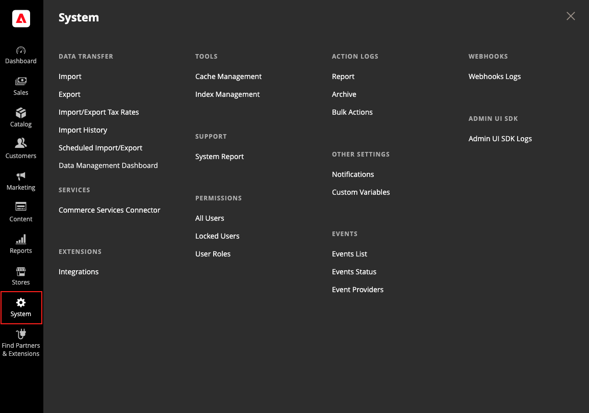

# [!UICONTROL System]菜单

[!UICONTROL System]菜单包括用于导入和导出数据、管理系统缓存和索引、管理权限、备份、系统通知和自定义变量的工具。

>[!BEGINTABS]

>[!TAB Adobe Commerce]

仅[!BADGE PaaS]{type=Informative url="https://experienceleague.adobe.com/zh-hans/docs/commerce/user-guides/product-solutions" tooltip="仅适用于云项目（Adobe管理的PaaS基础架构）和内部部署项目上的Adobe Commerce 。"}

{width="600" zoomable="yes"}

>[!TAB Adobe Commerce as a Cloud Service]

仅[!BADGE SaaS]{type=Positive url="https://experienceleague.adobe.com/zh-hans/docs/commerce/user-guides/product-solutions" tooltip="仅适用于Adobe Commerce as a Cloud Service和Adobe Commerce Optimizer项目（Adobe管理的SaaS基础架构）。"}

{width="600" zoomable="yes"}

>[!ENDTABS]

**_显示[!UICONTROL System]菜单:_**

在&#x200B;_管理员_&#x200B;侧边栏上，单击&#x200B;**[!UICONTROL System]**。

## [!UICONTROL Data Transfer]

通过这些[工具](data-transfer.md)，您能够在一次操作中管理多个记录。 您可以导入新项目，也可以更新、替换和删除现有产品和税率。

## [!UICONTROL Extensions]

仅[!BADGE PaaS]{type=Informative url="https://experienceleague.adobe.com/zh-hans/docs/commerce/user-guides/product-solutions" tooltip="仅适用于云项目（Adobe管理的PaaS基础架构）和内部部署项目上的Adobe Commerce 。"}

管理存储的[第三方集成](integrations.md)和扩展。

## [!UICONTROL Tools]

仅[!BADGE PaaS]{type=Informative url="https://experienceleague.adobe.com/zh-hans/docs/commerce/user-guides/product-solutions" tooltip="仅适用于云项目（Adobe管理的PaaS基础架构）和内部部署项目上的Adobe Commerce 。"}

使用此工具集合来管理您的系统资源，包括[缓存](cache-management.md)和[索引](index-management.md)管理、[备份](backups.md)以及安装设置。

## [!UICONTROL Support]

仅[!BADGE PaaS]{type=Informative url="https://experienceleague.adobe.com/zh-hans/docs/commerce/user-guides/product-solutions" tooltip="仅适用于云项目（Adobe管理的PaaS基础架构）和内部部署项目上的Adobe Commerce 。"}

（仅限Adobe Commerce）

[支持工具](support.md)可在开发和优化过程中用作资源，并用作诊断工具，帮助我们的支持团队识别和解决您系统的问题。

## [!UICONTROL Permissions]

Adobe Commerce和Magento Open Source使用[角色和权限](permissions.md)为管理员用户创建不同的访问级别。 这些工具使管理员能够根据&#x200B;_需要知道_&#x200B;向网站工作人员授予权限。

## [!UICONTROL Action Log]

（仅限Adobe Commerce）

[操作日志](action-log.md)跟踪在存储区中工作的管理员的活动。 对于大多数事件，可用信息包括操作、用户名称、是成功还是失败以及作为操作目标的对象的ID。 管理操作存档列出了存储在服务器上的CSV日志文件。

## [!UICONTROL Other Settings]

管理收件箱中的[通知](notifications.md)，创建[自定义变量](variables-custom.md)，并生成新的[加密密钥](encryption-key.md)。
