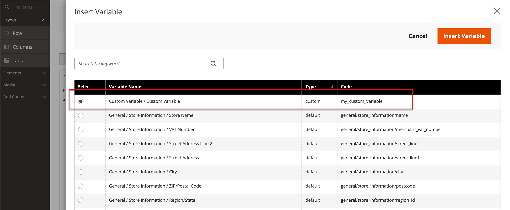

# 添加自定义变量

为满足您业务的特定需求，您可以创建自定义变量并将其插入到[页面](../content-design/pages.md)、[块](../content-design/blocks.md)和[电子邮件模板](email-templates.md)中。 单击&#x200B;_插入变量_&#x200B;按钮时显示的允许变量列表包括[预定义](variables-predefined.md)和自定义变量。 特定电子邮件模板的可用变量列表由与该模板关联的数据确定。 有关常用电子邮件模板及其关联变量的列表，请参阅[变量引用](variables-reference.md)。

{width="600" zoomable="yes"}

>[!NOTE]
>
>电子邮件和新闻稿模板中只能使用允许的预定义或自定义变量。

## 第1步：创建自定义变量

1. 在&#x200B;_管理员_&#x200B;侧边栏上，转到&#x200B;**[!UICONTROL System]** > _[!UICONTROL Other Settings]_>**[!UICONTROL Custom Variables]**。

1. 单击&#x200B;**[!UICONTROL Add New Variable]**。

1. 输入&#x200B;**[!UICONTROL Variable Code]**&#x200B;的标识符，使用所有小写字符且不加空格。

   如果需要，您可以使用下划线字符或连字符来表示空格。 例如： `my_custom_variable`

1. 输入用于内部引用的&#x200B;**[!UICONTROL Variable Name]**。 例如： `My Custom Variable`

1. 要输入与变量关联的值，请执行下列操作之一：

   - 对于&#x200B;**[!UICONTROL Variable HTML Value]**，输入使用简单HTML标签格式化的变量值。 例如：

     `<b>This formatted content appears in place of the variable.</b>`

   - 对于&#x200B;**[!UICONTROL Variable Plain Value]**，以纯文本形式输入变量值，而不设置格式。 例如：

     `This unformatted content appears in place of the variable.`

   >[!TIP]
   >
   >如果需要更多空间，请拖动文本框的右下角。

   {width="600" zoomable="yes"}

1. 完成后，单击&#x200B;**[!UICONTROL Save]**。

## 步骤2：在内容中插入自定义变量

使用[!DNL Page Builder]插入自定义变量。

1. 打开要将变量添加到内容的页面、块、类别或产品。

1. 展开&#x200B;**[!UICONTROL Content]**&#x200B;部分的。

1. 单击&#x200B;**[!UICONTROL Edit with Page Builder]**。

1. 在左侧面板中，单击&#x200B;**[!UICONTROL Elements]**&#x200B;并执行以下操作之一：

   - 在要插入变量的现有文本区域中单击。

   - 将新的&#x200B;**[!UICONTROL Text]**&#x200B;对象拖到舞台上。

1. 在编辑器工具栏的最右侧，单击（ ）以插入变量。

   ![[!DNL Page Builder]阶段和面板](./assets/variable-custom-pagebuilder-stage.png){width="600" zoomable="yes"}

1. 在列表中，选择要插入的自定义变量，然后单击&#x200B;**[!UICONTROL Insert Variable]**。

   {width="600" zoomable="yes"}

   变量标识符在编辑器中显示为占位符。

   ![[!DNL Page Builder]阶段 — 变量占位符](./assets/pagebuilder-variable-inserted.png){width="600" zoomable="yes"}

1. 完成后，单击&#x200B;**[!UICONTROL Save]**。
