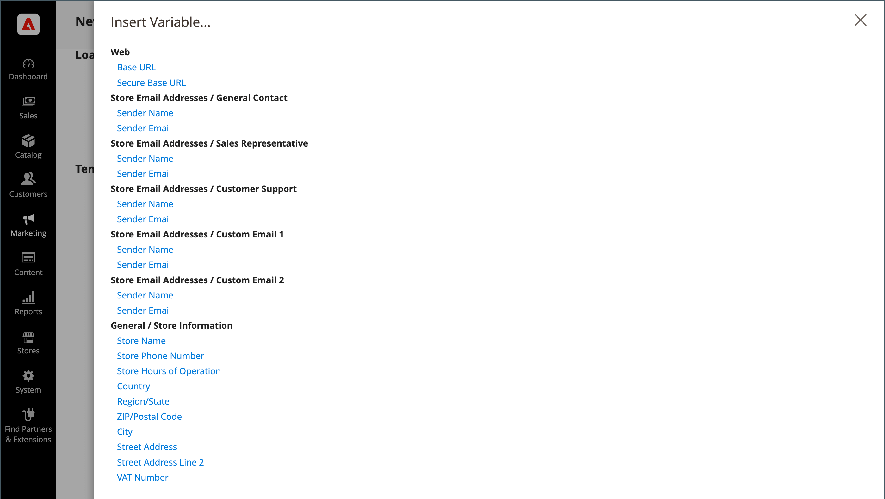
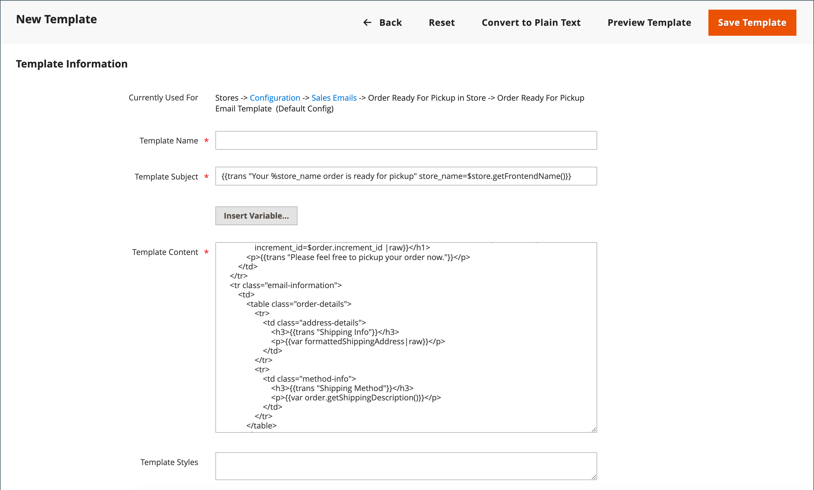

# 使用预定义变量

通过[预定义的](variables-predefined.md)变量，可以轻松个性化[电子邮件](email-templates.md)和[新闻稿](../merchandising-promotions/newsletters.md)模板以及其他类型的内容。 单击“插入变量”按钮时，将显示允许的[预定义](variables-predefined.md)变量列表。 如下图所示，特定电子邮件模板的可用变量列表由与该模板关联的数据决定。 有关常用电子邮件模板及其关联变量的列表，请参阅[变量引用](variables-reference.md)。

{width="700" zoomable="yes"}

## 向电子邮件模板添加变量

1. 在&#x200B;_管理员_&#x200B;侧边栏上，转到&#x200B;**[!UICONTROL Marketing]** > _[!UICONTROL Communications]_>**[!UICONTROL Email Templates]**。

1. 执行以下操作之一：

   - 要将变量添加到现有模板，请在列表中单击该模板以在编辑模式下打开。

   - 要在新模板中使用变量，请单击&#x200B;**[!UICONTROL Add New Template]**&#x200B;并自定义默认模板代码。 查看[消息模板](email-template-custom.md#message-templates)。

1. 在&#x200B;_[!UICONTROL Load default template]_下，选择要自定义的&#x200B;**[!UICONTROL Template]**。

1. 要应用模板，请单击&#x200B;**[!UICONTROL Load Template]**。

   _[!UICONTROL Currently used for]_字段显示模板的配置路径。_[!UICONTROL Template Subject]_&#x200B;和&#x200B;_[!UICONTROL Template Content]_是相对于所选模板自动生成的。

   - **[!UICONTROL Template Subject]** — 此文本显示在电子邮件的主题行中。

   - **[!UICONTROL Template Content]** — 此文本显示在已发送电子邮件的完整内容中。

   {width="600" zoomable="yes"}

1. 输入&#x200B;**[!UICONTROL Template Name]**。

1. 有关可与此电子邮件模板一起使用的[预定义](variables-predefined.md)变量的列表，请单击&#x200B;**[!UICONTROL Insert Variable]**。

   确定要插入到模板中的变量。 然后单击右上角的&#x200B;_关闭_ (X)。 （稍后将返回此页面。）

1. 要查看模板模型，请单击按钮栏中的&#x200B;**[!UICONTROL Preview Template]**。

   当预览在新选项卡中打开时，请确定变量相对于其他内容的放置位置。 然后返回到原始选项卡以继续。

   {width="600" zoomable="yes"}

1. 在&#x200B;**[!UICONTROL Template Content]**&#x200B;框中，将插入点放置在变量出现的位置，然后单击&#x200B;**[!UICONTROL Insert Variable...]**。

1. 在可用变量列表中，单击要插入到模板中的变量。

1. 完成后，单击&#x200B;**[!UICONTROL Save Template]**。

## 将模板转换为纯文本

1. 在编辑模式下打开模板。

1. 在页面顶部，单击&#x200B;**[!UICONTROL Convert to Plain Text]**。

1. 提示删除标记时，单击&#x200B;**[!UICONTROL OK]**。

1. 要保存纯文本版本，请单击&#x200B;**[!UICONTROL Save Template]**。

## 恢复HTML版本

1. 在页面顶部，单击&#x200B;**[!UICONTROL Return HTML Version]**。

1. 要保存模板的HTML版本，请单击&#x200B;**[!UICONTROL Save Template]**。
